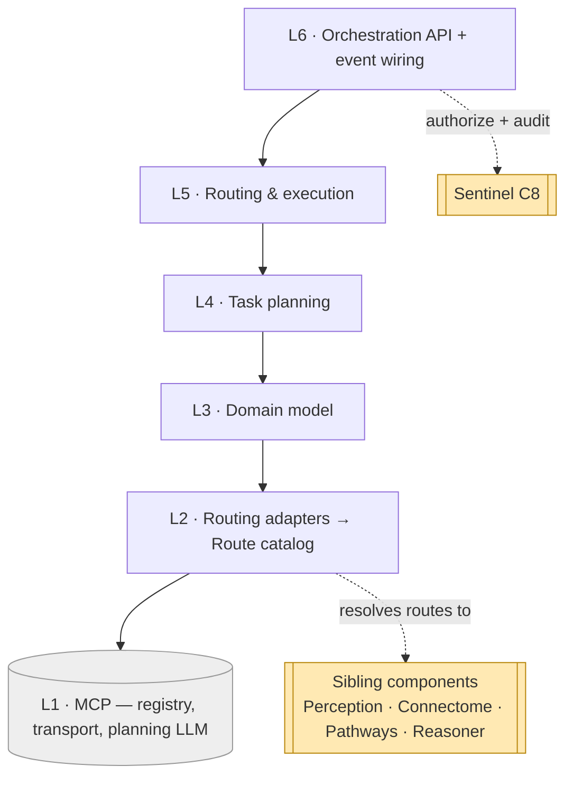
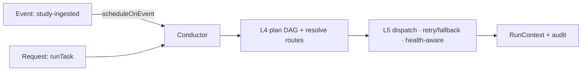

# Conductor — Layered Architecture (L1–L6)

Conductor runs **one scaffold** for every task — plan, route, execute — over six layers.
**Each layer depends only on the one directly below it.** The bottom is the external MCP
registry/transport + planning LLM; the top serves the orchestration API and wires stack
events.

## The stack

| # | Layer | Does | Spec |
|---|-------|------|------|
| **L6** | **Orchestration API / serving + event wiring** | entry points `runTask`, `scheduleOnEvent`, `status`; wire stack events (study-ingested → Perception → Connectome → Pathways); ask **Sentinel** to authorize actions + record audit | `07` |
| **L5** | **Routing & execution** | dispatch steps respecting dependencies; retries / fallbacks / timeouts; concurrency; circuit-break unhealthy servers; collect results into `RunContext` | `06` |
| **L4** | **Task planning** | decompose request/event into a step DAG; resolve each step to a **route** (sibling component or MCP server); build the execution `Plan` | `05` |
| **L3** | **Domain model** | `Task`, `Plan` (step DAG), `Step`, `Route`, `CapabilityDescriptor`, `Invocation`, `RunContext` | `04` |
| **L2** | **Routing adapters** | normalize registry entries + component/endpoint descriptors + health signals into a uniform **Capability/Route catalog** | `03` |
| **L1** | **Capability (MCP)** | the MCP **registry** (discovery/health/versions), **transport** to all MCP servers, and an **LLM/planning** capability. *External.* | `02` |

## The dependency rule

- **Allowed:** L(n) calls L(n−1). Execution (L5) dispatches the routes Planning (L4)
  resolved; the API (L6) packages an L5 run.
- **Forbidden:** skipping layers or calling upward. L6 never calls the registry directly — it
  consumes the routes L2 normalized and the plan L4 built.
- **External touch is at L2 only:** L2 calls the L1 registry/transport and is where
  **sibling-component** routes are resolved (the descriptors for Perception, Connectome,
  Pathways, Reasoner). Above L2 everything works on the in-memory `Plan` / `RunContext`.

> **Sentinel is reached at L6, not woven through.** Authorization is a discrete gate before
> each action and an audit write after — kept at the serving edge so the routing/execution
> core stays pure (`07`, `08`).

## One scaffold, many tasks

- **Event-driven** runs (the common case): a stack event maps to a **templated DAG** (`05`),
  resolved against the live registry and dispatched.
- **Request-driven** runs: an explicit `runTask` request, optionally LLM-decomposed when the
  shape isn't known ahead of time.

Both descend the same L1–L5; only the L4 entry (template vs. LLM-decompose) and the L6 entry
point differ. One scaffold means routing, health, retry and audit are built once and reused.

## Cross-component routing (a note on L2)

Unlike Reasoner/Pathways, which *consume* sibling outputs, Conductor **routes work to**
siblings: it does not read their domain data, it invokes their **entry points**. Those
endpoints are described as `CapabilityDescriptor`s and normalized into `Route`s at L2 (`03`),
alongside MCP-server capabilities — so a step can resolve to either with the same machinery:

- **Perception (C2)** — `perceiveStudy` (produce findings).
- **Connectome (C1)** — adapter `persist` / `read`.
- **Pathways (C5)** — `assessResponse`, `planTreatment`, `replanOnProgression`.
- **Reasoner (C4)** — `diagnose`, `updateOnNewEvidence`.

These are routing targets, distinct from the L1 MCP servers. Conductor itself writes nothing
to the graph — it routes a write **to Connectome**, after Sentinel authorizes it.

## How a task flows (illustrative)

`study-ingested` for `pat-001` / `les-001` (follow-up MRI) → L4 builds DAG
`perceive → persist → assessResponse → (re-plan?)` and resolves each step to a route → L5
dispatches: Perception produces `find-mri-001` (one seg MCP retried then fell back to a
healthy replica), Connectome persists, Pathways returns `prog-002` (progression),
triggering a conditional re-plan step → L6 authorized each action with Sentinel and wrote
the audit trail. Full run in `samples/conductor/`.

Layer-to-doc map: L1→`02`, L2→`03`, L3→`04`, L4→`05`, L5→`06`, L6→`07`; cross-cutting →
`08`, `09`.
