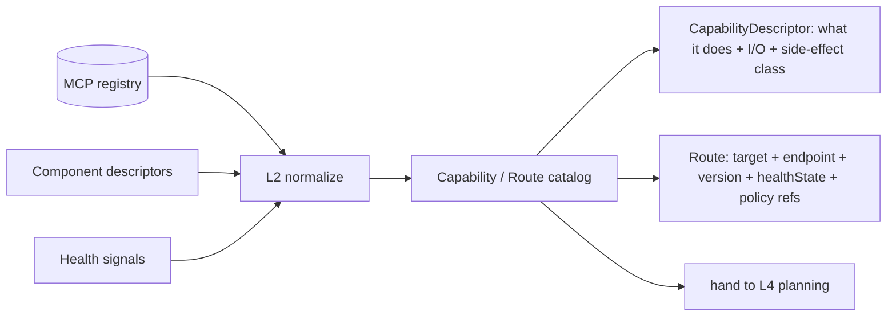

# Conductor — Routing Adapters (L2)

L2 builds the **uniform catalog** the planner and executor route against. It is the only
layer that reaches outward — to the L1 **registry/transport** **and** to the **sibling
components** (whose endpoints it describes as routes). Above L2, planning and execution work
on the catalog and the in-memory plan, not live discovery.

> L2 **normalizes and grounds routes**; it does not plan or dispatch. No DAG building, no
> retries here — just discover, describe, and shape into a `Capability/Route catalog`.

## What L2 normalizes

| Source | Via | Yields |
|---|---|---|
| **MCP registry** (L1) | query | server entries → endpoint, capabilities, `health`, `version` |
| **Component descriptors** | load | sibling entry points (Perception/Connectome/Pathways/Reasoner) → endpoint, inputs/outputs, side-effect class |
| **Health signals** | subscribe / poll | per-route liveness, latency, error-rate → `healthState` |
| **Transport** (L1) | bind | the call mechanism each route is invoked through |

Two route *kinds*, one shape: an **MCP-server route** (registry-discovered) and a
**component route** (descriptor-declared) are both normalized into the same
`CapabilityDescriptor` → `Route`, so L4 resolves and L5 dispatches them identically.

## Normalizing into the Route catalog

- **CapabilityDescriptor** — *what* a target can do: capability id, inputs, outputs, and a
  **side-effect class** (`read` | `compute` | `action`). The class drives whether L6 must ask
  Sentinel to authorize (`07`).
- **Route** — *how to reach it*: target (component endpoint or MCP server), endpoint,
  resolved `version`, current `healthState`, and references to the **routing policy** that
  governs retry/fallback/timeout (`08`).

## Output: the catalog

One normalized catalog handed to L4:

| Part | Contents |
|---|---|
| `capabilities[]` | `CapabilityDescriptor`s (id, I/O, side-effect class) |
| `routes[]` | resolvable `Route`s (target, endpoint, version, healthState) |
| `replicas` | alternate routes for one capability (for fallback / health-aware dispatch) |
| `health` | per-route liveness / latency / error-rate snapshot |
| `policyRefs` | retry/fallback/timeout/circuit-breaker policy bindings (`08`) |

## Health-aware grounding

Each route carries a live `healthState` (`healthy` | `degraded` | `unhealthy`). L2 surfaces
it; **L5 acts on it** (circuit-break, prefer a healthy replica) and **L4 reads it** to prefer
a healthy route when resolving a step (`05`, `06`). L2 also exposes **replicas** — multiple
routes that satisfy the same capability — which is what makes fallback possible.

> The catalog is a **snapshot with live health**: capability/version are resolved when the
> plan is built; health is re-checked at dispatch so a server that fails between planning and
> execution is still caught.

## Grounding contract

Every route is **traceable** to its registry entry or component descriptor (with the resolved
`version`), so each `Invocation` downstream records *exactly* which server/endpoint/version it
hit — the basis of the action audit trail (`07`, `08`). L2 mutates nothing: it never invokes a
target, it only describes how to. The first real call happens at L5.

See `docs/components/conductor/02-mcp-capability-map.md` (L1 capabilities) and
`docs/components/conductor/08-registry-and-policies.md` (policies bound here).
