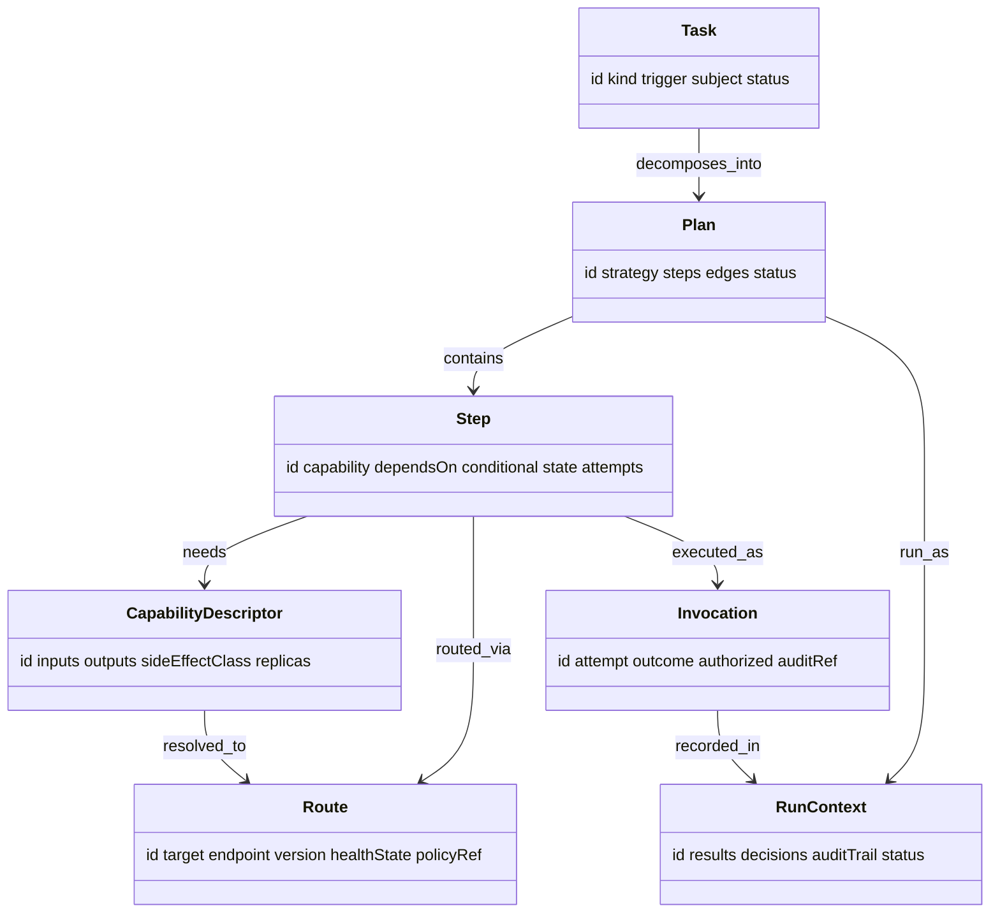

# Conductor — Domain Model (L3)

L3 defines Conductor's vocabulary. Everything above L3 speaks it; nothing above L2 makes live
registry/transport/component calls — it all works on these objects.

## Entities

### Task
One orchestration request, from an API call or a stack event.
- **Attributes:** `id`, `kind` (`event` | `request`), `trigger` (e.g. `study-ingested`),
  `subject` (e.g. `les-001` / `pat-001`), `payload`, `status` (`planned` | `running` |
  `succeeded` | `failed` | `partial`), `createdAt`.

### Plan
The executable **step DAG** built at L4 (`05`).
- **Attributes:** `id`, `task`, `steps[]`, `edges[]` (dependencies), `strategy`
  (`template` | `llm-decomposed`), `status`.

### Step
One unit of work in the plan.
- **Attributes:** `id`, `capability` (what it needs), `route` (resolved at L4), `dependsOn[]`
  (step ids), `inputBindings` (from prior steps' outputs / payload), `conditional` (predicate
  on a prior result, e.g. *only if `prog-002` = progression*), `state` (`pending` |
  `authorizing` | `dispatched` | `succeeded` | `failed` | `skipped`), `attempts`.

### Route
A resolved target for a step (built at L2, `03`).
- **Attributes:** `id`, `target` (component endpoint **or** MCP server), `endpoint`,
  `version`, `healthState`, `policyRef` (retry/fallback/timeout/breaker, `08`).

### CapabilityDescriptor
*What* a target can do — the unit the planner resolves a step against.
- **Attributes:** `id`, `inputs`, `outputs`, `sideEffectClass` (`read` | `compute` |
  `action`), `replicas[]` (alternate routes satisfying it).

### Invocation
One actual call of a route during execution (L5, `06`).
- **Attributes:** `id`, `step`, `route`, `attempt`, `startedAt`, `endedAt`, `outcome`
  (`ok` | `timeout` | `error` | `unavailable`), `result` / `error`, `authorized` (Sentinel
  decision ref), `auditRef`.

### RunContext
The accumulating state of a running plan.
- **Attributes:** `id`, `task`, `plan`, `results` (per-step outputs, keyed by step id),
  `invocations[]`, `decisions[]` (Sentinel authorizations), `auditTrail[]`, `status`.

## Target effects (other components' schemas — reused)

Conductor produces no clinical entity of its own. The **outputs of routed steps** are the
sibling components' types — a Perception `Finding` (`find-mri-001`), a Connectome persist of
it, a Pathways `ProgressionAssessment` (`prog-002`). Conductor stores **refs** to them in
`RunContext.results`; it never reshapes or asserts them. Shapes live in
`docs/components/connectome/04-domain-model.md`,
`docs/components/perception/04-domain-model.md`, and
`docs/components/pathways/04-domain-model.md`.

## Relationships

## Shared attributes

`id`, `source`, `asserted_by` (`conductor` for routing/run records — **never** for clinical
facts), `timestamp` — on `Task`, `Invocation`, and every `auditTrail` entry. Conductor's
provenance describes **routing and ordering decisions**, not domain assertions; the routed
component owns the clinical provenance. Full attribute reference and diagrams in `09`.
