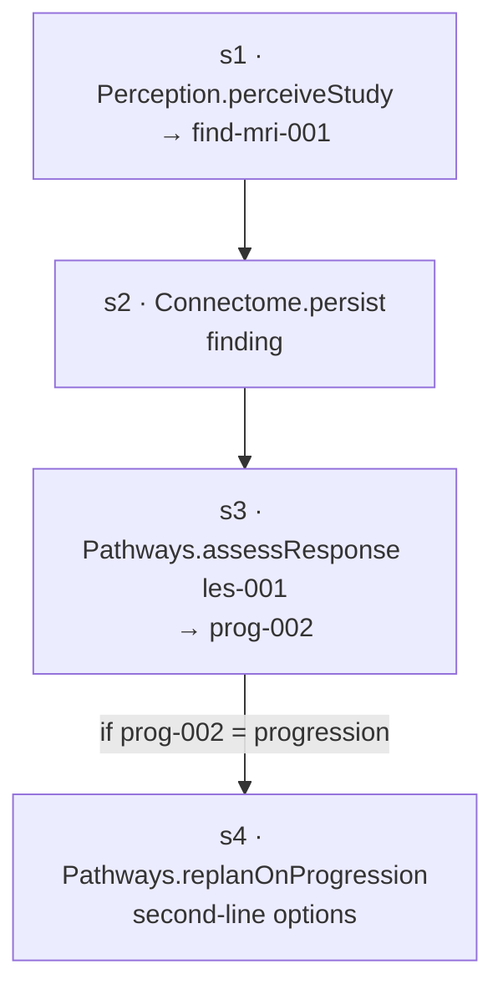

# Conductor — Task Planning (L4)

L4 turns a `Task` into an executable `Plan`: **decompose** the request/event into a **step
DAG**, then **resolve** each step to a concrete `Route` from the L2 catalog. It plans; it does
not dispatch (that's L5, `06`).

> L4 **plans and resolves**; it makes no live calls and causes no effects. The output is an
> in-memory `Plan` — steps, dependencies, and a chosen route per step — ready for execution.

## Two decomposition strategies

| Strategy | When | How |
|---|---|---|
| **Template** | known stack event (e.g. `study-ingested`) | a predefined DAG template, parameterized by the task subject |
| **LLM-decomposed** | open-ended `runTask` request | the planning LLM (`02`) proposes steps + deps over the capability catalog |

Both produce the same `Plan` shape. Templates are the default and the common case — they are
deterministic, reviewable, and need no model call. The LLM is the fallback for novel requests.

> Even LLM-decomposed plans are **bounded by the catalog**: every proposed step must name a
> real capability that resolves to a route. Steps that don't resolve are rejected — the LLM
> proposes structure, not capabilities that don't exist (`02`).

## Decompose → DAG

For the running case, `study-ingested(les-001)` expands to:

- **Steps** are units of work; **edges** are dependencies (`dependsOn`). `s2` cannot start
  until `s1` produces the finding; `s3` needs the persisted finding; `s4` is **conditional**
  on `s3`'s verdict.
- A step with no satisfied dependency is *ready*; the DAG is what lets L5 run independent
  steps concurrently and order dependent ones correctly.

## Resolve each step to a route

For every step, L4 picks a `Route` from the L2 catalog (`03`) by:

1. **Capability match** — find `CapabilityDescriptor`s that satisfy the step's need.
2. **Health preference** — prefer a `healthy` route; note `replicas[]` for fallback (`06`).
3. **Version pinning** — record the resolved `version` so the run is reproducible and
   auditable.
4. **Side-effect classing** — carry the descriptor's `sideEffectClass` (`read`/`compute`/
   `action`) so L6 knows which steps need **Sentinel authorization** (`07`).

| Step | Capability | Resolves to (route kind) | sideEffectClass |
|---|---|---|---|
| s1 | perceive study | **Perception** endpoint (component) | `compute` |
| s2 | persist finding | **Connectome** adapter (component) | `action` |
| s3 | assess response | **Pathways** `assessResponse` (component) | `compute` |
| s4 | re-plan on progression | **Pathways** `replanOnProgression` (component) | `action` |

> Steps can resolve to **either** a sibling component **or** an MCP server — both are routes.
> A purely computational sub-step (e.g. a measurement) could resolve straight to an MCP
> server; here the work is component-level.

## Conditional & loop structure

- **Conditional steps** carry a predicate on a prior result (`s4` fires only on
  `prog-002 = progression`). Unsatisfied conditionals are **skipped**, not failed (`06`).
- **Loopbacks** are expressed as new tasks, not cycles: a `progression` verdict can
  `scheduleOnEvent` a fresh re-planning task (`07`), keeping the DAG acyclic. This mirrors
  Pathways' `replanOnProgression` loop
  (`docs/components/pathways/07-proposal-and-monitoring.md`).

## Output: the Plan

A `Plan` (`04`) handed to L5: ordered `steps[]` each with a resolved `route`, `dependsOn[]`,
`inputBindings` (wiring a prior step's output into the next step's input), `conditional`
predicates, and the chosen `strategy`. Nothing has run yet.

See `docs/components/conductor/06-routing-and-execution.md` for how the Plan is dispatched.
