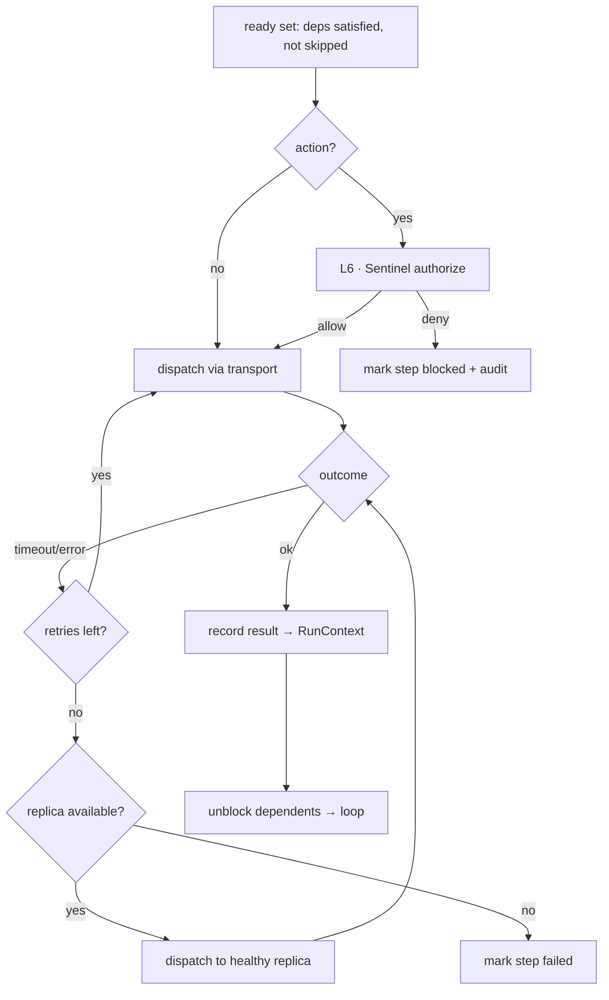

# Conductor — Routing & Execution (L5)

L5 runs the `Plan`: **dispatch** steps respecting dependencies, with **retries, fallbacks,
timeouts, concurrency, and circuit-breaking**, collecting results into the `RunContext`. It is
the only layer (with L2's discovery) that causes real calls — but it asks L6/Sentinel to
**authorize** each action first (`07`).

> L5 **executes the plan it was given**; it does not re-plan. It chooses *which replica* and
> *when to retry*, never *which steps exist* — that was fixed at L4 (`05`).

## The dispatch loop (agent loop)

1. Compute the **ready set** — steps whose `dependsOn` are satisfied and whose `conditional`
   (if any) holds; **skip** steps whose conditional is false.
2. For **action**-class steps, get **Sentinel authorization** (`07`) before dispatch.
3. **Dispatch** ready steps **concurrently** (independent branches run in parallel).
4. On result, write to `RunContext.results`, unblock dependents, loop until the DAG drains.

## Fault tolerance

| Mechanism | Behavior |
|---|---|
| **Timeout** | each route has a deadline from its policy (`08`); a slow call is cut and treated as a failure |
| **Retry** | transient failures (`timeout`/`unavailable`) retried with backoff, up to the policy's `maxAttempts` |
| **Fallback** | retries exhausted → dispatch to a **replica** route for the same capability (`03`) |
| **Circuit-break** | a route flagged `unhealthy` (or tripping the breaker on repeated failures) is **skipped** — go straight to a replica, don't waste attempts (`08`) |
| **Concurrency** | independent DAG branches run in parallel up to a concurrency limit |
| **Compensation** | a failed **action** after a committed write records the partial state; Conductor does not silently roll back domain data — it marks the run `partial` and audits it |

### Health-aware dispatch (running case)

In the worked run, `s1` (Perception.perceiveStudy) routes to a segmentation MCP server that
returns `unavailable`. L5:
1. **retries** once (transient) → still `unavailable`;
2. the registry now reports that server `unhealthy` → **circuit-break**;
3. **falls back** to a healthy **replica** segmentation server → success, `find-mri-001`
   produced.

The fallback, the retry, and the breaker trip are all recorded as `Invocation`s on the step —
the run succeeded *and* the flakiness is visible in the audit (`07`).

## Conditional resolution

When `s3` (Pathways.assessResponse) returns `prog-002 = progression`, the conditional on `s4`
(`replanOnProgression`) is satisfied and `s4` becomes ready. Had the verdict been `stable`,
`s4` would be **skipped** (state `skipped`, not `failed`) and the run would still **succeed**.

## Collecting results

Every step's output is written to `RunContext.results` keyed by step id, and every call is an
`Invocation` (route, attempt, outcome, authorization ref, audit ref). The terminal `Task`
status is derived:

| All steps | → Task status |
|---|---|
| succeeded or cleanly skipped | `succeeded` |
| some succeeded, an action failed after a write | `partial` |
| a required step failed with no replica | `failed` |

> Conductor reports outcomes; it does not **interpret** them. `prog-002` being `progression`
> is Pathways' verdict — Conductor just routed to it, recorded it, and (per the DAG) triggered
> the next step.

See `docs/components/conductor/07-orchestration-api.md` (authorize + audit) and
`docs/components/conductor/08-registry-and-policies.md` (retry/breaker policies).
