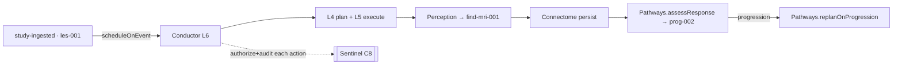

# Conductor — Orchestration API / Serving + Event Wiring (L6)

L6 is Conductor's edge: the **entry points** callers use, the **event wiring** that turns
stack events into tasks, and the **Sentinel authorize + audit** gate around every action. It
packages an L5 run; it owns no planning or dispatch logic of its own.

> L6 is where Conductor **meets the rest of the stack** — callers above, events alongside,
> Sentinel across. The routing/execution core (L4/L5) stays pure; serving and governance live
> here.

## Entry points

| Entry point | Purpose | Returns |
|---|---|---|
| **`runTask(request)`** | run an explicit task now (template or LLM-decomposed, `05`) | `RunContext` (results + audit) |
| **`scheduleOnEvent(event)`** | bind a stack event to a templated task; fire on arrival | task id (async) |
| **`status(taskId)`** | inspect a running / completed run | `Task` + `RunContext` snapshot |

`runTask` is synchronous request/response for short plans; long or event-driven runs go
through `scheduleOnEvent` and are polled via `status`.

## Event wiring

Conductor subscribes to stack events and maps each to a templated plan (`05`):

| Event | Wired plan (DAG) |
|---|---|
| **`study-ingested`** | Perception.perceiveStudy → Connectome.persist → Pathways.assessResponse → *(if progression)* Pathways.replanOnProgression |
| **`diagnosis-confirmed`** | Pathways.planTreatment → Connectome.persist (candidate plan) |
| **`new-evidence`** (e.g. histology) | Reasoner.updateOnNewEvidence → Connectome.persist (candidate) |

This is the event in `docs/components/pathways/01-layered-architecture.md` (the
`assessResponse` monitoring trigger), seen from the **orchestration** side: Pathways defines
*what* assessResponse does; Conductor defines *when it runs and what feeds it*.

## Sentinel: authorize before acting, audit after

> **Conductor asks; Sentinel answers; Conductor records.**

- Every step whose route is **action**-class (`sideEffectClass = action`, e.g. a Connectome
  write, a re-plan) is **authorized by Sentinel (C8)** before L5 dispatches it (`06`).
  `read`/`compute` steps run without an authorization gate.
- The decision (`allow` / `deny`, with reason) is recorded as a `decision` on the
  `RunContext`; a denied step is **blocked + audited**, never silently dropped.
- After each action, Conductor writes an **audit** entry: the route (target/endpoint/version),
  attempts, outcome, the authorization ref, and the run/step provenance — `asserted_by:
  conductor` for the *routing decision*, with the domain provenance owned by the routed
  component.

| Conductor records (routing/run) | Sentinel governs (policy) | Routed component owns (domain) |
|---|---|---|
| which route, version, attempt, outcome | whether the action is permitted | the clinical fact + its provenance |
| ordering / dependency decisions | consent / PHI / access policy | candidate→confirmed status |
| retry / fallback / breaker events | model & safety governance | the assertion's evidence trail |

## The candidate discipline (Conductor's part)

Conductor **never confirms** a clinical fact. When the plan routes a write, it routes a
**candidate** (Reasoner's candidate `Diagnosis`, Pathways' candidate `TreatmentPlan` /
`ProgressionAssessment`) to **Connectome**, flagged `candidate`. Human confirmation is a
separate step via **Console (C7)** — outside Conductor's run. Conductor's job ends at
**routing the candidate, authorized and audited**.

## Output

`runTask`/`scheduleOnEvent` yield a `RunContext` (`04`): per-step results (refs to the domain
outputs — `find-mri-001`, `prog-002`), the full `invocations[]` (with retries/fallbacks),
Sentinel `decisions[]`, and the `auditTrail[]`. `status` exposes the same while running.

See `docs/components/conductor/06-routing-and-execution.md` (dispatch) and
`docs/components/conductor/08-registry-and-policies.md` (policies + audit format).
