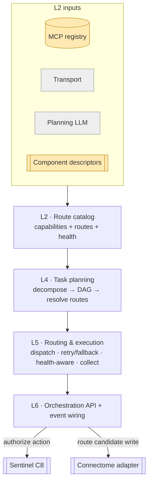
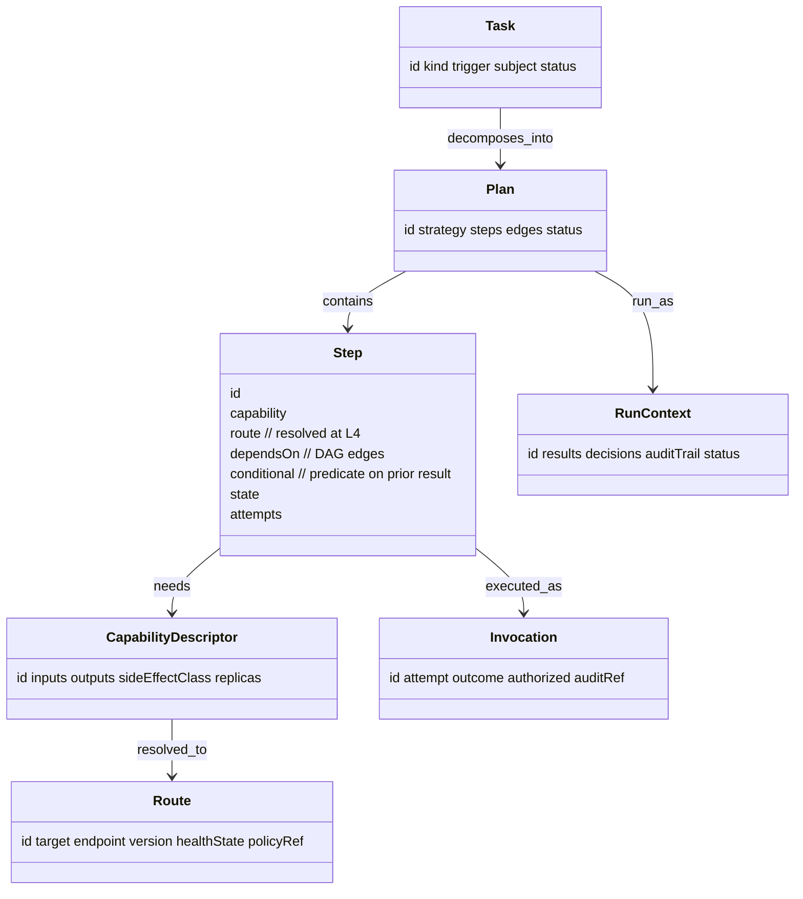

# Conductor — Reference (diagrams + attributes)

The visual model and attribute-level reference. Pairs with `04` (entities) and `05`–`07`
(planning / execution / serving).

## Pipeline (end to end)

## Data shapes

## Attribute reference

### Step
| Attribute | Type | Notes |
|---|---|---|
| `capability` | id | what the step needs (resolves to a route) |
| `route` | Route | chosen target (component **or** MCP server) |
| `dependsOn` | id[] | predecessor steps (DAG edges) |
| `conditional` | predicate | gate on a prior result; false → `skipped` |
| `state` | enum | `pending`→`authorizing`→`dispatched`→`succeeded`/`failed`/`skipped` |
| `attempts` | int | retry count consumed |

### Route
| Attribute | Type | Notes |
|---|---|---|
| `target` | enum/ref | component endpoint or MCP server |
| `endpoint` | string | where to invoke |
| `version` | string | **pinned per run**, recorded on every Invocation |
| `healthState` | enum | `healthy` / `degraded` / `unhealthy` |
| `policyRef` | ref | retry/fallback/timeout/breaker policy (`08`) |

### Invocation
| Attribute | Type | Notes |
|---|---|---|
| `attempt` | int | which try (retries/fallbacks each record one) |
| `outcome` | enum | `ok` / `timeout` / `error` / `unavailable` |
| `authorized` | ref | Sentinel decision (action-class steps) |
| `auditRef` | ref | audit-trail entry |

### Shared provenance
`id`, `source`, `asserted_by` (`conductor` — for the **routing decision**, never the clinical
fact), `timestamp`.

## Enumerations

| Enum | Values |
|---|---|
| `Task.kind` | `event`, `request` |
| `Task.status` | `planned`, `running`, `succeeded`, `failed`, `partial` |
| `Step.state` | `pending`, `authorizing`, `dispatched`, `succeeded`, `failed`, `skipped` |
| `CapabilityDescriptor.sideEffectClass` | `read`, `compute`, `action` |
| `Route.healthState` | `healthy`, `degraded`, `unhealthy` |
| `Invocation.outcome` | `ok`, `timeout`, `error`, `unavailable` |
| `Plan.strategy` | `template`, `llm-decomposed` |

## Worked instance

A concrete run — `study-ingested` for `pat-001` / `les-001` orchestrated end to end
(Perception → Connectome persist → Pathways.assessResponse → conditional re-plan), with a
retry/fallback on a flaky segmentation server, health-aware dispatch, and a Sentinel
authorize+audit hook on each action — is in `samples/conductor/`.
