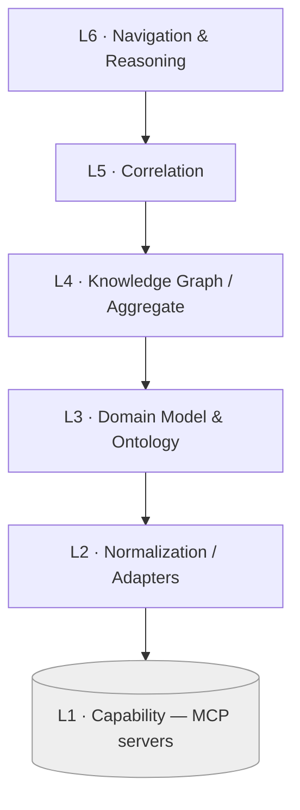

# Connectome — Layered Architecture (L1–L6)

Connectome is built as six layers. **Each layer depends only on the layer directly
below it.** A layer never reaches two levels down and never calls upward. This is the
core structural constraint of the whole component; the docs, the diagrams, and any
future code must honor it.

## The stack

| # | Layer | Responsibility | Consumes | Spec |
|---|-------|----------------|----------|------|
| **L6** | **Navigation & Reasoning** | Cross-modal navigation; diagnosis / treatment / progression journeys; query & traversal entry points; discovery journeys. | L5 | `07` |
| **L5** | **Correlation** | Asserts cross-modal links: `Lesion` manifestations, anatomical-location / spatial-registration / temporal / embedding-similarity correspondence — each with provenance + confidence. | L4 | `06` |
| **L4** | **Knowledge Graph / Aggregate** | The unified domain graph; aggregates normalized findings from many studies & modalities into nodes + edges. | L3 | `05` |
| **L3** | **Domain Model & Ontology** | Entity definitions (Patient, Study, Finding, Lesion, Diagnosis…) and standards/terminology mappings. | L2 | `04` |
| **L2** | **Normalization / Adapters** | Maps raw MCP-server outputs (DICOM, FHIR, pathology, terminology, vectors) into L3 entities. | L1 | `03` |
| **L1** | **Capability (MCP servers)** | Actual compute & data: DICOM/PACS, FHIR, segmentation, registration, pathology, terminology, embeddings, retrieval. *External — Connectome only calls these.* | — | `02` |



## The dependency rule

- **Allowed:** L(n) calls L(n−1). e.g. L5 Correlation reads the graph (L4); L6
  Navigation issues traversals over correlation results (L5).
- **Forbidden:** skipping layers (L6 calling L2 directly), or any upward call.
- **Consequence:** every capability a higher layer needs must be *surfaced by the layer
  beneath it*. If Navigation (L6) wants similar cases, it asks Correlation (L5), which
  uses graph + embedding evidence (L4 + an L1 capability surfaced via L2), not the
  embedding server directly.

This keeps the **"no low-level code"** guarantee enforceable: the only place that
touches an external system is **L2 adapters calling L1 MCP servers**. Everything above
L2 speaks pure domain model.

## Where the "no low-level code" boundary sits

```
   ai-neuro-os (Connectome)            external
   ───────────────────────────         ─────────
   L6 Navigation        ┐
   L5 Correlation       │  domain + aggregate code (in scope)
   L4 Knowledge Graph   │
   L3 Domain Model      ┘
   L2 Adapters  ───────── the ONLY layer that talks to ──▶  L1 MCP servers
```

L2 translates; it does not compute. Segmentation, registration, OCR, inference,
embedding generation, DICOM decoding — all happen **inside MCP servers**, never inside
Connectome.

## Layer-to-doc map

- L1 → `02-mcp-capability-map.md`
- L2 → `03-normalization-adapters.md`
- L3 → `04-domain-model.md`
- L4 → `05-knowledge-graph.md`
- L5 → `06-cross-modal-correlation.md`
- L6 → `07-navigation-and-queries.md`
- Cross-cutting → `08-modality-modeling.md`, `09-data-model-reference.md`,
  `data-dictionary.md`

## How a request flows (illustrative)

"Show me where this MRI mass appears in the other modalities."

1. **L6** receives the navigation request anchored on an MRI `Finding`.
2. **L5** resolves the `Finding`'s `Lesion` and gathers all `manifestation_of` /
   `corresponds_to` links (and, if sparse, embedding-similarity candidates).
3. **L4** supplies the graph neighborhood the correlation logic reads.
4. **L3/L2/L1** had already populated that neighborhood: adapters (L2) normalized DICOM
   (imaging-archive MCP) and pathology (pathology MCP) outputs into `Finding` nodes (L3)
   that L4 aggregated.

The clinician sees: MRI ↔ CT ↔ US ↔ histology findings for one lesion, each labeled
with its provenance and confidence.
