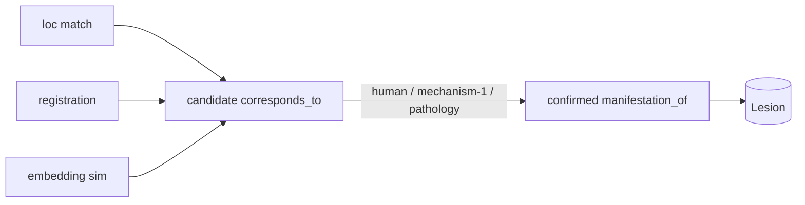

# Connectome — Cross-Modal Finding Correlation (L5) · *the core*

This is the headline capability: **given a finding in one modality, reach the same
entity in another.** L5 reads the graph (L4) and **asserts the links** that make
cross-modal navigation possible — each with provenance and confidence so trust is
explicit and *candidate* vs. *confirmed* links are always distinguishable.

## The central idea: an abstract Lesion

Modalities don't share pixels, coordinates or vocabularies, so we don't try to match
them directly by default. Instead each modality's `Finding` is declared a
**`manifestation_of`** one abstract **`Lesion`** node (`04`, `05`). Correlation becomes
a *graph* operation:

```
MRI Finding ─manifestation_of─▶  Lesion  ◀─manifestation_of─ Histology Finding
CT  Finding ─manifestation_of─▶  (one)   ◀─manifestation_of─ US Finding
```

Navigate `Lesion → manifestation_of⁻¹ → Findings`, group by `Modality`, and you have the
same entity seen four ways.

## Five complementary linking mechanisms

Listed in priority order. Each produces `manifestation_of` and/or `corresponds_to` edges
tagged with how they were derived.

### 1. Shared abstract Lesion node *(primary)*
A human or algorithm asserts that a finding belongs to a known lesion → one
`manifestation_of` edge. Highest-trust, explicit. This is the backbone; the others feed
candidates into it.

### 2. Shared anatomical location
Findings coded to the **same atlas region + laterality** (`located_at` →
`AnatomicalLocation`) are candidate correlates — *works even before a Lesion exists*.
Cheap, coarse; good for proposing, not confirming.
- **Data needed:** atlas-coded locations (LocationAdapter + terminology server).

### 3. Spatial registration / common coordinate frame
Studies registered to a shared space (e.g. **MNI**) let us correlate findings
**geometrically** — overlapping/adjacent regions across modalities. Includes
**radiologic–pathologic correlation**: map a histology specimen back to its MRI/US
location via the registration server.
- **Data needed:** registration transforms (registration MCP server).
- **Strength:** precise where imaging is co-registered; the only mechanism that links
  histology to imaging *spatially*.

### 4. Temporal alignment
Orders a lesion's findings/states along a timeline — enabling "the **same** finding in a
**later** study" (follow-up) and progression. A follow-up MRI finding `corresponds_to`
the baseline MRI finding and both are `manifestation_of` the same lesion.
- **Data needed:** `acquiredAt` on studies; consistent lesion identity.

### 5. Embedding similarity *(discovery)*
Multimodal **vector similarity** (L1 embedding server) **proposes** candidate
`corresponds_to` edges between findings that have **no** shared lesion/location/
registration yet, and surfaces similar findings across the **whole cohort**. This is the
**discovery role** at L5: it widens recall where mechanisms 1–4 have no evidence.
- **Data needed:** embeddings on findings/studies (EmbeddingAdapter).
- **Trust:** always `asserted_by = embedding`, with a similarity `confidence`. **Stays
  `candidate` until confirmed** by a human or by mechanisms 1–4. Never silently promoted.

## Candidate vs. confirmed



- **Candidate** links (mechanisms 2/3/5, or low-confidence 4) are *proposals*. Navigation
  can include or exclude them via a confidence/trust filter.
- **Confirmed** links (mechanism 1, or any candidate ratified by a human or by histology)
  bind a finding firmly to a `Lesion`.

Every edge records `asserted_by`, `method`, `confidence`, `timestamp`, so the UI can show
*why* two findings are considered the same and let the clinician accept/reject.

## Confidence & conflict handling

- **Aggregation:** when several mechanisms independently propose the same correspondence,
  confidence is reinforced (recorded as multiple supporting assertions, not silently
  averaged away).
- **Conflict:** if histology (mechanism 1/3, high trust) contradicts an embedding
  candidate (mechanism 5), the high-trust assertion wins and the candidate is marked
  rejected — with the rejection retained for audit.
- **Lesion split/merge:** as evidence changes, L5 may merge two lesions into one or split
  one into two; each change is provenance-stamped (`05` identity rules).

## Output to L6

L5 hands navigation (L6) a lesion-centric, trust-annotated neighborhood: for any anchor
finding, its lesion, all manifestations grouped by modality, the timeline of states, and
any candidate discoveries — each labeled confirmed/candidate with confidence. That is
exactly what the navigation journeys in `07` consume.
