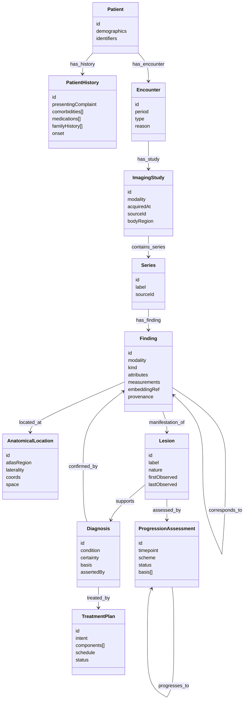

# Connectome — Data Model Reference (diagrams + attributes)

The attribute-level reference and the visual model. Pairs with `04` (entities) and `05`
(graph/edges).

## Class / ER diagram (entities & relationships)

## Attribute reference

### Shared (all nodes & edges)
| Attribute | Type | Notes |
|---|---|---|
| `id` | string | stable domain id (deterministic from source) |
| `source` | string | originating system/MCP server |
| `asserted_by` | enum | `human` \| `algorithm` \| `embedding` |
| `method` | string | how produced (e.g. "manual read", "seg-v2", "ANN cosine") |
| `confidence` | float 0–1 | trust score |
| `timestamp` | datetime | when asserted |

### Finding (most detailed node)
| Attribute | Type | Notes |
|---|---|---|
| `modality` | enum | MRI \| CT \| Ultrasound \| Histology |
| `kind` | code | SNOMED CT / RadLex (e.g. "ring-enhancing mass") |
| `attributes` | map<code,value> | modality-specific (signal, density, echogenicity, grade…) |
| `measurements` | map | volume, diameter, HU, ADC, Doppler velocity, mitotic count… |
| `embeddingRef` | ref | `{model, dim, vectorRef}` into the L1 vector index (vector not stored in graph) |
| `seriesId` | ref | parent Series |
| `locationId` | ref | AnatomicalLocation |

### Edge attributes of note
| Edge | Extra attributes |
|---|---|
| `manifestation_of` | `status` (confirmed\|candidate) |
| `corresponds_to` | `status`, `mechanism` (1–5 per `06`) |
| `supports` / `confirmed_by` | `basis` |
| `progresses_to` | `interval`, `deltaMeasurements` |

## Status & trust enums

- `status`: `confirmed` \| `candidate`
- `asserted_by`: `human` \| `algorithm` \| `embedding`
- `mechanism` (for `corresponds_to`): `lesion` \| `location` \| `registration` \|
  `temporal` \| `embedding` (see `06`)

## Mapping back to standards

Each node projects to FHIR/DICOM as tabulated in `04`. The graph edges correspond to
FHIR references, so the whole model can be exported to a FHIR-native store or expressed
as RDF/OWL triples (node=subject, edge=predicate, properties=reified statements) without
information loss.

## Worked instance

A concrete instantiation of this model — one patient, four modalities, one lesion through
time — is in `samples/connectome/` (`patient-example.json` + `correlation-graph.md`).
