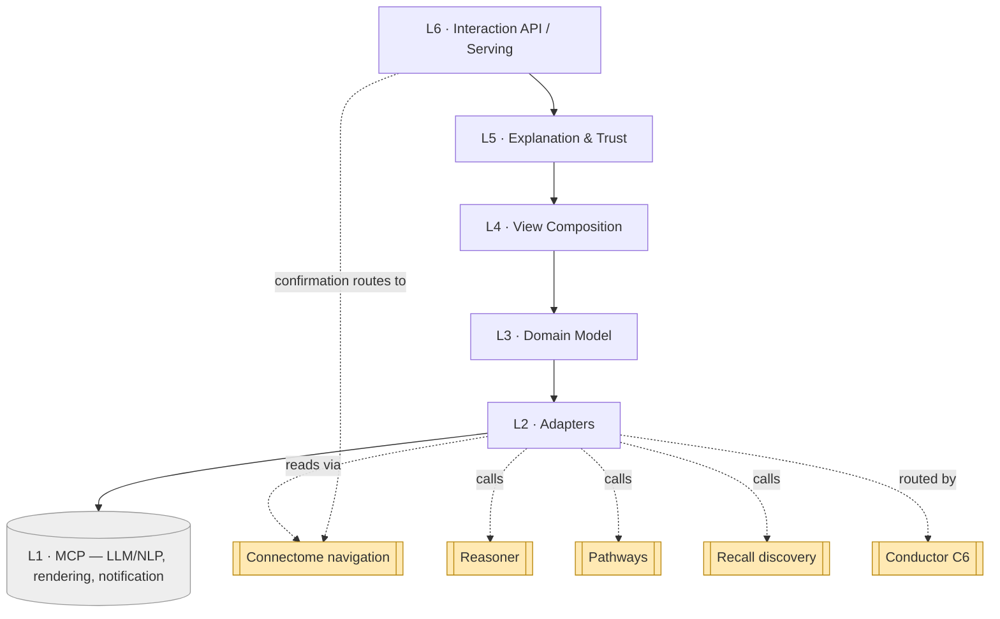
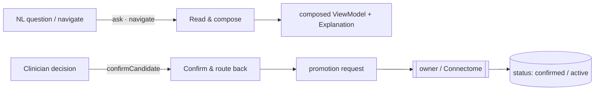

# Console — Layered Architecture (L1–L6)

Console runs every clinician interaction over one six-layer scaffold.
**Each layer depends only on the one directly below it.** The bottom is external MCP
servers (LLM/NLP, rendering); the top exposes the interaction API and routes the
clinician's confirmations back to the owning components.

## The stack

| # | Layer | Responsibility | Spec |
|---|-------|----------------|------|
| **L6** | **Interaction API / Serving** | entry points `ask` / `navigate` / `confirmCandidate` / `draftReport`; route candidate→confirmed promotion back to owner/Connectome (Sentinel-governed) | `07` |
| **L5** | **Explanation & Trust** | render evidence/provenance, distinguish confirmed vs candidate, apply the trust profile, generate grounded explanations, draft reports | `06` |
| **L4** | **View Composition** | assemble multi-component results into one coherent view (lesion dashboard = navigation + differential + plan + timeline) | `05` |
| **L3** | **Domain Model** | `Session`, `Query`(intent), `ViewModel`, `Explanation`, `ReportDraft`, `ConfirmationAction`, `TrustProfile` | `04` |
| **L2** | **Adapters** | intent adapter (LLM intent → structured sibling requests) + view-model adapter (results → view models). **Sibling + MCP calls happen here**, often via **Conductor** (C6) | `03` |
| **L1** | **Capability (MCP servers)** | **LLM/NLP** (intent parse + NL generation), **rendering/report**, optional **notification**. *External.* | `02` |

## The dependency rule

- **Allowed:** L(n) calls L(n−1). Explanation (L5) explains what Composition (L4) assembled;
  the API (L6) serves what L5 produced.
- **Forbidden:** skipping layers or calling upward. L6 never calls the LLM directly — it
  serves the explained, composed result. L4 never calls Reasoner directly — it composes the
  view models L2 already produced.
- **External touch is at L2 only:** L2 calls the L1 MCP servers (LLM/NLP, rendering) **and**
  reaches the sibling components (reads Connectome, calls Reasoner / Pathways / Recall),
  usually via **Conductor**. Above L2 everything works on assembled in-memory view models.

## Two interaction modes, one scaffold

Console serves two kinds of interaction over the same L1–L6 layers:

- **Read** (`ask` / `navigate` / `draftReport`) descends L6→L1: parse intent, gather from
  siblings, compose, explain, serve.
- **Confirm** (`confirmCandidate`) takes the clinician's decision on a presented candidate
  and routes the promotion back to the owner — Console requests, the owner/Connectome
  writes, **Sentinel** (C8) governs.

Both share the same scaffold; only L4–L6 operations differ. Keeping one stack means the
intent/composition/explanation machinery is built once and reused by every interaction.

## Cross-component inputs (a note on L2)

Like Reasoner and Pathways, Console is a **consumer**: its content comes from sibling
components, gathered at L2 (`03`):

- **Connectome** — the navigation journeys (cross-modal findings, history, timeline)
  (`docs/components/connectome/07-navigation-and-queries.md`).
- **Reasoner** — the differential + candidate `Diagnosis` + next test
  (`docs/components/reasoner/07-proposal-and-handoff.md`).
- **Pathways** — the candidate / active `TreatmentPlan` + `ProgressionAssessment` timeline
  (`docs/components/pathways/07-proposal-and-monitoring.md`).
- **Recall** — embedding-backed discovery (similar findings / cases).

These are sibling-component dependencies, distinct from the L1 MCP servers (LLM/NLP,
rendering). Multi-step gathering is typically **routed by Conductor** (C6). Console writes
nothing directly; it routes confirmations through L6.

## How an interaction flows (illustrative)

- **Ask:** *"what's going on with pat-001's left frontal lesion?"* → L2 parses intent (LLM)
  → gathers Connectome cross-modal findings (`find-mri-001`/`ct`/`us`/`histo-001`),
  Reasoner differential (candidate `dx-001`), Pathways plan `tx-001` + timeline
  `prog-001`→`prog-002` → L4 composes a **lesion dashboard** → L5 marks confirmed vs
  candidate + explains → L6 serves it.
- **Confirm:** clinician confirms candidate `dx-001` (and `tx-001`) → L6 `confirmCandidate`
  routes the promotion to Reasoner/Connectome (dx) and Pathways/Connectome (plan);
  Sentinel-governed → `dx-001` becomes `confirmed`, `tx-001` becomes `active`.

Layer-to-doc map: L1→`02`, L2→`03`, L3→`04`, L4→`05`, L5→`06`, L6→`07`; cross-cutting →
`08`, `09`.
