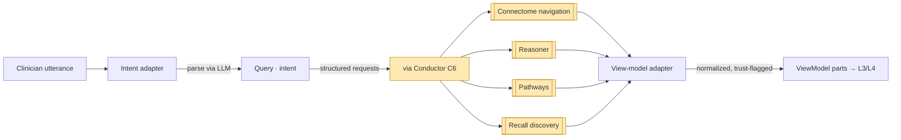

# Console — Adapters (L2)

L2 is the **only** layer that reaches outside Console. It has two adapters and one rule:
turn the LLM's parsed intent into **structured requests** to sibling components, and turn
their results into **view models** the layers above can compose. **Every** call to an MCP
server (LLM/NLP, rendering) and to a sibling component (Connectome, Reasoner, Pathways,
Recall) happens here — typically **routed by Conductor** (C6).

## Two adapters

### Intent adapter — utterance → structured request
Calls the **LLM/NLP** MCP server to parse the clinician's free text into a `Query` (`04`):
the **intent** (navigate / explain / discover / confirm / report), the **subject**
(patient/lesion/finding/diagnosis, resolved to graph IDs via terminology), the **scope**,
and a **trust-profile hint**. It then maps that `Query` to one or more concrete
sibling-component requests — it does **not** answer the question itself.

| Parsed intent | Maps to request(s) |
|---|---|
| *navigate* / *explain a lesion* | Connectome journeys A (cross-modal), B (history→dx), C (dx→plan), D (timeline) |
| *what's the diagnosis / why* | Reasoner `explainDiagnosis` / the differential proposal |
| *what's the plan / is it working* | Pathways plan + `ProgressionAssessment` timeline |
| *find similar / what else looks like this* | Recall discovery (journeys F, G, H) |
| *confirm this candidate* | a `ConfirmationAction` → L6 routing (`07`) |
| *draft a report* | a `draftReport` composition over the assembled view |

### View-model adapter — results → view models
Takes each sibling result and normalizes it into a **trust-flagged view-model part**: every
node/edge keeps its `status` (`confirmed` | `candidate`) and provenance (`asserted_by`,
`confidence`, `method`, `timestamp`) so L4 can compose and L5 can mark and explain. It
strips transport detail and binds everything to graph IDs — nothing reaches L3+ untyped.

## Sibling-call map

| Sibling | Console asks for | Surface / journey | Doc |
|---|---|---|---|
| **Connectome** (C1) | cross-modal findings, history, dx→plan, lesion timeline | navigation journeys A–E (+ trust filter) | `docs/components/connectome/07-navigation-and-queries.md` |
| **Connectome / Recall** | discovery (similar findings / cases / text) | journeys F, G, H (candidates) | same + `docs/components/recall/` |
| **Reasoner** (C4) | differential, candidate `Diagnosis`, next test, rationale | `reasonCase` / `explainDiagnosis` | `docs/components/reasoner/07-proposal-and-handoff.md` |
| **Pathways** (C5) | candidate/active `TreatmentPlan`, `ProgressionAssessment`s | `planTreatment` (read) / timeline | `docs/components/pathways/07-proposal-and-monitoring.md` |
| **Conductor** (C6) | routing of multi-step gathers + events | the agent loop / dispatch | C6 (orchestration service) |

## Trust profile flows down here

The `Query` carries the chosen **trust profile** (strict vs exploratory, `06`). L2 passes it
**into the traversal** so Connectome enforces it (`WHERE status IN [...]`,
`asserted_by = human`) and so Recall discovery is only included under the exploratory
profile. The profile is set here, applied in the graph, and *displayed* at L5 — Console
never silently mixes trust levels.

## Why sibling calls live at L2

Per the dependency rule (`01`), only L2 touches L1 and siblings. Above L2, view composition
(L4) and explanation (L5) work purely on the assembled, trust-flagged view models — they
never re-query the graph or call the LLM. This keeps the upper layers deterministic over a
fixed snapshot of evidence and isolates all external coupling (provider/registry swaps,
Conductor routing) to a single layer.
