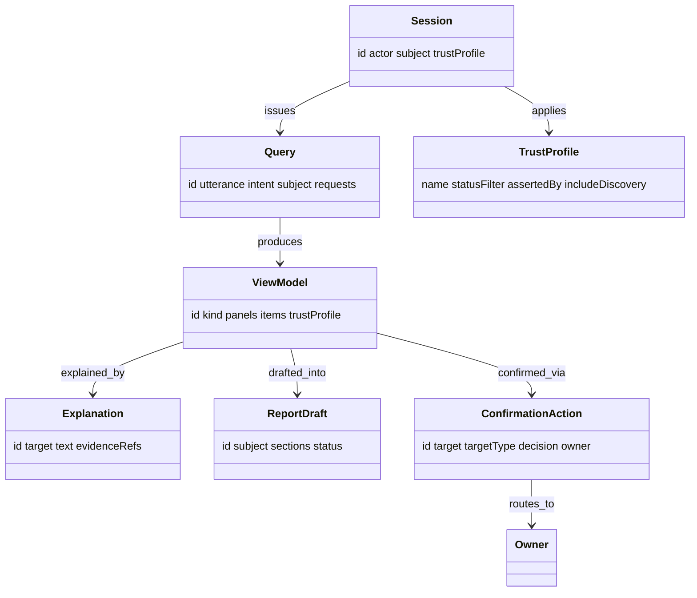

# Console — Domain Model (L3)

L3 defines Console's vocabulary: the **session**, the **parsed question**, the **composed
view**, the **explanation**, the **report**, and the **confirmation action** — plus the
**trust profile** that threads through them all. Everything above L3 speaks this; nothing
above L2 makes live graph/sibling/MCP calls.

## Interaction entities

### Session
One clinician interaction context — who, what they're looking at, the active trust profile.
- **Attributes:** `id`, `actor` (clinician identity, for audit), `subject` (patient /
  lesion / case in focus), `trustProfile` (`strict` | `exploratory`), `startedAt`,
  `history[]` (prior queries/actions in the session).

### Query
A parsed natural-language question — the structured **intent** the intent adapter (`03`)
produced from the utterance.
- **Attributes:** `id`, `utterance` (raw text), `intent` (`navigate` | `explain` |
  `discover` | `confirm` | `report`), `subject` (resolved graph ID), `scope`,
  `trustProfile`, `requests[]` (the sibling requests it mapped to).

### ViewModel
A composed, trust-flagged answer assembled from one or more sibling results (`05`). The unit
the renderer and the explainer consume.
- **Attributes:** `id`, `kind` (e.g. `lesion-dashboard` | `timeline` | `differential` |
  `discovery`), `panels[]` (each panel a typed slice: findings, differential, plan,
  timeline), `items[]` carrying per-item `status` (`confirmed` | `candidate`) + provenance,
  `trustProfile`, `sources[]` (refs to the sibling results used).

### Explanation
A grounded, NL rationale for a presented item, generated from cited evidence (`06`).
- **Attributes:** `id`, `target` (the item explained), `text` (LLM-generated, constrained
  to evidence), `evidenceRefs[]` (findings / criteria / precedent / edges cited),
  `confidence`, `asserted_by` (`algorithm`), `method`.

### ReportDraft
A structured clinical summary grounded in graph evidence (`08`).
- **Attributes:** `id`, `subject`, `template`, `sections[]` (each with text + `evidenceRefs[]`),
  `status` (`draft` — never auto-finalized), `generatedAt`, `evidenceTrail[]`.

### ConfirmationAction
The clinician's decision on a presented candidate — what Console **routes back** (`07`).
- **Attributes:** `id`, `actor`, `target` (candidate ID, e.g. `dx-001`), `targetType`
  (`diagnosis` | `treatmentPlan` | `correlation` | `discovery`), `decision` (`confirm` |
  `reject`), `owner` (component the promotion routes to), `rationale`, `timestamp`.

### TrustProfile
The strict-vs-exploratory filter, set per session/query, applied in the traversal and the
display.
- **Attributes:** `name` (`strict` | `exploratory`), `statusFilter` (`[confirmed]` vs
  `[confirmed, candidate]`), `assertedBy` (`human` for strict), `includeDiscovery` (bool).

## Target / borrowed entities *(read from siblings — not authored here)*

Console **reads** these via L2 and presents them; it does not own or write them:

| Entity | Owner | Read for |
|---|---|---|
| `Finding`, `Lesion`, edges | Connectome (C1) | cross-modal panel, timeline |
| `Diagnosis` (+ differential) | Reasoner (C4) | differential panel, confirmation target |
| `TreatmentPlan` | Pathways (C5) | plan panel, confirmation target |
| `ProgressionAssessment` | Pathways (C5) | timeline panel |
| discovery candidates | Recall (C3) | discovery panel (exploratory only) |

## Relationships

## Shared attributes

`id`, `actor` (for audit), `timestamp`, and — on generated content (`Explanation`,
`ReportDraft`) — `asserted_by` (`algorithm`), `method`, `evidenceRefs[]`. Presented items
always carry the **borrowed** `status` (`confirmed` | `candidate`) and provenance from their
source; Console never changes them, it only displays and (via `ConfirmationAction`)
**requests** their promotion. Full attribute reference and diagrams in `09`.
