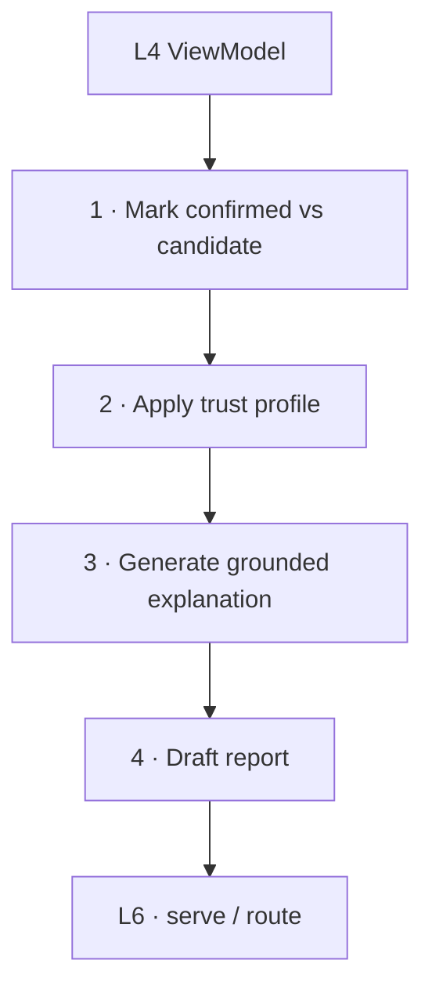
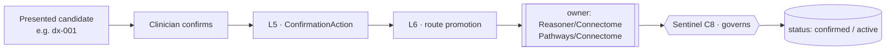

# Console — Explanation & Trust (L5)

L5 is where a composed `ViewModel` (L4) becomes **trustworthy to a human**: it renders the
evidence and provenance, **marks confirmed vs candidate**, applies the **trust profile**,
generates **grounded explanations**, and drafts **reports**. It calls only L4 — and, for
wording, the LLM via the L2 boundary it was handed (it never re-queries the graph).

## Four jobs

## 1 · Confirmed vs candidate — always distinct

Every presented item carries a borrowed `status`:

- **confirmed** — `status = confirmed`, typically `asserted_by = human` (e.g. the
  histology-confirmed `manifestation_of` edges, an active `tx-001`).
- **candidate** — machine-proposed and not yet human-confirmed: a candidate `Diagnosis`
  (`dx-001` pre-confirmation), a candidate `ProgressionAssessment`, a discovered correlation.

L5 attaches a **trust flag** to each item so the renderer styles it distinctly (badges /
muting / a "candidate" rail — see `08`). This is non-negotiable across the stack: a clinician
must never mistake a candidate for confirmed fact
(`docs/components/connectome/07-navigation-and-queries.md`).

## 2 · Trust profile — strict vs exploratory

The profile (set at the session/query, `04`; enforced in the traversal at `03`) decides what
is *shown* and how:

| Profile | Shows | Use |
|---|---|---|
| **strict** | `confirmed` only (`asserted_by = human`) | clinical **decisions** — sign-off, orders, the record |
| **exploratory** | `confirmed` **+ candidate + discovery** (all flagged) | **hypothesis generation** — "what else could this be?" |

Under strict, the unconfirmed `dx-001`, candidate assessments and Recall discoveries are
withheld or collapsed; under exploratory they appear, clearly marked. The profile is
displayed too, so the clinician always knows which lens they are looking through.

## 3 · Grounded explanation

For any item, L5 produces an `Explanation` (`04`) by handing the **cited evidence** to the
LLM and asking it to *word* the rationale — not to supply facts:

- **Input:** the item + its `evidenceRefs[]` (findings, criteria results, precedent, edges)
  drawn from the sibling result (e.g. Reasoner's `supporting`/`refuting`/`criteriaResults`,
  `docs/components/reasoner/07-proposal-and-handoff.md`).
- **Constraint:** generation is bounded to the supplied evidence — the model may not assert a
  finding, criterion, or claim that isn't in the bundle. Every sentence traces to an
  `evidenceRef`.
- **Output:** prose + the citation list + provenance (`asserted_by: algorithm`, `method`,
  `confidence`).

> Example: *"High-grade glioma is the leading **candidate**: ring enhancement with rim
> diffusion restriction (`find-mri-001`) and mass effect (`find-ct-001`), concordant with
> precedent `pat-417`; WHO-CNS5 grade is **indeterminate** pending tissue — biopsy is the
> recommended next test."* Each clause cites graph evidence; the candidate status is explicit.

## 4 · Report drafting

L5 assembles a `ReportDraft` (templates in `08`): per-section text, each grounded in
`evidenceRefs[]`, `status: draft`. Reports never auto-finalize and never include an
unconfirmed item as fact — candidates appear, if at all, labeled as such. The draft is the
clinician's to edit and sign.

## The confirmation flow (read here, routed at L6)

When the clinician acts on a presented candidate, L5 packages a `ConfirmationAction` (`04`)
— *what* candidate, *which* owner it belongs to, confirm or reject, with rationale — and
hands it to L6, which **routes the promotion back** to the owning component / Connectome.

Console **relays** the human decision; it never confirms on its own and never writes the
graph. The owner promotes, Connectome persists, **Sentinel** (C8) governs the provenance of
the change (`07`).

## Layer dependency recap

L5 calls **only L4** (and uses the LLM for wording through the boundary set at L2). It never
queries a sibling or the graph directly — the evidence it explains is already in the composed
`ViewModel`, preserving the dependency rule (`01`).
