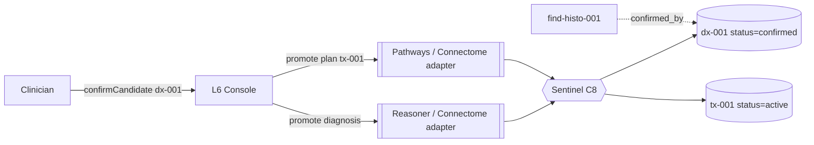

# Console — Interaction API / Serving (L6)

L6 is Console's outward face: the entry points clinicians (and **Conductor**, C6) call, and
the layer that **routes a confirmed candidate's promotion back** to its owning component /
Connectome. It calls only L5 — it never touches the LLM, the graph, or a sibling directly.

## Entry points (conceptual — design-level)

| Entry point | Purpose | Returns |
|---|---|---|
| `ask(utterance, trustProfile)` | full pipeline: parse intent → gather → compose → explain → serve | composed, explained `ViewModel` |
| `navigate(subject, journey, trustProfile)` | direct navigation (a Connectome journey) without NL | `ViewModel` (e.g. timeline, cross-modal) |
| `confirmCandidate(candidateId, decision, rationale)` | relay the clinician's confirm/reject → **route promotion back** | a routed `ConfirmationAction` + outcome |
| `draftReport(subject, template)` | compose + generate a grounded `ReportDraft` | `ReportDraft` (`status: draft`) |

These are the surface **Console**'s UI binds to and that **Conductor** (C6) calls when
routing a multi-step or event-driven interaction.

## The confirmation handoff contract (relay, don't persist)

Per the boundary rule (`00`), `confirmCandidate` does **not** write the graph. It routes the
clinician's decision to the **owning component**, which performs the promotion; Connectome
persists; **Sentinel** (C8) governs.

| Candidate type | Routes to | Becomes |
|---|---|---|
| `Diagnosis` (e.g. `dx-001`) | Reasoner / Connectome (`docs/components/reasoner/07-proposal-and-handoff.md`) | `status: confirmed` |
| `TreatmentPlan` (e.g. `tx-001`) | Pathways / Connectome (`docs/components/pathways/07-proposal-and-monitoring.md`) | `status: active` |
| `ProgressionAssessment` | Pathways / Connectome | signed-off on the timeline |
| correlation / discovery | Connectome / Recall (`docs/components/connectome/07-navigation-and-queries.md`) | confirmed edge |

A **reject** is routed the same way (the candidate is dismissed / superseded with provenance
kept). Either way the human decision and its rationale are audited by Sentinel.

## Why human-confirmed, surfaced here

Confirmation is the highest-stakes human action in the stack — it turns a machine proposal
into the record. Reasoner and Pathways deliberately stop at **proposal**; Console is where
the human sees the evidence, the alternatives, and the uncertainty, and **owns the
decision**. Console makes the decision *possible and informed*; it never makes it.

## What L6 does *not* do

- It does not **persist** (Connectome) or **promote** the candidate itself (the owner does).
- It does not **diagnose** (Reasoner C4), **plan/monitor** (Pathways C5), or **discover**
  (Recall C3) — it serves their results.
- It does not **schedule** itself or run the agent loop — **Conductor** (C6) calls these
  entry points and wires events (e.g. a new `prog-002` → notify).
- It does not **auto-confirm** — every promotion originates from a human `confirmCandidate`.

## Idempotency

- Re-running `ask`/`navigate` for the same subject re-composes over the current graph
  snapshot — no side effects (reads only).
- `confirmCandidate` is keyed to the candidate + decision; a repeated confirm is a no-op once
  the owner has promoted (provenance kept, Sentinel-governed) — never a double write.
- `draftReport` produces a fresh `ReportDraft`; nothing is finalized without a human signing
  it.
