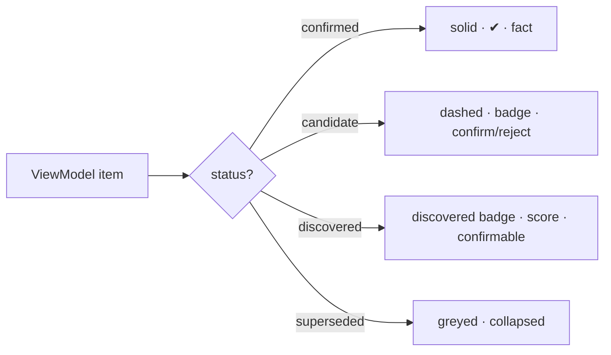

# Console — Presentation & Reports (cross-cutting)

Two cross-cutting concerns that span the layers: **how trust is shown** (so confirmed and
candidate are never confused) and **how reports are templated** (so every drafted document
is grounded). These pair with L5 (`06`) and the rendering MCP capability (`02`).

## Trust display patterns

The rule (stack-wide): **confirmed and candidate/discovered items are always visually
distinct** (`docs/components/connectome/07-navigation-and-queries.md`). L5 attaches the trust
flag; the renderer applies one of these patterns from it.

| State | Meaning | Display pattern |
|---|---|---|
| **confirmed** | `status = confirmed`, `asserted_by = human` | solid / primary styling; ✔ badge; counts as fact |
| **candidate** | machine-proposed, awaiting human confirm | dashed / muted; "candidate" badge; **confirm / reject** affordance |
| **discovered** | embedding-backed (Recall), exploratory only | distinct "discovered" badge + similarity score; confirmable |
| **superseded** | replaced, provenance kept | greyed, collapsed by default; reachable via history |

Supporting conventions:

- **Provenance on hover/expand** — `asserted_by`, `method`, `confidence`, `timestamp`, and
  the `evidenceRefs[]` behind any item are one interaction away.
- **Trust-profile banner** — the active profile (**strict** / **exploratory**, `06`) is shown
  on the view; under strict, candidate/discovered items are withheld or collapsed, not just
  restyled.
- **Confidence shown, not hidden** — calibrated confidence (e.g. differential `0.62`) is
  surfaced next to candidates, never laundered into apparent certainty.
- **Candidate actions are explicit** — confirming routes back via `confirmCandidate` (`07`);
  the UI never lets a candidate quietly become fact.

## Report templates

A `ReportDraft` (`04`) is assembled by L5 and rendered via the report MCP capability. Every
section is **grounded** — its text carries `evidenceRefs[]` into the graph — and the draft is
**never auto-finalized** (`status: draft`, a human signs).

### Lesion case report *(the worked template)*

| Section | Sourced from | Grounding |
|---|---|---|
| **Header** | patient `pat-001`, lesion `les-001` | demographics + lesion identity |
| **History** | `hist-001` | presenting complaint, comorbidities |
| **Imaging / cross-modal findings** | `find-mri-001`, `find-ct-001`, `find-us-001` | per-modality findings + measurements |
| **Pathology** | `find-histo-001` | grade-4 confirmation |
| **Diagnosis** | `dx-001` | **confirmed** condition + basis (candidate state shown if not yet confirmed) |
| **Treatment plan** | `tx-001` | components + intent + rationale |
| **Progression** | `prog-001` → `prog-002` | RANO verdicts + interval; the timeline |
| **Provenance footer** | all of the above | evidence trail + assertion/confidence per item |

### Templating rules

1. **Cite or omit** — a sentence with no `evidenceRef` is not written.
2. **Respect trust** — confirmed items read as fact; a candidate appears only if labeled
   "candidate" (strict reports may exclude candidates entirely).
3. **Show the timeline** — longitudinal findings and assessments are reported in order, not
   collapsed to a single snapshot.
4. **Draft, not record** — the report is a starting point for the clinician to edit and sign;
   Console does not author the medical record.

Other templates (progression summary, MDT discussion brief, referral letter) reuse the same
section/grounding machinery; only the section set differs.
