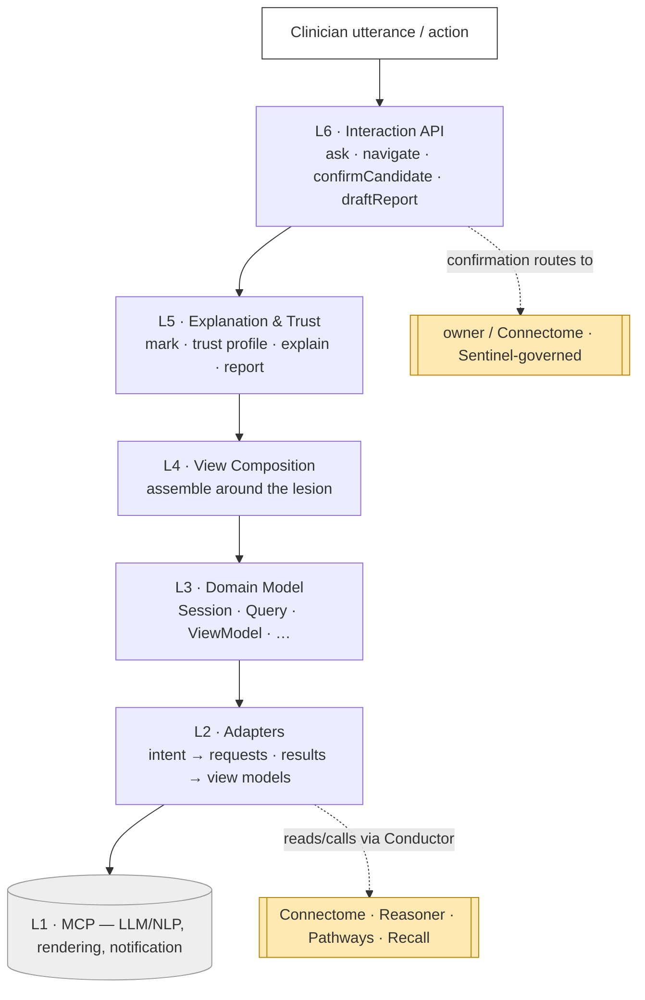
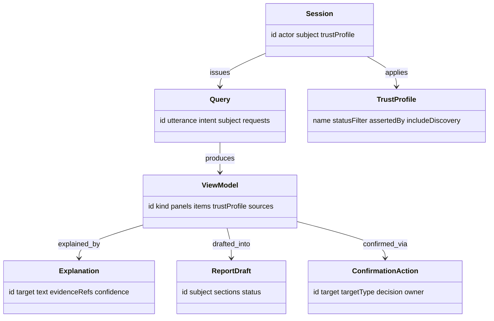

# Console — Reference (diagrams + attributes)

The visual model and attribute-level reference. Pairs with `04` (entities) and `05`–`07`
(composition / explanation & trust / interaction API).

## End to end

## Data shapes

## Attribute reference

### Query / ViewModel
| Attribute | Type | Notes |
|---|---|---|
| `Query.intent` | enum | `navigate` \| `explain` \| `discover` \| `confirm` \| `report` |
| `Query.trustProfile` | enum | `strict` \| `exploratory` |
| `ViewModel.kind` | enum | `lesion-dashboard` \| `timeline` \| `differential` \| `discovery` \| `report-preview` |
| `ViewModel.items[].status` | enum | `confirmed` \| `candidate` (borrowed from source) |
| `ViewModel.sources` | ref[] | the sibling results composed |

### Explanation / ReportDraft
| Attribute | Type | Notes |
|---|---|---|
| `Explanation.evidenceRefs` | ref[] | findings / criteria / precedent / edges cited |
| `Explanation.text` | string | LLM-generated, constrained to evidence |
| `ReportDraft.sections[]` | obj[] | each: text + `evidenceRefs[]` |
| `ReportDraft.status` | enum | `draft` (never auto-finalized) |

### ConfirmationAction
| Attribute | Type | Notes |
|---|---|---|
| `targetType` | enum | `diagnosis` \| `treatmentPlan` \| `correlation` \| `discovery` |
| `decision` | enum | `confirm` \| `reject` |
| `owner` | enum | component the promotion routes to (Reasoner / Pathways / Connectome / Recall) |

### Shared provenance
`id`, `actor` (audit), `timestamp`; on generated content `asserted_by` (`algorithm`),
`method`, `evidenceRefs[]`. Presented items keep their **source** `status` + provenance;
Console displays and **requests** promotion, it never writes.

## Enumerations

| Enum | Values |
|---|---|
| `Query.intent` | `navigate`, `explain`, `discover`, `confirm`, `report` |
| `TrustProfile.name` | `strict`, `exploratory` |
| item `status` | `confirmed`, `candidate`, `discovered`, `superseded` |
| `ConfirmationAction.targetType` | `diagnosis`, `treatmentPlan`, `correlation`, `discovery` |
| `ConfirmationAction.decision` | `confirm`, `reject` |
| `ReportDraft.status` | `draft` |

## Worked instance

A concrete run — a clinician asks *"what's going on with `pat-001`'s left frontal lesion?"*,
Console composes the lesion dashboard (cross-modal findings + candidate `dx-001` differential
+ recommended biopsy + plan `tx-001` + `prog-001`→`prog-002` timeline) with confirmed vs
candidate marked, the clinician **confirms** `dx-001` and `tx-001`, and the promotions route
back — is in `samples/console/`, matching the Connectome / Reasoner / Pathways case.
