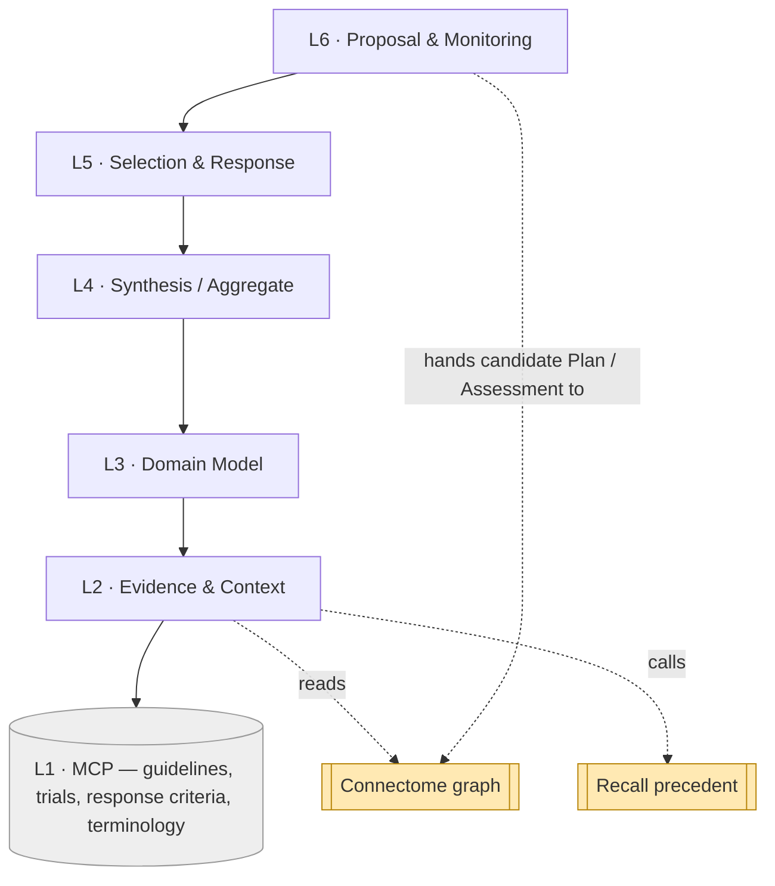
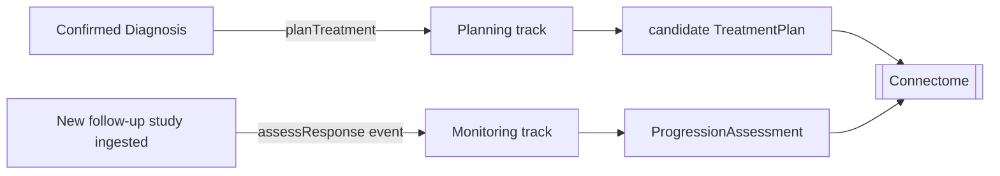

# Pathways — Layered Architecture (L1–L6)

Pathways runs **two tracks** — Planning and Monitoring — over one six-layer scaffold.
**Each layer depends only on the one directly below it.** The bottom is external MCP
servers; the top hands plans and assessments to Connectome.

## The stack (both tracks)

| # | Layer | Planning track | Monitoring track | Spec |
|---|-------|----------------|------------------|------|
| **L6** | **Proposal & Monitoring** | produce candidate `TreatmentPlan` → Connectome (MDT confirms); entry `planTreatment` | event-driven `ProgressionAssessment` → Connectome timeline; entry `assessResponse` | `07` |
| **L5** | **Selection & Response** | rank options, check eligibility, build rationale, calibrate | apply response criteria (RANO/McDonald) deterministically over the comparison | `06` |
| **L4** | **Synthesis / Aggregate** | generate treatment options (guideline + precedent + trials) → assemble a coherent plan | assemble the baseline↔follow-up comparison set | `05` |
| **L3** | **Domain Model** | `PlanningCase`, `TreatmentOption`, `GuidelineMatch`, `TrialMatch`, `TreatmentPlan` | `MonitoringTask`, `ResponseAssessment` → `ProgressionAssessment` | `04` |
| **L2** | **Evidence & Context** | read Connectome (diagnosis/lesion/history/prior plan/timeline); call **Recall** (treated-case precedent); load guidelines/trials/criteria | `03` |
| **L1** | **Capability (MCP servers)** | **guideline KB**, **clinical-trial registry/matching**, **response-criteria KB**, **terminology**. *External.* | `02` |

## The dependency rule

- **Allowed:** L(n) calls L(n−1). Selection (L5) ranks the options Synthesis (L4) built;
  Proposal (L6) packages the L5 result.
- **Forbidden:** skipping layers or calling upward. L6 never calls a guideline server
  directly — it consumes what synthesis + selection produced.
- **External touch is at L2 only:** L2 calls the L1 MCP servers and reaches the sibling
  components (reads Connectome, calls Recall). Above L2 everything works on the assembled
  in-memory context.

## Two triggers, two tracks

- **Planning** fires once, when a diagnosis is confirmed (by Reasoner→human, or directly).
- **Monitoring** fires every time a follow-up study lands (the event-driven decision),
  producing the next point on the lesion's progression timeline.

Both descend the same L1–L5; only L4–L6 operations differ. Keeping one scaffold means the
guideline/criteria/precedent machinery is built once and reused by both.

## Cross-component inputs (a note on L2)

Like Reasoner, Pathways is a **consumer**: its evidence comes from sibling components,
gathered at L2 (`03`):
- **Connectome** — confirmed `Diagnosis`, the `Lesion`, history, prior `TreatmentPlan`, the
  `ProgressionAssessment` timeline.
- **Recall** — `discoverSimilarCases` filtered to **treated** cases, for outcome precedent.

These are sibling-component dependencies, distinct from the L1 MCP servers. Pathways writes
Connectome only through the candidate handoff at L6.

## How a case flows (illustrative)

- **Plan:** confirmed `dx-001` (high-grade glioma) → L2 gathers diagnosis + guidelines +
  trials + precedent → L4 builds options → L5 selects "resection → chemoradiation →
  adjuvant" + a trial match → L6 proposes candidate `tx-001` → MDT confirms.
- **Monitor:** post-op MRI ingested → `assessResponse` → L5 applies RANO → `prog-001`
  (stable); months later a follow-up MRI → RANO → `prog-002` (progression).

Layer-to-doc map: L1→`02`, L2→`03`, L3→`04`, L4→`05`, L5→`06`, L6→`07`; cross-cutting →
`08`, `09`.
