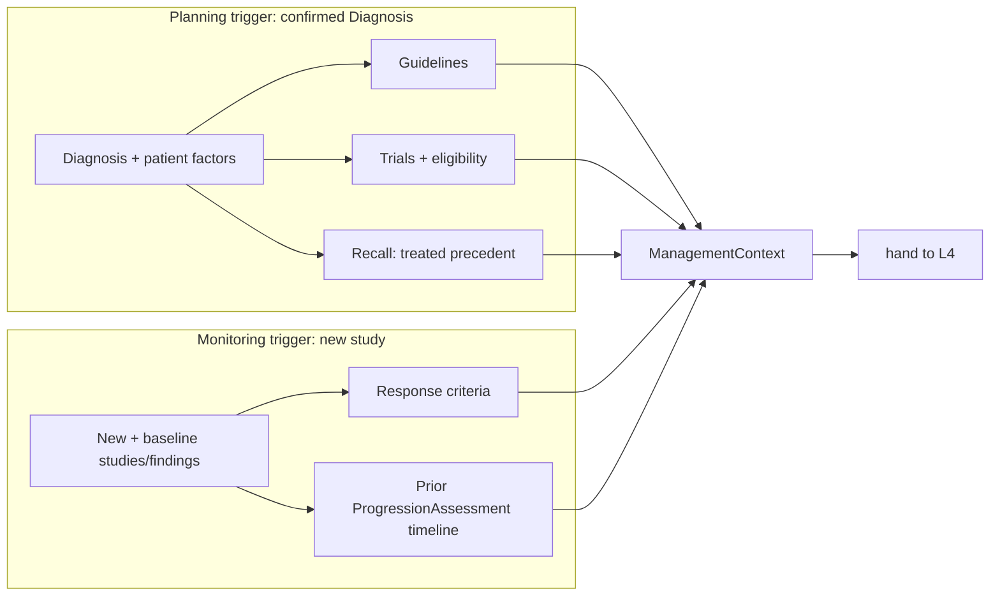

# Pathways — Evidence & Context (L2)

L2 assembles the **management context** both tracks reason over. It is the only layer that
reaches outward — to the L1 MCP servers **and** to the sibling components Connectome and
Recall. Above L2, planning and monitoring work on the assembled context, not live calls.

> L2 **gathers and grounds**; it does not plan or assess. No option ranking, no criteria
> scoring here — just collect, code, and shape into a `ManagementContext`.

## What L2 gathers

| Source | Via | Yields |
|---|---|---|
| **Connectome graph** | read | confirmed `Diagnosis`, the `Lesion`, history, prior `TreatmentPlan`, the `ProgressionAssessment` timeline, relevant `Finding`s/measurements |
| **Recall** | `discoverSimilarCases` (treated) | similar **treated** cases + their regimens & outcomes (precedent) |
| **Guideline KB** (MCP) | load | guidelines applicable to the coded diagnosis + patient factors |
| **Trial registry** (MCP) | query | candidate trials + eligibility for the patient profile |
| **Response-criteria KB** (MCP) | load | the response scheme(s) for monitoring (RANO/McDonald) |
| **Terminology** (MCP) | code | normalized codes across all of the above |

## Track-specific gathering

- **Planning** pulls the diagnosis, patient factors (age/performance status/biomarkers from
  history & findings), applicable guidelines, eligible trials, and treated-case precedent.
- **Monitoring** pulls the new study's measurable findings, the baseline it compares to, the
  prior timeline, and the response criteria to apply.

## Output: the ManagementContext

One grounded context handed to L4:

| Part | Contents |
|---|---|
| `diagnosis` | the confirmed diagnosis (planning) |
| `patientFactors` | age, performance status, biomarkers, comorbidities |
| `guidelines[]` | applicable guideline matches |
| `trials[]` | candidate trials + eligibility |
| `precedent[]` | similar treated cases + outcomes (Recall) |
| `comparison` | baseline↔follow-up findings/measurements (monitoring) |
| `responseCriteria` | the scheme(s) to apply (monitoring) |
| `priorPlan` / `timeline` | existing plan & assessments |
| `codes` | normalized terminology |

## Grounding contract

Every element is **traceable** to its source (Connectome node / Recall result / KB entry),
so downstream each plan element can cite its guideline/trial/precedent and each response
assessment can point at the measurements that drove it. L2 never mutates Connectome; the
only write is the candidate handoff at L6.
