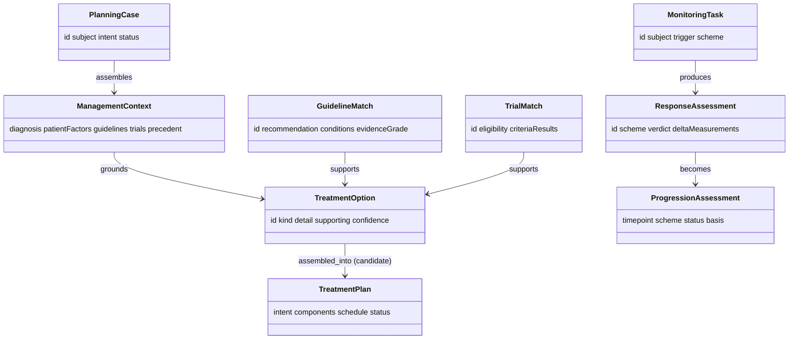

# Pathways — Domain Model (L3)

L3 defines Pathways' vocabulary across both tracks, plus the **target output types** it
shares with Connectome. Everything above L3 speaks this; nothing above L2 makes live
graph/Recall/MCP calls.

## Planning-track entities

### PlanningCase
One planning task, anchored on a confirmed diagnosis.
- **Attributes:** `id`, `subject` (diagnosisId / lesionId / patientId), `intent`
  (curative | palliative | …), `status`, `createdAt`.

### ManagementContext
The grounded context from L2 (`03`) — diagnosis, patient factors, guidelines, trials,
precedent, prior plan/timeline, codes. Every element carries a `ref` to its source.

### GuidelineMatch
A guideline recommendation matched to this case.
- **Attributes:** `id`, `guidelineId`, `recommendation`, `conditions` (met?), `evidenceGrade`,
  `evidenceRefs[]`.

### TrialMatch
An eligible (or near-eligible) clinical trial.
- **Attributes:** `id`, `trialId`, `eligibility` (`eligible` | `ineligible` | `unknown`),
  `criteriaResults[]` (per eligibility item + evidence), `rationale`.

### TreatmentOption
One candidate therapy element, grounded.
- **Attributes:** `id`, `kind` (surgery | radiotherapy | systemic | trial | surveillance),
  `detail`, `supporting[]` (guideline/precedent/trial refs), `tradeoffs`, `confidence`.

## Monitoring-track entities

### MonitoringTask
One response-assessment, triggered by a new study.
- **Attributes:** `id`, `subject` (lesionId), `trigger` (studyId), `scheme` (RANO/McDonald),
  `status`, `at`.

### ResponseAssessment
The computed response verdict (becomes a `ProgressionAssessment`).
- **Attributes:** `id`, `scheme`, `verdict` (stable | response | progression | recurrence |
  pseudo-progression), `criteriaResults[]`, `deltaMeasurements`, `comparedStudies[]`,
  `evidenceRefs[]`.

## Target output entities *(Connectome schema — reused)*

### TreatmentPlan
The planning handoff type — Connectome's `TreatmentPlan`
(`docs/components/connectome/04-domain-model.md`): `intent`, `components[]`, `schedule`,
`status`. Pathways fills it (assembled from selected `TreatmentOption`s) flagged `candidate`.

### ProgressionAssessment
The monitoring handoff type — Connectome's `ProgressionAssessment`: `timepoint`, `scheme`,
`status`, `basis[]`. Pathways fills it from a `ResponseAssessment`.

## Relationships

## Shared attributes

`id`, `source`, `asserted_by` (`algorithm`), `method`, `confidence` (calibrated, planning),
`timestamp` — on options, assessments, and the produced `TreatmentPlan`/`ProgressionAssessment`.
Full attribute reference and diagrams in `09`.
