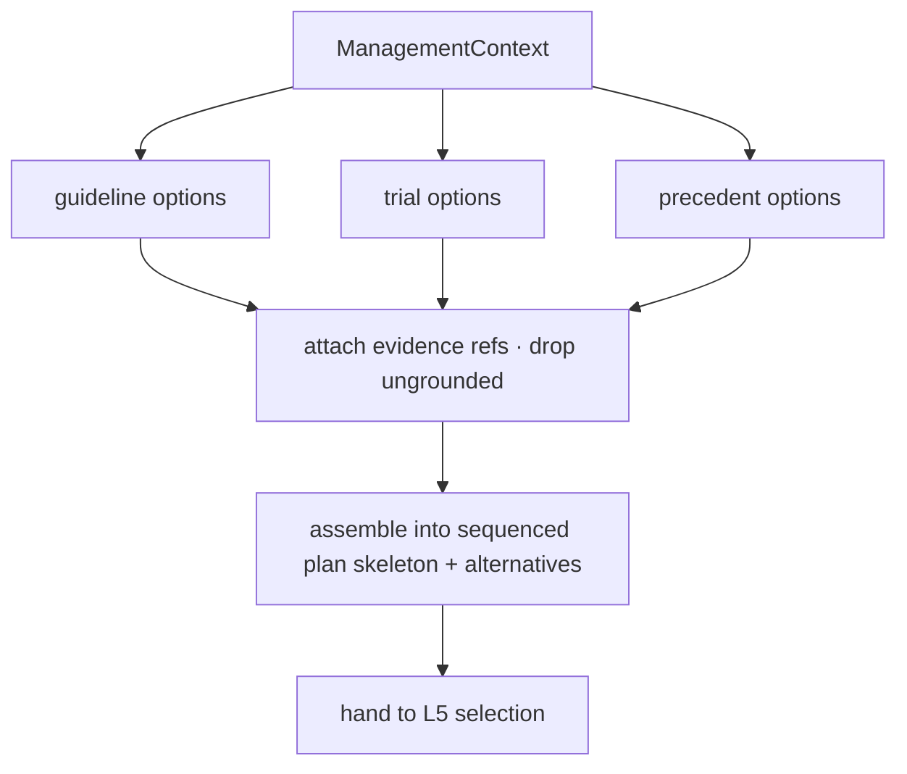

# Pathways — Synthesis / Aggregate (L4)

L4 builds the raw material both tracks need. For **planning** it generates grounded
`TreatmentOption`s and assembles a candidate plan; for **monitoring** it assembles the
baseline↔follow-up **comparison set** the response criteria will score. L4 decides *what's
on the table*; L5 decides *what's chosen / what it means*.

## Planning track — option generation & assembly

### Generate options (three grounded sources)
1. **Guideline-driven** — each applicable `GuidelineMatch` (from L2) whose conditions are
   met yields `TreatmentOption`s (e.g. "maximal safe resection", "concurrent
   chemoradiation", "adjuvant chemotherapy"), tagged with evidence grade.
2. **Trial-driven** — each eligible `TrialMatch` becomes a trial `TreatmentOption`, carrying
   the eligibility rationale.
3. **Precedent-driven** — regimens used in similar **treated** cases (Recall) with good
   outcomes enter as options to consider (analogical), down-weighted vs. guideline evidence.

> Every option must cite a guideline / trial / precedent ref — the same **grounding gate**
> Reasoner uses. No ungrounded therapy is proposed.

### Assemble into a plan
Options are organized into a coherent **sequence** (a `TreatmentPlan` skeleton), respecting
ordering and dependencies — e.g. *surgery → concurrent chemoradiation → adjuvant systemic*,
with surveillance built in. Conflicts (mutually exclusive options) are kept as alternatives
for L5 to choose between.

## Monitoring track — comparison assembly

For a triggering follow-up study, L4 assembles the **comparison set**:
- the **baseline** (and/or nadir) study/findings for the lesion,
- the **current** study/findings,
- the **measurable** targets per the response scheme (e.g. RANO bidimensional/volume
  targets), aligned across timepoints,
- any confounders flagged (e.g. recent treatment → pseudo-progression risk window).

This is **selection of what to compare**, not the verdict — L5 applies the criteria.

## What L4 produces

- **Planning:** a grounded, sequenced plan skeleton + alternatives, handed to L5 for
  selection, eligibility finalization, and rationale.
- **Monitoring:** an aligned baseline↔current comparison set, handed to L5 for deterministic
  response scoring.

L4 deliberately does **not** rank/choose options or assign a response verdict — it sets the
table. L5 adjudicates.
