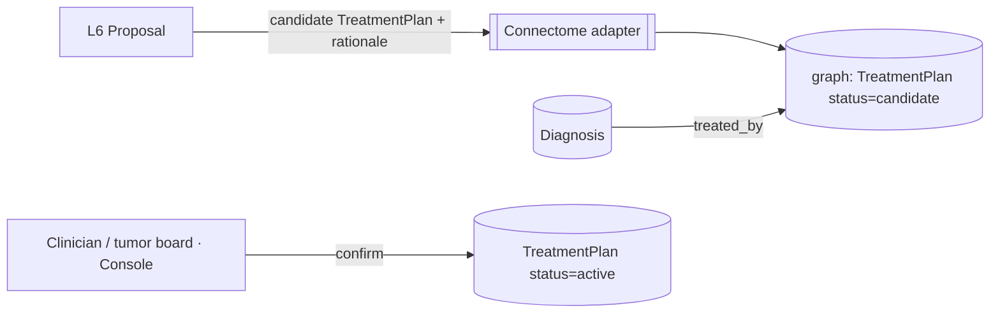
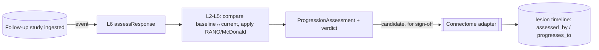

# Pathways — Proposal & Monitoring (L6)

L6 is Pathways' outward face for both tracks: it hands the **candidate `TreatmentPlan`** to
Connectome for MDT confirmation, and runs the **event-driven monitoring loop** that drops a
`ProgressionAssessment` on the lesion timeline whenever a follow-up study lands. It calls
only L5.

## Planning track — propose, MDT confirms

L6 packages the selected plan (L5) and hands the **candidate `TreatmentPlan`** to
Connectome's adapter (`status: candidate`, `asserted_by: algorithm`).

- Connectome links the plan to the diagnosis via `treated_by`
  (`docs/components/connectome/05-knowledge-graph.md`).
- A clinician / **MDT** (via **Console**, C7) reviews the sequence, rationale, trial
  matches and alternatives, and **confirms** — only then is the plan `active`.

> Treatment is a high-stakes, often multidisciplinary decision. Pathways stops at
> **proposal**, surfacing the evidence and the alternatives, and lets the MDT own it — the
> same candidate→confirmed discipline used across the stack.

## Monitoring track — event-driven surveillance

Monitoring is **automatic**, not on-request:

- The **ingest signal** for a new study on a monitored lesion triggers `assessResponse`
  (wired by **Conductor**, C6).
- The resulting `ProgressionAssessment` is added to the lesion timeline (`assessed_by`, and
  `progresses_to` from the prior assessment), as a **candidate** for clinician sign-off
  (response verdicts carry treatment implications).
- A `progression` / `recurrence` verdict can **re-trigger the planning track** (re-plan on
  progression) — closing the treat→monitor→re-plan loop.

## Entry points (conceptual — design-level)

| Entry point | Track | Purpose |
|---|---|---|
| `planTreatment(diagnosisId, options)` | planning | full planning pipeline → candidate `TreatmentPlan` |
| `matchTrials(patientId)` | planning | trial eligibility only |
| `assessResponse(studyId)` | monitoring | event-driven response assessment → `ProgressionAssessment` |
| `replanOnProgression(lesionId)` | both | re-enter planning when monitoring calls progression |

These are the surface **Conductor** (C6, events/scheduling) and **Console** (C7, clinician
actions) call.

## What L6 does *not* do

- It does not **persist** (Connectome) or **confirm** (a human / MDT).
- It does not **diagnose** (Reasoner) or **execute** care (downstream clinical systems).
- It does not **schedule** the monitoring trigger itself — Conductor wires the ingest event.

## Idempotency

- Re-running planning for a diagnosis supersedes the prior candidate plan (provenance kept,
  Sentinel-governed) — no silent overwrite.
- Each `ProgressionAssessment` is keyed to its triggering study, so re-processing a study
  updates rather than duplicates its timeline point.
