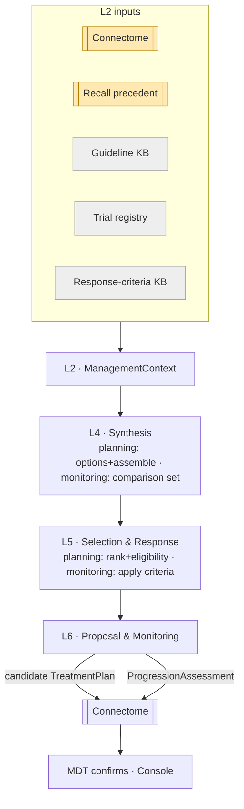
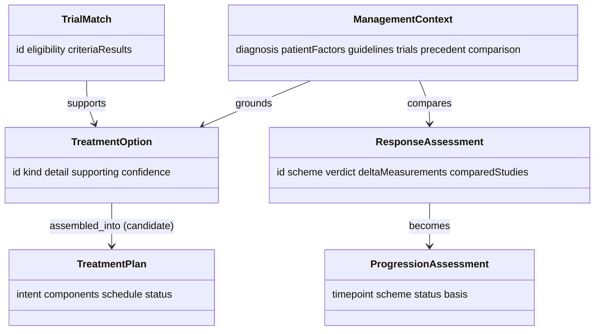

# Pathways — Reference (diagrams + attributes)

The visual model and attribute-level reference. Pairs with `04` (entities) and `05`–`06`
(synthesis / selection & response).

## Both tracks (end to end)

## Data shapes

## Attribute reference

### TreatmentOption / TreatmentPlan
| Attribute | Type | Notes |
|---|---|---|
| option `kind` | enum | surgery \| radiotherapy \| systemic \| trial \| surveillance |
| option `supporting` | ref[] | guideline / trial / precedent refs |
| plan `intent` | enum | curative \| palliative \| diagnostic \| surveillance |
| plan `components` | obj[] | sequenced selected options |
| plan `status` | enum | `candidate` → `active` (on MDT confirm) |
| plan `confidence` | float | calibrated |

### ResponseAssessment / ProgressionAssessment
| Attribute | Type | Notes |
|---|---|---|
| `scheme` | enum | RANO \| McDonald \| mRS |
| `verdict` / `status` | enum | response \| stable \| progression \| recurrence \| pseudo-progression |
| `deltaMeasurements` | map | measured change vs. baseline |
| `comparedStudies` / `basis` | ref[] | studies compared |
| `criteriaResults` | obj[] | per-criterion met/not-met/indeterminate + refs |

### Shared provenance
`id`, `source`, `asserted_by` (`algorithm`), `method`, `confidence`, `timestamp`; plans &
assessments are `status: candidate` until human/MDT confirmation.

## Enumerations

| Enum | Values |
|---|---|
| `TreatmentOption.kind` | `surgery`, `radiotherapy`, `systemic`, `trial`, `surveillance` |
| `TreatmentPlan.status` | `candidate`, `active`, `superseded` |
| response `verdict` | `response`, `stable`, `progression`, `recurrence`, `pseudo-progression` |
| `TrialMatch.eligibility` | `eligible`, `ineligible`, `unknown` |

## Worked instance

A concrete run — planning `tx-001` (resection → chemoradiation → adjuvant) + a trial match
for confirmed `dx-001`, then event-driven `prog-001` (stable) and `prog-002` (progression)
— is in `samples/pathways/`, matching the Connectome case.
