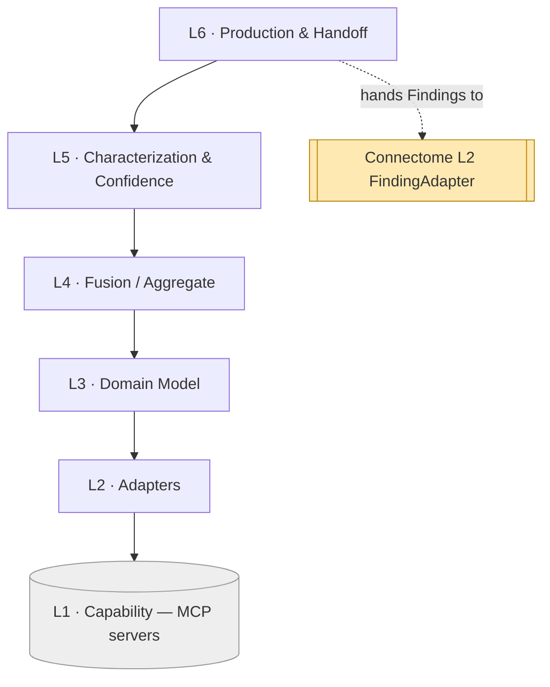

# Perception — Layered Architecture (L1–L6)

Perception uses the same six-layer scaffold as Connectome — **each layer depends only on
the layer directly below it** — specialized to its job: turn images + reports into
characterized `Finding`s. The bottom is external MCP servers; the top hands findings to
Connectome.

## The stack

| # | Layer | Responsibility | Consumes | Spec |
|---|-------|----------------|----------|------|
| **L6** | **Production & Handoff** | Per-study pipeline entry points; produce final `Finding`s; hand to Connectome's `FindingAdapter`; emit candidates for review. | L5 | `07` |
| **L5** | **Characterization & Confidence** | Attach coded attributes + measurements; calibrate confidence; QC gating; resolve conflicts; decide candidate vs. promote. | L4 | `06` |
| **L4** | **Fusion / Aggregate** | Combine detections across models and across series/sequences (and reports) about the same region into one consolidated candidate finding. | L3 | `05` |
| **L3** | **Domain Model** | `DetectionTask`, `ModelRun`, `Detection`, `Measurement`, `Evidence`, and the target `Finding` (Connectome schema). | L2 | `04` |
| **L2** | **Adapters / Normalization** | Map each MCP server's raw output (mask/RLE, box+score, measurements, NLP spans) into the common internal `Detection`. | L1 | `03` |
| **L1** | **Capability (MCP servers)** | Vision + NLP models: segmentation, detection, characterization, measurement, report-NLP, QC; + registration, terminology. *External.* | — | `02` |



## The dependency rule

- **Allowed:** L(n) calls L(n−1). Fusion (L4) reads normalized detections (L3 over L2);
  Production (L6) reads characterized findings (L5).
- **Forbidden:** skipping layers or calling upward. Production never calls a model
  directly — it consumes what characterization produced.
- **The only external touch** is **L2 adapters → L1 MCP servers**. No pixels, masks or
  vectors are ever processed above L2 — Perception holds no model code.

## Where Perception sits next to Connectome

```
   PERCEPTION                         CONNECTOME
   ──────────                         ──────────
   L6 Production ── hands Findings ──▶ L2 FindingAdapter ──▶ L4 graph
   L5 Characterization                 (single writer to the graph)
   L4 Fusion
   L3 Domain Model  ◀── reuses ──────  L3 Domain Model (Finding shape)
   L2 Adapters
   L1 MCP servers (vision + NLP)
```

Perception's L3 **reuses Connectome's `Finding` definition** as its output type, so the
handoff needs no translation — the produced object already is what Connectome persists.

## How a study flows (illustrative)

New MRI study arrives (triggered by Conductor/Intake on ingest):

1. **L6** opens a production run for `study-mri-001`.
2. **L1/L2** run per-sequence models (FLAIR seg, T1c enhancement, DWI restriction) + the
   report-NLP server; adapters normalize each output into `Detection`s.
3. **L4** fuses the sequence detections + the report sentence that all describe the *same*
   left-frontal region into one candidate finding.
4. **L5** characterizes it (FLAIR-hyperintense, ring-enhancing, rim restriction),
   measures it (volume, diameter), QC-checks it, and calibrates confidence.
5. **L6** emits the finished `Finding` (`find-mri-001`) to Connectome's `FindingAdapter`.

Layer-to-doc map: L1→`02`, L2→`03`, L3→`04`, L4→`05`, L5→`06`, L6→`07`; cross-cutting →
`08`, `09`.
