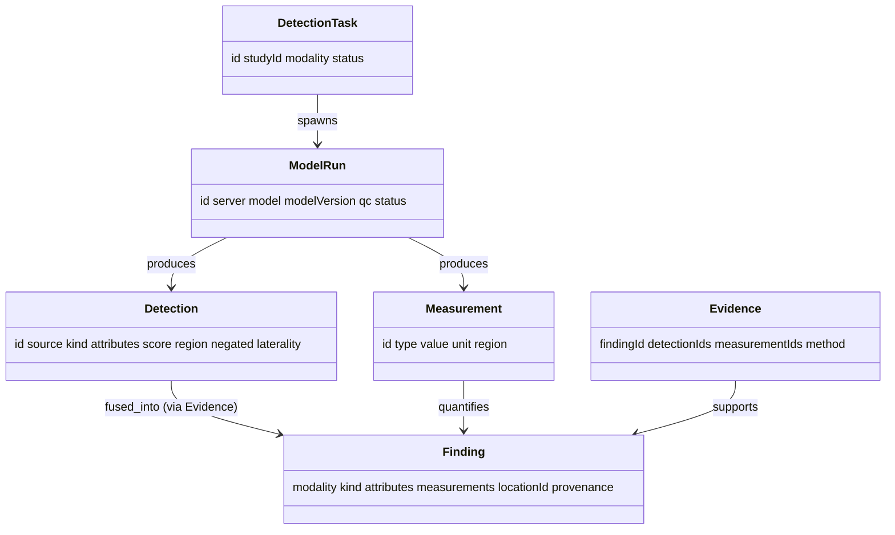

# Perception — Domain Model (L3)

L3 defines Perception's internal entities and the **target output type** it shares with
Connectome. Everything above L3 speaks this vocabulary; nothing above L2 sees raw model
output.

## Internal entities

### DetectionTask
A unit of perception work: "find findings in this study/series with these models".
- **Attributes:** `id`, `studyId`, `modality`, target series, requested capabilities,
  status.
- **Purpose:** the orchestration record L6 opens per study (`07`).

### ModelRun
One invocation of one MCP model.
- **Attributes:** `id`, `taskId`, `server`, `model`, `modelVersion`, `inputRef`,
  `status`, `qc`.
- **Purpose:** provenance + reproducibility; every `Detection` points back to its
  `ModelRun`.

### Detection — *the unit of perception*
A single candidate observation from **one** source (a model output or a report span),
normalized by L2.
- **Attributes:** `id`, `modelRunId`, `source` (`image` | `report`), `kind` (coded),
  `attributes` (coded, optional), `score`, `region` (`{seriesId, mask|box}` or
  `{reportSpan}`), `negated`, `laterality`, provenance.
- **Note:** detections are **pre-fusion** — many detections may describe one real finding.

### Measurement
A quantitative value bound to a region.
- **Attributes:** `id`, `type` (volume/diameter/HU/ADC/…), `value`, `unit`, `region`,
  `modelRunId`.

### Evidence
The link tying a produced `Finding` back to the detections/measurements/reports that
support it.
- **Attributes:** `findingId`, `detectionIds[]`, `measurementIds[]`, fusion `method`,
  agreement summary.
- **Purpose:** auditability — *why* this finding exists and how confident.

## Target output entity

### Finding *(Connectome's schema — reused, not redefined)*
Perception's deliverable. Its shape is exactly Connectome's `Finding`
(`docs/components/connectome/04-domain-model.md`): `modality`, `kind`, `attributes`,
`measurements`, `locationId`, optional `embeddingRef`, and shared provenance/confidence.
Perception fills it; Connectome persists it.

- **Reuse rationale:** producing the consumer's type means the handoff (`07`) needs no
  translation and there is no parallel finding model to keep in sync.

## Entity relationships

## Shared attribute set

Same as Connectome (`asserted_by`, `source`, `model`/`method`, `confidence`,
`timestamp`) on every internal entity and on the produced `Finding`. `asserted_by` is
`algorithm` for model detections and `human` for report-derived ones — a distinction
fusion (`05`) and characterization (`06`) use when reconciling sources.

The full attribute reference and diagrams are in `09`.
