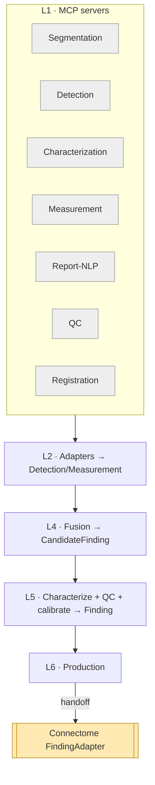
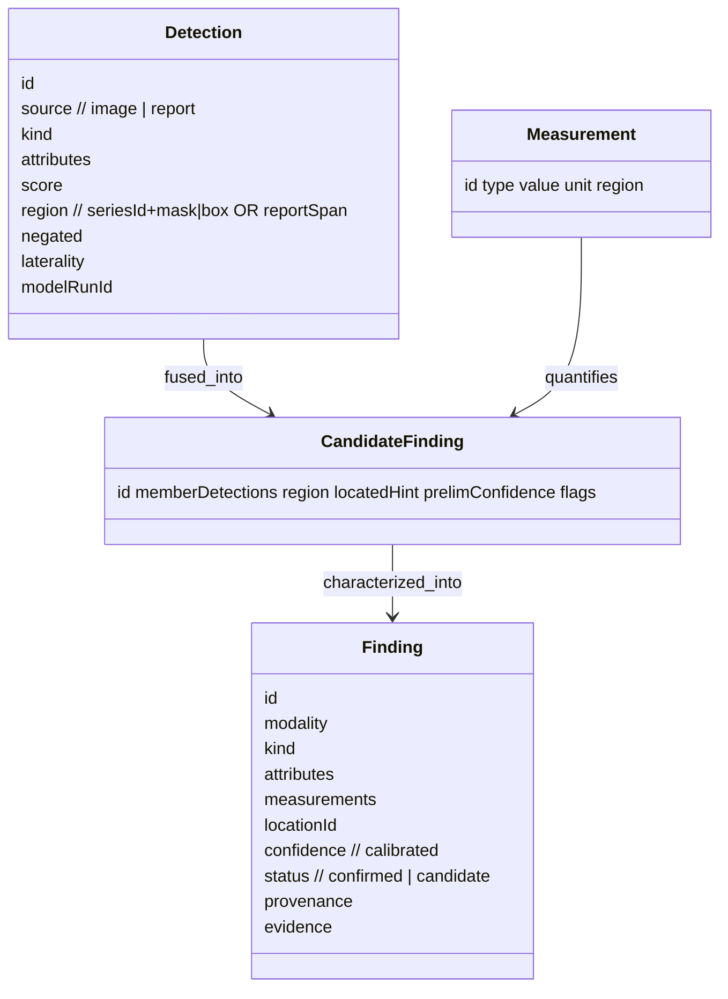

# Perception — Reference (diagrams + attributes)

The visual model and attribute-level reference. Pairs with `04` (entities) and `05`–`06`
(fusion/characterization).

## Pipeline (end to end)

## Detection → Finding (data shapes)

## Attribute reference

### Detection
| Attribute | Type | Notes |
|---|---|---|
| `source` | enum | `image` \| `report` |
| `kind` | code | SNOMED/RadLex |
| `attributes` | map | optional characterization scores |
| `score` | float | raw model score (pre-calibration) |
| `region` | obj | `{seriesId, mask\|box}` or `{reportSpan}` |
| `negated` | bool | report negation ("no enhancement") |
| `laterality` | enum | left/right/midline |
| `modelRunId` | ref | provenance to the `ModelRun` |

### Finding (produced — Connectome schema)
| Attribute | Type | Notes |
|---|---|---|
| `modality` | enum | MRI \| CT \| Ultrasound \| Histology |
| `kind` | code | finding type |
| `attributes` | map | coded characteristics (final, reconciled) |
| `measurements` | map | volume/diameter/HU/ADC/Ki-67… |
| `locationId` | ref | AnatomicalLocation (from registration) |
| `confidence` | float | **calibrated** 0–1 |
| `status` | enum | `confirmed` \| `candidate` |
| `evidence` | obj | detections/measurements/agreement/conflicts |

### Shared provenance (all entities)
`id`, `source`, `asserted_by` (`algorithm` \| `human`), `model`/`modelVersion`, `method`,
`confidence`, `timestamp`.

## Enumerations

| Enum | Values |
|---|---|
| `Detection.source` | `image`, `report` |
| `asserted_by` | `algorithm` (model), `human` (report) |
| `Finding.status` | `confirmed`, `candidate` |
| `QC status` | `pass`, `degraded`, `fail` |

## Worked instance

A concrete run — the MRI study from the Connectome case producing `find-mri-001` by fusing
FLAIR/T1c/DWI detections with the report sentence — is in `samples/perception/`.
