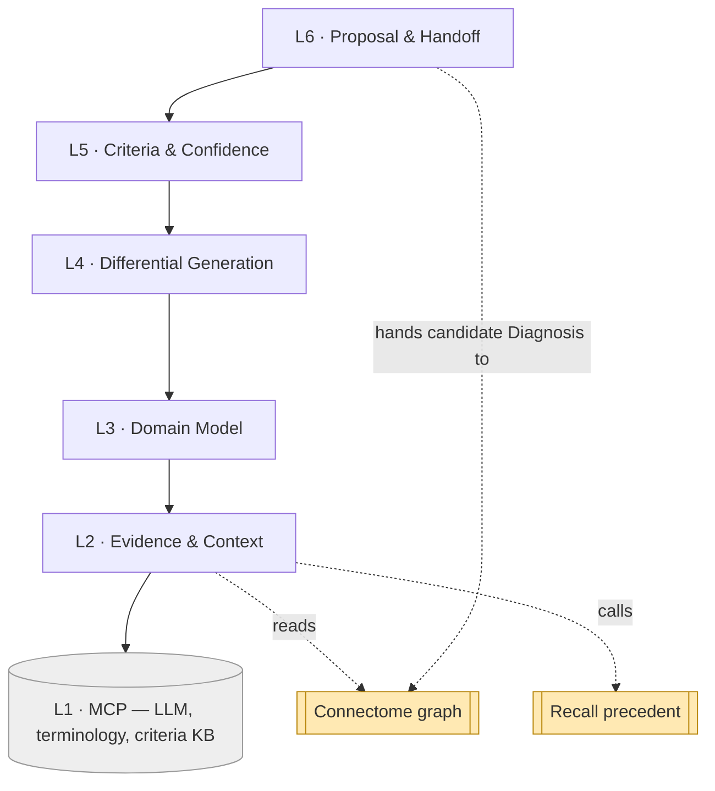

# Reasoner — Layered Architecture (L1–L6)

Reasoner uses the same six-layer scaffold — **each layer depends only on the one directly
below it** — specialized to diagnosis: gather evidence, generate a differential, apply
criteria, propose a candidate diagnosis. The bottom is external MCP servers; the top hands
a candidate diagnosis to Connectome.

## The stack

| # | Layer | Responsibility | Consumes | Spec |
|---|-------|----------------|----------|------|
| **L6** | **Proposal & Handoff** | Produce the candidate `Diagnosis` + differential + next-test; hand to Connectome (flagged candidate); entry points `reasonCase` / `explainDiagnosis`. | L5 | `07` |
| **L5** | **Criteria & Confidence** | Apply formal criteria deterministically (met/not-met/indeterminate); calibrate confidence; choose the **next discriminating test**. | L4 | `06` |
| **L4** | **Differential Generation** | Rule-driven criteria checks + LLM hypothesis generation, fused into a ranked, evidence-grounded differential. | L3 | `05` |
| **L3** | **Domain Model** | `ReasoningCase`, `EvidenceBundle`, `Criterion`/`CriteriaSet`, `DifferentialItem`, `DiscriminatingTest`, `DiagnosisProposal`. | L2 | `04` |
| **L2** | **Evidence & Context** | Gather evidence: read Connectome graph, call **Recall** for precedent, load applicable criteria; assemble the reasoning context. | L1 + sibling components | `03` |
| **L1** | **Capability (MCP servers)** | **LLM/reasoning**, **terminology**, **criteria/guideline knowledge base**. *External.* | — | `02` |



## The dependency rule

- **Allowed:** L(n) calls L(n−1). Criteria (L5) adjudicates the differential (L4);
  Proposal (L6) packages the criteria-scored result (L5).
- **Forbidden:** skipping layers or calling upward. Proposal never calls the LLM directly —
  it consumes what differential + criteria produced.
- **External touch is at L2 only:** L2 calls the L1 MCP servers, *and* reaches the sibling
  components — it **reads** Connectome and **calls** Recall. Everything above L2 works on
  the assembled in-memory reasoning context, not live graph/Recall calls.

## Cross-component inputs (a note on L2)

Unlike Perception (which only outputs to Connectome) and Recall (which is called by
Connectome), Reasoner is a **consumer**: its evidence comes from sibling components.

- **Connectome** — read the lesion, its findings across modalities, the patient history,
  any existing diagnoses (`docs/components/connectome/07-navigation-and-queries.md`).
- **Recall** — call `discoverSimilarCases` for precedent
  (`docs/components/recall/07-discovery-api.md`).

These are **sibling-component dependencies**, gathered at L2, distinct from the L1 MCP
servers. Reasoner never writes Connectome except via the candidate-diagnosis handoff at L6.

## Where the hybrid method lives

```
   L4 Differential ── LLM (MCP) proposes candidates, grounded in L2 evidence
   L5 Criteria     ── deterministic rule-checklists adjudicate each candidate
```

The LLM widens the hypothesis space; the rules keep the conclusion auditable. Neither
acts alone: an LLM candidate with no supporting evidence is dropped; a criteria result
with no candidate to attach to is surfaced as "criteria-positive, consider X".

## How a case flows (illustrative)

"Reason over the left-frontal lesion."

1. **L6** opens a `ReasoningCase` for the lesion.
2. **L2** gathers: the MRI/CT/US findings (Connectome), the history, similar prior cases
   (Recall), and loads candidate criteria sets (criteria KB).
3. **L4** generates a differential — *high-grade glioma vs. tumefactive demyelination vs.
   abscess* — each grounded in specific findings.
4. **L5** applies criteria, calibrates confidence, and identifies the **next discriminating
   test** (here: biopsy/histology).
5. **L6** emits a **candidate** `Diagnosis` (top of differential) + the full reasoning, to
   Connectome's adapter — for a human to confirm.

Layer-to-doc map: L1→`02`, L2→`03`, L3→`04`, L4→`05`, L5→`06`, L6→`07`; cross-cutting →
`08`, `09`.
