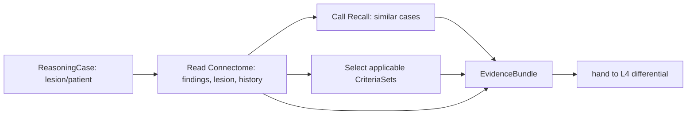

# Reasoner — Evidence & Context (L2)

L2 assembles the **reasoning context**: the bundle of evidence everything above reasons
over. It is the only layer that reaches outward — to the L1 MCP servers **and** to the
sibling components Connectome and Recall. Above L2, reasoning works on the assembled
context, not live calls.

> L2 **gathers and grounds**; it does not reason. No differential, no criteria scoring
> here — just collect evidence, code it, and shape it into an `EvidenceBundle`.

## What L2 gathers

| Source | Via | Yields |
|---|---|---|
| **Connectome graph** | read (navigation queries) | the `Lesion`, its `Finding`s across modalities, `AnatomicalLocation`, `PatientHistory`, prior `Diagnosis` |
| **Recall** | `discoverSimilarCases` | similar prior cases (precedent) + their recorded diagnoses/outcomes |
| **Criteria KB** (MCP) | load | candidate `CriteriaSet`s applicable to the presentation |
| **Terminology** (MCP) | code | normalized codes for findings/history/candidate diagnoses |

## The gather sequence

1. **Read Connectome** for the case's structured evidence — the cross-modal findings on
   the lesion, the history, anything already diagnosed.
2. **Call Recall** for precedent — similar findings/cases across the cohort
   (Sentinel-scoped), each carrying a recorded diagnosis/outcome to reason *by analogy*.
3. **Select criteria** — which `CriteriaSet`s could apply (e.g. demyelinating presentation
   → McDonald; mass lesion → WHO CNS pathway), loaded from the criteria KB.
4. **Code** everything via terminology so candidates and evidence share a vocabulary.

## Output: the EvidenceBundle

A single, grounded context object handed to L4:

| Part | Contents |
|---|---|
| `findings[]` | cross-modal findings on the lesion (with provenance/confidence) |
| `history` | relevant clinical history |
| `precedent[]` | similar cases (candidate, from Recall) + recorded outcomes |
| `candidateCriteriaSets[]` | applicable criteria to be applied at L5 |
| `codes` | normalized terminology for all of the above |

## Grounding contract

Every item in the bundle is **traceable** to its Connectome node / Recall result / KB
entry, so that downstream:
- each `DifferentialItem` can **cite** the specific evidence supporting/refuting it (`05`),
- each criterion result can **point at** the evidence that satisfied it (`06`),
- the final proposal carries a complete, auditable evidence trail (`07`).

L2 never mutates Connectome; it only reads. The single write Reasoner makes is the
candidate-diagnosis handoff at L6.
