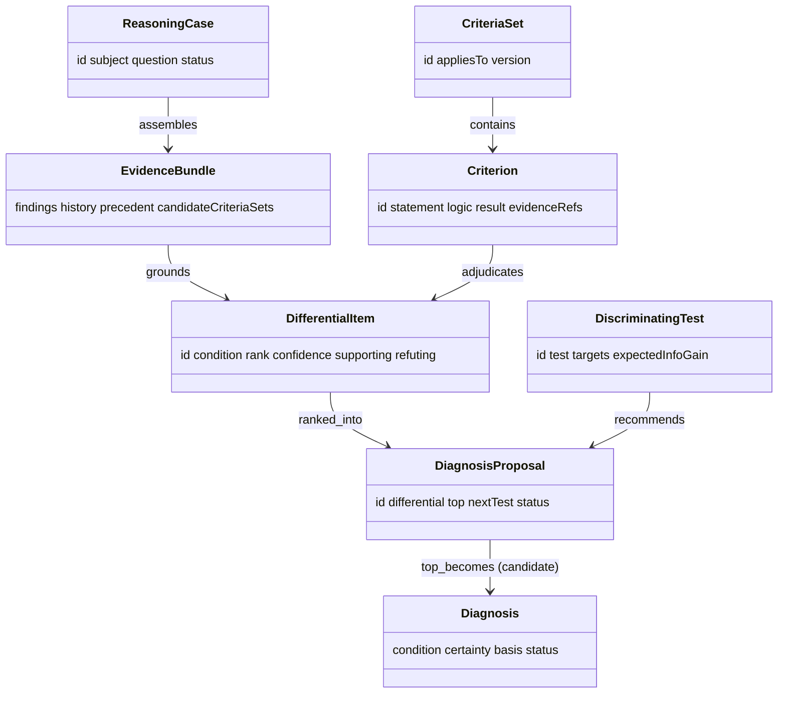

# Reasoner — Domain Model (L3)

L3 defines Reasoner's vocabulary. Everything above L3 speaks it; nothing above L2 makes
live graph/Recall/MCP calls — it all works on these objects.

## Entities

### ReasoningCase
One reasoning task, anchored on a lesion (or a patient presentation).
- **Attributes:** `id`, `subject` (lesionId / patientId), `question` (diagnose | explain),
  `status`, `createdAt`.

### EvidenceBundle
The grounded context assembled at L2 (`03`).
- **Attributes:** `findings[]`, `history`, `precedent[]` (from Recall), `candidateCriteriaSets[]`,
  `codes`. Every element carries a `ref` back to its source (Connectome node / Recall
  result / KB id).

### Criterion / CriteriaSet
A formal, checkable diagnostic rule, and the named set it belongs to.
- **CriteriaSet:** `id` (e.g. `McDonald-2017`, `WHO-CNS5`, `RANO`), `appliesTo`, `version`.
- **Criterion:** `id`, `statement`, `logic` (how to evaluate), `evidenceNeeded`,
  `result` (set at L5: `met` | `not-met` | `indeterminate`), `evidenceRefs[]`.

### DifferentialItem
One candidate diagnosis with its grounding.
- **Attributes:** `id`, `condition` (coded), `rank`, `prior`/`likelihood`, `supporting[]`
  (evidence refs), `refuting[]` (evidence refs), `criteriaResults[]`, `confidence`
  (calibrated at L5), `rationale` (LLM explanation, grounded).

### DiscriminatingTest
A recommended next test that would most change the differential.
- **Attributes:** `id`, `test` (e.g. biopsy/histology, contrast MRI, LP), `targets[]`
  (which DifferentialItems it separates), `expectedInfoGain`, `rationale`.

### DiagnosisProposal
The packaged output.
- **Attributes:** `id`, `subject`, `differential[]` (ranked DifferentialItems),
  `top` (the proposed candidate `Diagnosis`), `nextTest` (a DiscriminatingTest),
  `status: candidate`, `evidenceTrail`, provenance.

## Target output entity

### Diagnosis *(Connectome's schema — reused)*
The handoff type. Its shape is Connectome's `Diagnosis`
(`docs/components/connectome/04-domain-model.md`): coded `condition`, `certainty`,
`basis`, `asserted_by`, plus the candidate `status`. Reasoner fills it (as the `top` of
the differential) and hands it over; Connectome persists it.

## Relationships

## Shared attributes

`id`, `source`, `asserted_by` (`algorithm` for Reasoner output; the rationale notes LLM vs.
rule contributions), `method`, `confidence` (calibrated), `timestamp` — on the proposal and
the produced `Diagnosis`. Full attribute reference and diagrams in `09`.
