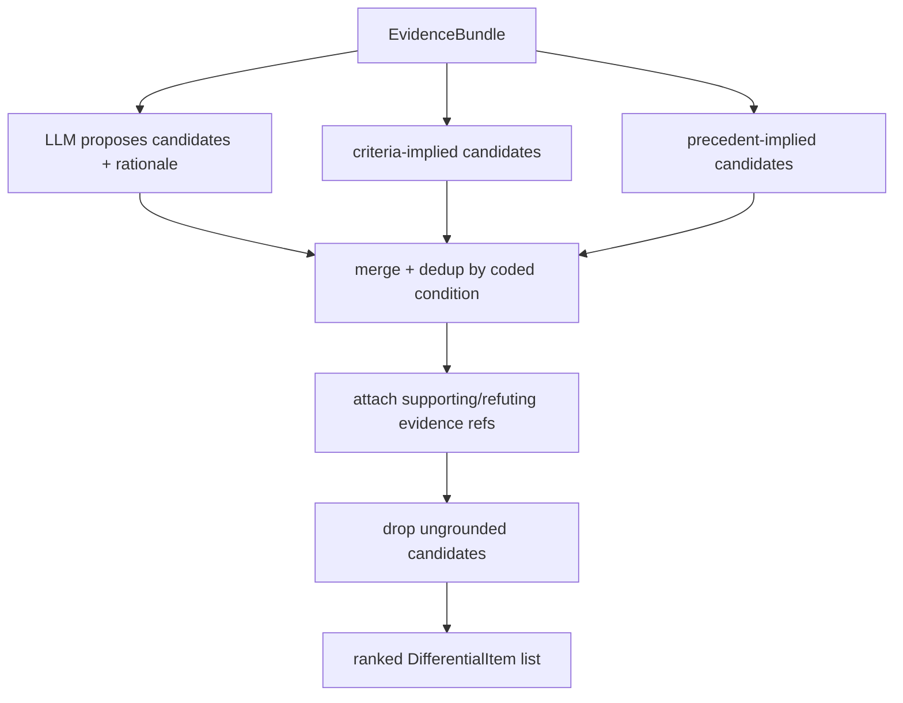

# Reasoner — Differential Generation (L4)

L4 turns the `EvidenceBundle` (L2) into a **ranked differential** — the candidate
diagnoses, each grounded in specific evidence. This is where the hybrid method's two halves
first combine: the LLM **proposes**, rule-driven criteria checks **inform**, evidence
**anchors**.

> "Fuse, don't free-associate": every candidate must cite evidence in the bundle. An
> ungrounded LLM suggestion is dropped here, before it can reach a clinician.

## Inputs

From the `EvidenceBundle` (`03`): cross-modal `findings`, `history`, `precedent` (Recall
similar cases + their diagnoses), and the `candidateCriteriaSets`.

## Generation — two sources of candidates

1. **LLM hypothesis generation (MCP)** — given the grounded context, propose candidate
   conditions with a rationale that **cites findings/history**. Breadth: catches the
   atypical and the look-alike.
2. **Criteria-driven candidates** — a `CriteriaSet` that is plausibly satisfied implies its
   condition as a candidate (e.g. demyelinating pattern → MS via McDonald). Precision:
   anchored in formal definitions.
3. **Precedent-driven candidates** — diagnoses recorded on Recall's similar cases enter as
   candidates to consider (analogical), including **look-alike different diagnoses** worth
   ruling out (the value Recall adds — see `docs/components/recall/07-discovery-api.md`).

## Fusion into a differential

Candidates from all three sources are merged and de-duplicated by coded condition. For
each surviving `DifferentialItem`, L4 attaches:

- `supporting[]` — evidence refs that favor it,
- `refuting[]` — evidence refs against it,
- a preliminary `rank` from how much grounded evidence supports it,
- `rationale` — the grounded LLM explanation.

## Grounding gate

Before a candidate leaves L4 it must have at least one `supporting` evidence ref from the
bundle. This is the **anti-hallucination** rule: the LLM can suggest, but only evidence
keeps a candidate alive. Candidates with strong *refuting* evidence are retained but
down-ranked (so the clinician sees what was considered and excluded, and why).

## What L4 produces

A ranked list of `DifferentialItem`s, each grounded with supporting/refuting evidence and
a rationale — handed to L5 for **formal criteria adjudication, confidence calibration, and
next-test selection**. L4 deliberately does **not** finalize confidence or apply criteria
deterministically; it sets the field of candidates. L5 adjudicates it.
