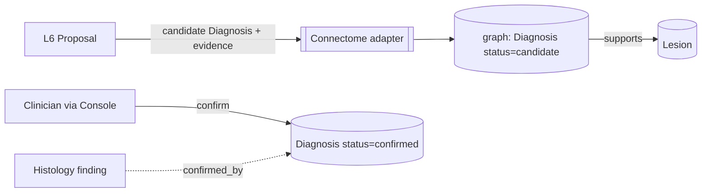

# Reasoner — Proposal & Handoff (L6)

L6 is Reasoner's outward face: it packages the adjudicated differential (L5) into a
`DiagnosisProposal` and hands the top candidate to **Connectome** — flagged **candidate**,
for a human to confirm. It calls only L5, never the LLM directly.

## The proposal

L6 assembles a `DiagnosisProposal` (`04`):

| Part | Contents |
|---|---|
| `differential[]` | the ranked, criteria-scored, evidence-cited candidates |
| `top` | the highest-confidence candidate → the proposed `Diagnosis` |
| `nextTest` | the `DiscriminatingTest` (what would confirm/refute) |
| `evidenceTrail` | refs to every finding / criterion / precedent used |
| provenance | `asserted_by: algorithm`, LLM+rule contributions, calibrated confidence |

## The handoff contract (propose, don't persist)

Per the boundary rule (`00`), L6 hands the **candidate `Diagnosis`** to Connectome's
adapter; Connectome is the single writer to the graph. The diagnosis lands as
`status: candidate` with `asserted_by: algorithm`.

- Connectome links the candidate `Diagnosis` to the `Lesion` via `supports`
  (`docs/components/connectome/05-knowledge-graph.md`).
- A clinician (via **Console**, C7) reviews the differential + evidence + next-test and
  **confirms** (or rejects) — only then does `status` become `confirmed`.
- When the recommended next test is done (e.g. histology), its finding can `confirmed_by`
  the diagnosis (closing the loop with the Connectome case).

## Why human-confirmed

Diagnosis is the highest-stakes assertion in the stack. Reasoner deliberately stops at
**proposal**: it makes the reasoning, evidence and uncertainty fully visible, and lets a
clinician own the decision. This is the same candidate→confirmed discipline used by
Perception (findings) and Recall (similarities), applied where it matters most.

## Entry points (conceptual — design-level)

| Entry point | Purpose |
|---|---|
| `reasonCase(subject, options)` | full pipeline → `DiagnosisProposal` handed off |
| `explainDiagnosis(diagnosisId)` | regenerate the grounded rationale + evidence for an existing diagnosis |
| `updateOnNewEvidence(subject)` | re-reason when new findings arrive (e.g. histology back) |

These are the surface **Conductor** (C6) and **Console** (C7) call.

## What L6 does *not* do

- It does not **persist** (Connectome does) or **confirm** (a human does).
- It does not **plan treatment** or **monitor** (Pathways, C5).
- It does not **schedule** itself (Conductor) — it exposes the entry points.

## Idempotency

Re-reasoning a case (e.g. after histology returns) produces an updated proposal with the
same `subject`; the previously proposed candidate is superseded with provenance retained
(governed by **Sentinel**, C8) — never silently overwritten.
