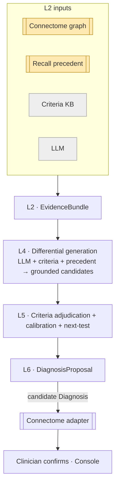
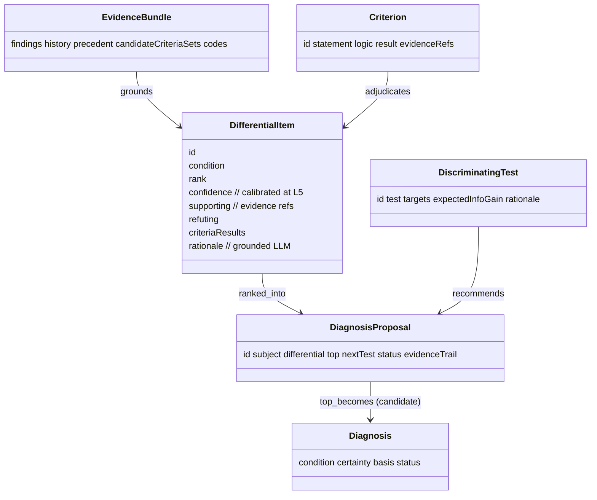

# Reasoner — Reference (diagrams + attributes)

The visual model and attribute-level reference. Pairs with `04` (entities) and `05`–`06`
(differential / criteria).

## Pipeline (end to end)

## Data shapes

## Attribute reference

### DifferentialItem
| Attribute | Type | Notes |
|---|---|---|
| `condition` | code | SNOMED/ICD-11/WHO CNS |
| `rank` | int | position in differential |
| `confidence` | float | **calibrated** 0–1 |
| `supporting` / `refuting` | ref[] | evidence (findings/history/precedent/criteria) |
| `criteriaResults` | obj[] | per-criterion met/not-met/indeterminate + refs |
| `rationale` | text | grounded LLM explanation |

### DiagnosisProposal
| Attribute | Type | Notes |
|---|---|---|
| `subject` | ref | lesion/patient |
| `differential` | DifferentialItem[] | ranked |
| `top` | DifferentialItem | → proposed `Diagnosis` |
| `nextTest` | DiscriminatingTest | what would confirm/refute |
| `status` | enum | always `candidate` |
| `evidenceTrail` | ref[] | full auditable trail |

### Shared provenance
`id`, `source`, `asserted_by` (`algorithm`), `method` (`hybrid: rules+llm`), `confidence`,
`timestamp`.

## Enumerations

| Enum | Values |
|---|---|
| `Criterion.result` | `met`, `not-met`, `indeterminate` |
| `DiagnosisProposal.status` | `candidate` (always) |
| `ReasoningCase.question` | `diagnose`, `explain` |

## Worked instance

A concrete run — reasoning over the left-frontal lesion into a 3-way differential, applying
criteria, recommending biopsy as the next test, and proposing candidate `dx-001` (later
`confirmed_by` histology) — is in `samples/reasoner/`.
