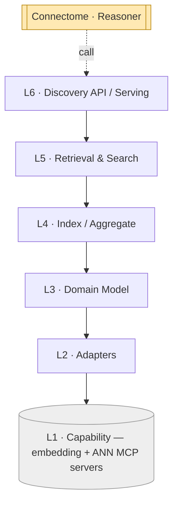

# Recall — Layered Architecture (L1–L6)

Recall uses the same six-layer scaffold — **each layer depends only on the one directly
below it** — specialized to its job: embed things, index them, and serve similarity. The
bottom is external MCP servers; the top is the discovery API other components call.

## The stack

| # | Layer | Responsibility | Consumes | Spec |
|---|-------|----------------|----------|------|
| **L6** | **Discovery API / Serving** | The endpoints other components call: `embed`, `discoverSimilar`, `discoverSimilarCases`, `search`. Returns candidates with provenance. | L5 | `07` |
| **L5** | **Retrieval & Search** | ANN search, hybrid lexical+vector, filtering (modality/scope/time), re-ranking, similarity calibration, dedup, privacy scoping. | L4 | `06` |
| **L4** | **Index / Aggregate** | The index lifecycle: build/refresh per vector space & granularity; namespaces; aggregate case-level vectors from finding/study/text vectors. | L3 | `05` |
| **L3** | **Domain Model** | `Embeddable`, `Embedding`, `VectorSpace`, `IndexEntry`, `Neighbor`, `Query`. | L2 | `04` |
| **L2** | **Adapters / Normalization** | Wrap the embedding & vector MCP servers: map domain objects → embed requests; map ANN hits → domain refs. | L1 | `03` |
| **L1** | **Capability (MCP servers)** | Multimodal **embedding** + **vector-search/ANN** (+ retrieval, object store for vectors). *External.* | — | `02` |



## The dependency rule

- **Allowed:** L(n) calls L(n−1). Serving (L6) calls Retrieval (L5); Retrieval reads the
  index (L4); the index is built from domain embeddings (L3 over L2 over L1).
- **Forbidden:** skipping layers or calling upward. The discovery API never calls an
  embedding model directly — it goes through retrieval and the index.
- **The only external touch** is **L2 adapters → L1 MCP servers**. No raw vectors are
  manipulated above L2 except as opaque `vectorRef`s — Recall holds no model or ANN code.

## Two flows through the stack

**Write path (embed-on-ingest):**
```
Connectome EmbeddingAdapter ─▶ L6 embed() ─▶ L5/L4 route to space ─▶ L2 call embedding MCP
                                                                   ─▶ L4 upsert IndexEntry
                                              ◀─ vectorRef ◀────────────────────────────────
```
Connectome gets back a `vectorRef`; the vector lives in Recall's index.

**Read path (discovery):**
```
Connectome / Reasoner ─▶ L6 discoverSimilar() ─▶ L5 ANN + filter + calibrate + scope
                                              ◀─ ranked candidate Neighbors (asserted_by=embedding)
```

## Where Recall sits next to Connectome

Recall is to *vectors* what Connectome is to *the graph*: the owner. Connectome stores a
`vectorRef` (a pointer), not the vector; Connectome's `EmbeddingAdapter`
(`docs/components/connectome/03-normalization-adapters.md`) and its discovery (`06`
mechanism 5, `07` journeys F/G/H) **delegate to Recall's L6**. Recall returns candidates;
**Connectome decides** whether a candidate becomes a confirmed correlation. Recall never
writes the graph.

Layer-to-doc map: L1→`02`, L2→`03`, L3→`04`, L4→`05`, L5→`06`, L6→`07`; cross-cutting →
`08`, `09`.
