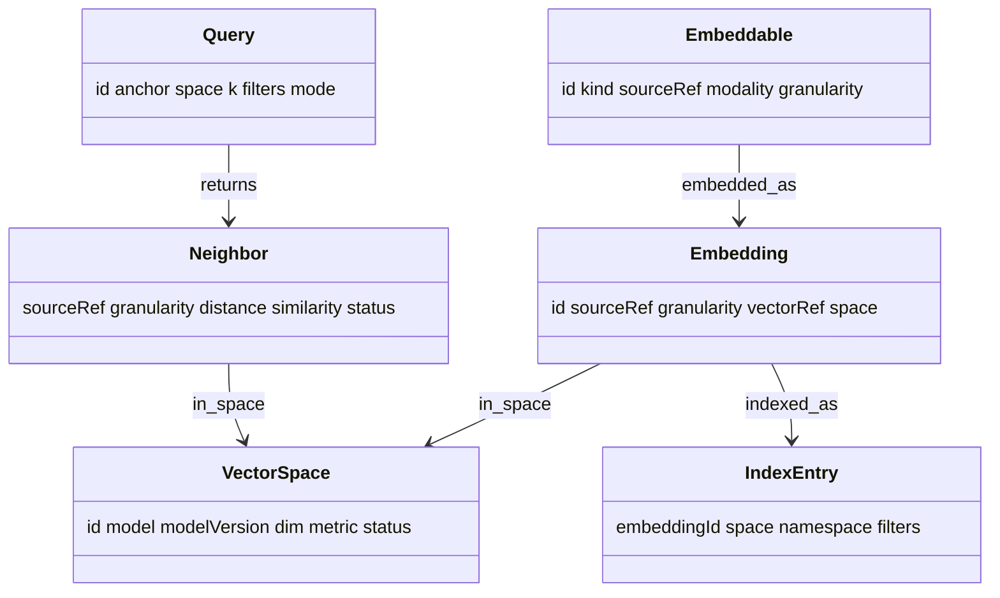

# Recall — Domain Model (L3)

L3 defines Recall's internal vocabulary. Everything above L3 speaks it; nothing above L2
sees raw vectors or ANN payloads.

## Entities

### Embeddable
A thing that can be embedded — a reference into Connectome plus the content modality.
- **Attributes:** `id`, `kind` (`finding` | `study` | `case` | `text`), `sourceRef`
  (Connectome id or text handle), `modality` (for image content), `granularity`.
- **Purpose:** the unit Recall is asked to remember.

### VectorSpace
A model + version + target that defines a coordinate system. Vectors are only comparable
**within** a space.
- **Attributes:** `id`, `model`, `modelVersion`, `modality`/`textual`, `dim`, `metric`
  (cosine/dot), `status` (active | deprecated).
- **Purpose:** the versioning unit (`08`); every `Embedding` belongs to exactly one.

### Embedding
One vector for one Embeddable in one VectorSpace.
- **Attributes:** `id`, `sourceRef`, `granularity`, `space`, `vectorRef` (pointer into the
  store — **the value Connectome holds**), provenance (`asserted_by = embedding`,
  `timestamp`).
- **Note:** the vector itself lives in the store; the graph and Recall's domain hold only
  the `vectorRef`.

### IndexEntry
An Embedding's membership in a searchable index namespace.
- **Attributes:** `embeddingId`, `space`, `namespace` (e.g. `mri-img-v1/cohort`), metadata
  filters (modality, patientScope, time, granularity).
- **Purpose:** what L5 search actually queries (`05`).

### Query
A similarity request.
- **Attributes:** `id`, `anchor` (an Embeddable/vector or text), `space`, `k`, `filters`
  (modality, scope, time), `mode` (vector | lexical | hybrid).

### Neighbor / SimilarityResult
A single ranked match.
- **Attributes:** `sourceRef`, `granularity`, `distance` (raw), `similarity` (calibrated,
  added at L5), `space`, `status: candidate`, provenance.
- **Purpose:** the output unit Recall serves; always **candidate**.

## Relationships

## Relationship to Connectome's model

Recall does **not** redefine clinical entities. Its `sourceRef` points at Connectome's
`Finding`/`Study`/case ids (`docs/components/connectome/04-domain-model.md`); a `Neighbor`
resolves back to a Connectome node the caller already understands. The only new value
Recall contributes to the graph is the `vectorRef` on a `Finding`/`Study`.

## Shared attributes

`id`, `source`, `asserted_by` (always `embedding` for Recall output), `method` (e.g.
`ann-cosine`), `similarity` (calibrated, 0–1), `timestamp`. Full attribute reference and
diagrams in `09`.
