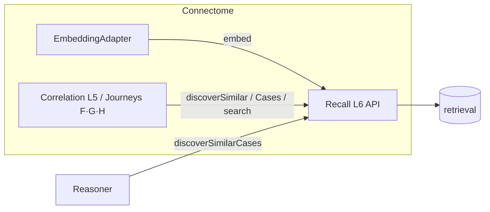

# Recall — Discovery API / Serving (L6)

L6 is Recall's outward face: the small, stable API other components call. It exposes the
write path (`embed`) and the read paths (similarity / cases / search), delegating to L5 —
never to a model directly.

## Endpoints (conceptual — design-level signatures, no implementation)

| Endpoint | Purpose | Returns |
|---|---|---|
| `embed(sourceRef, kind, space?)` | embed-on-ingest; returns a `vectorRef` for the graph | `{ vectorRef, space }` |
| `discoverSimilar(anchor, k, filters)` | finding-to-finding similarity (journey F) | candidate `Neighbor[]` |
| `discoverSimilarCases(patientId\|caseRef, k, filters)` | similar prior cases / cohort (journey G) | candidate case `Neighbor[]` |
| `search(text, filters, mode=hybrid)` | free-text / semantic search (journey H) | candidate `Neighbor[]` |
| `reembed(scope, space)` | rebuild vectors for a new space (admin; Conductor-scheduled) | job status |

All read endpoints accept `filters` = `{ modality?, granularity?, time?, scope }` and
return **candidate** neighbors (`asserted_by = embedding`, calibrated `similarity`, the
`scope` used).

## Who calls what

- **Connectome `EmbeddingAdapter`** calls `embed()` on ingest and stores the returned
  `vectorRef` on the `Finding`/`Study` (replaces any direct embedding-MCP call —
  `docs/components/connectome/03-normalization-adapters.md`).
- **Connectome correlation** (mechanism 5) and **discovery journeys F/G/H** (`07`) call the
  `discover*`/`search` endpoints.
- **Reasoner** (C4) calls `discoverSimilarCases` for precedent.

## The serving contract

- **Input:** a Connectome `sourceRef` (or query text) + filters/scope.
- **Output:** ranked **candidate** neighbors resolving back to Connectome ids the caller
  already understands.
- **Guarantee:** results are scoped to the caller's authorized privacy scope (Sentinel),
  calibrated, deduped, and never written to the graph by Recall.

## What L6 does *not* do

- It does not **persist** correlations or facts (Connectome does, on promotion).
- It does not **diagnose** or **correlate** — it ranks similarity; callers interpret it.
- It does not **schedule** its own bulk jobs — Conductor (C6) does; L6 exposes `reembed`
  for Conductor to drive.

## Boundary recap

Recall serves similarity; the caller owns the meaning. This is the same candidate→confirmed
discipline used across the stack: discovery widens recall, humans/components confirm.
