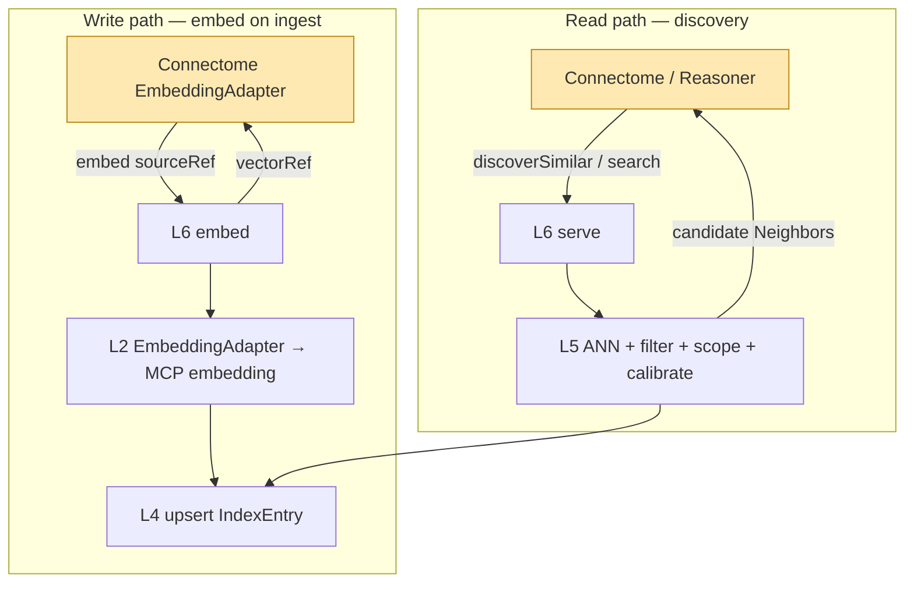
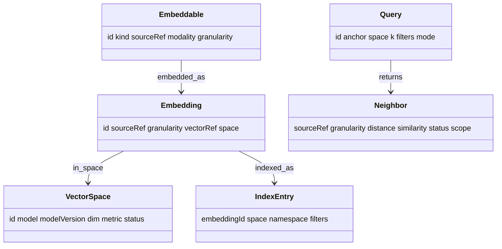

# Recall — Reference (diagrams + attributes)

The visual model and attribute-level reference. Pairs with `04` (entities), `05`–`06`
(index/search), `08` (granularity/spaces).

## Write & read paths

## Data shapes

## Attribute reference

### Embedding
| Attribute | Type | Notes |
|---|---|---|
| `sourceRef` | ref | Connectome Finding/Study/case id, or text handle |
| `granularity` | enum | finding \| study \| case \| text |
| `space` | obj | `{model, modelVersion, modality, dim, metric}` |
| `vectorRef` | ref | pointer into the store — **the value Connectome holds** |
| `asserted_by` | enum | always `embedding` |

### Neighbor (served result)
| Attribute | Type | Notes |
|---|---|---|
| `sourceRef` | ref | resolves to a Connectome node |
| `granularity` | enum | which index it came from |
| `distance` | float | raw ANN distance |
| `similarity` | float | **calibrated** 0–1 |
| `space` | obj | the space searched |
| `scope` | enum | `patient:<id>` \| `cohort` (authority used) |
| `status` | enum | always `candidate` |

## Enumerations

| Enum | Values |
|---|---|
| `Embeddable.kind` / `granularity` | `finding`, `study`, `case`, `text` |
| `Query.mode` | `vector`, `lexical`, `hybrid` |
| `scope` | `patient:<id>`, `cohort` |
| `Neighbor.status` | `candidate` (always) |
| `VectorSpace.status` | `active`, `deprecated` |

## Worked instance

A concrete query — `discoverSimilar(find-mri-001)` returning cohort candidates, plus a
`discoverSimilarCases` for the patient — is in `samples/recall/`, tying back to the
Connectome discovery example.
