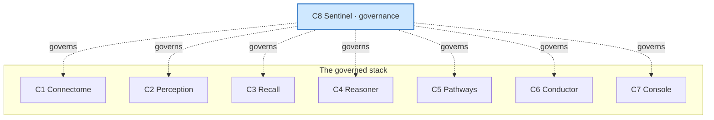

# Sentinel — Overview (C8)

**Sentinel** is the **cross-cutting governance** component of `ai-neuro-os`. It answers,
for every action any other component takes: **"who is doing this, to what, under what
authority, with what consent, using which model version — and is it recorded?"** It guards
**provenance**, **audit**, **consent / PHI**, **access control**, **model & safety
governance**, and **eval / drift** — applied across the whole stack.

Like every component it follows the stack rules: **no low-level code** (the policy engine,
audit store, consent/PHI registry, identity provider and model-eval/drift monitor are all
**MCP servers** at L1), **layered** (each layer depends only on the one below), **domain +
aggregate code only**.

## Why this exists

The stack asserts clinical facts: Perception writes findings, Reasoner proposes a diagnosis,
Recall surfaces cohort precedent, Pathways plans treatment. Three things must be true of
every one of those assertions, and none of them are the asserting component's job:

1. **Provenance** — every node/edge carries *who/what asserted it, how, with what
   confidence, when*. This is a stack-wide invariant (`docs/components/connectome/04-domain-model.md`
   shared attribute set), and Sentinel owns it.
2. **Authority & consent** — cross-patient memory (Recall cohort discovery) and
   candidate→confirmed promotion are powerful and sensitive; they must be authorized,
   consent-checked, scoped and de-identified.
3. **Model governance** — the LLM (Reasoner/Pathways), segmentation (Perception) and
   embedding (Recall) models drift; their versions must be registered, eval'd and approved.

Sentinel does these **once, as a shared service**, so every component honors the same rules.

## Sits over the stack

Sentinel is **not in the build-up chain**. Connectome (C1) is the center; the data/cognition
components build outward from it. Sentinel sits **over** the whole stack and is **called by**
the others at decision points — it does not produce clinical content of its own.

## The five governance concerns

| Concern | What Sentinel does | Most directly touches |
|---|---|---|
| **Provenance & audit** | validate every assertion carries who/what/how/when; keep an immutable trail | Connectome shared attributes (all writes) |
| **Consent / PHI** | check consent, enforce de-identification on cross-patient access | Recall cohort discovery |
| **Access control** | allow/deny who may run which action on which scope | Conductor routing, Console |
| **Model governance** | register, eval, approve model versions; flag drift | Perception, Recall, Reasoner, Pathways |
| **Eval / drift** | run eval/drift checks against thresholds on the models in use | the model-calling components |

## Boundaries (govern / authorize / record)

> **Sentinel governs; components produce. Sentinel does not diagnose, plan, embed, or
> persist clinical content — it authorizes, gates, validates and records.**

- It **authorizes** an action against a scope (allow/deny), it does not perform the action.
- It **gates** candidate→confirmed promotion; the human (via Console) still makes the call,
  Sentinel records who and checks provenance completeness.
- It **validates** provenance; the asserting component still stamps it.
- It **records** an immutable audit trail; it never edits the graph.

## Interception hooks (the L6 surface)

Other components call five hooks (`07`):

| Hook | Purpose |
|---|---|
| `authorize(action, scope)` | allow/deny an action on a scope → `AccessDecision` |
| `record(auditEvent)` | append an immutable `AuditEvent` |
| `checkConsent(patient, action, scope)` | resolve applicable `ConsentRecord` |
| `governPromotion(candidate→confirmed)` | gate a promotion (role + provenance-complete) |
| `registerModelVersion(model, version)` | register/approve a model version → eval/drift |

## Scope (this phase)

- **Inputs:** L1 MCP servers (policy, audit, consent/PHI, identity, model-eval/drift) and
  the requests sibling components make at the L6 hooks.
- **Output:** `AccessDecision`s, `ConsentRecord`/`ScopeGrant` resolutions, validated
  `ProvenanceRecord`s, `ModelGovernanceRecord`s, and an append-only stream of `AuditEvent`s.
- **Deliverable:** design specification + a worked sample. **No code.**

## Design principles

1. **No low-level code** — policy, audit, consent, identity, eval/drift are MCP servers;
   Sentinel orchestrates.
2. **Strict layering** — L1→L6, each depends only on the one below (`01`).
3. **Cross-cutting, not in the chain** — Sentinel is called by others; it produces no
   clinical content.
4. **Provenance is a stack-wide invariant** — every asserted node/edge carries it (`08`).
5. **Deterministic, auditable decisions** — allow/deny and promotion gates are explicit
   and every decision emits an `AuditEvent`.
6. **Least authority + minimum necessary** — cohort access is scoped and de-identified.

## Requirements traceability

| Requirement | Where |
|---|---|
| Provenance invariant | `04`, `06`, `08` |
| Audit trail (immutable) | `06`, `08` |
| Consent / PHI, de-identification | `04`, `05`, `06`, `08` |
| Access / scope control | `05`, `06`, `07` |
| Candidate→confirmed promotion gate | `06`, `07` |
| Model governance + eval/drift | `02`, `06`, `07` |
| Hooks other components call | `07` |
| Compliance alignment | `08` |

## Reading order

`01` layers → `02` capabilities → `03` adapters → `04` domain model →
`05` governance context → `06` enforcement & evaluation → `07` governance API →
`08` audit & compliance → `09` reference. Then the worked example in `samples/sentinel/`.
