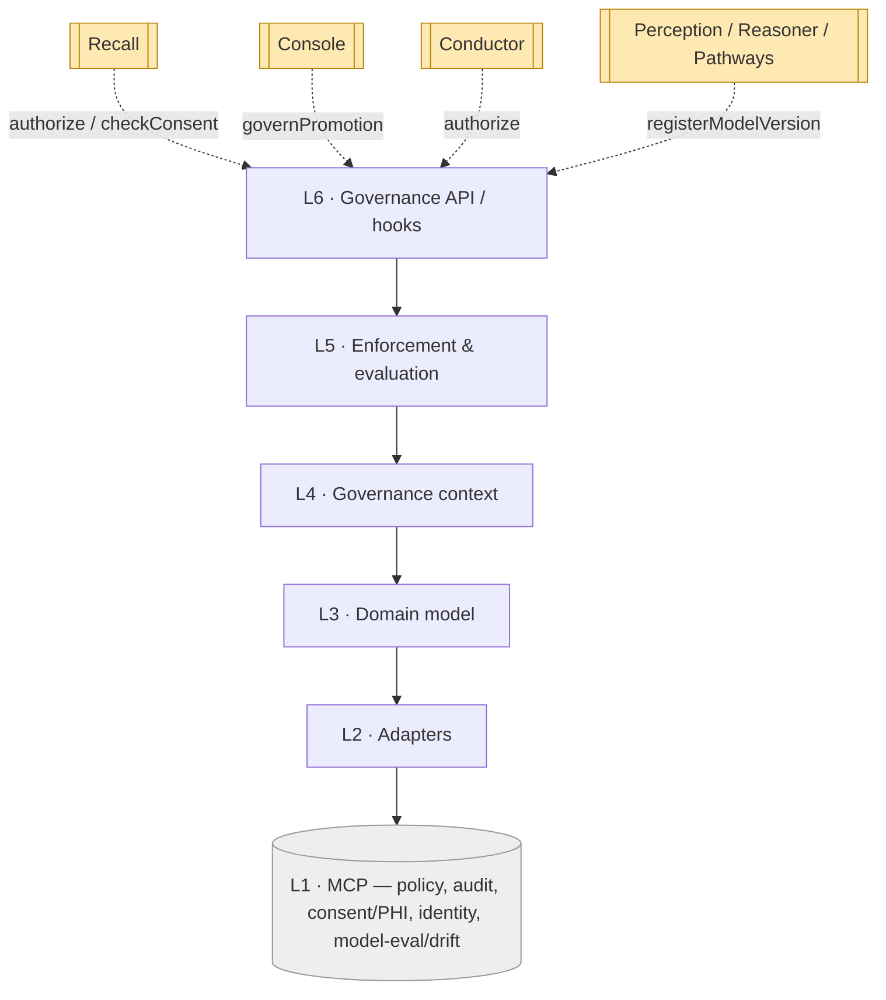
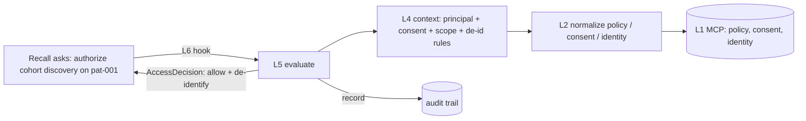

# Sentinel — Layered Architecture (L1–L6)

Sentinel runs its own six-layer scaffold, **each layer depending only on the one directly
below it.** The bottom is external MCP servers; the top is a set of **interception hooks**
the other components call. Unlike the producing components (Reasoner, Pathways), Sentinel's
L6 does not write to Connectome — it is **called by** the stack, and returns decisions.

## The stack

| # | Layer | Does | Spec |
|---|-------|------|------|
| **L6** | **Governance API / serving** | the hooks others call: `authorize`, `record`, `checkConsent`, `governPromotion`, `registerModelVersion` | `07` |
| **L5** | **Enforcement & evaluation** | decide allow/deny + scope; gate candidate→confirmed promotion; validate provenance completeness; run model eval/drift; apply redaction / de-identification | `06` |
| **L4** | **Governance context** | assemble the context for a request (who, what scope, what consent, which model versions); build the audit-trail skeleton | `05` |
| **L3** | **Domain model** | `Policy`, `AccessDecision`, `AuditEvent`, `ConsentRecord`, `ProvenanceRecord`, `ModelGovernanceRecord`, `ScopeGrant` | `04` |
| **L2** | **Adapters** | normalize policy decisions, audit events, consent records, identity tokens, model-eval signals into L3 types | `03` |
| **L1** | **Capability (MCP servers)** | **policy engine**, **audit-log store**, **consent/PHI registry**, **identity/access provider**, **model-eval/drift monitor**. *External.* | `02` |

## The dependency rule

- **Allowed:** L(n) calls L(n−1). Enforcement (L5) decides over the context (L4) built
  from the domain objects (L3) the adapters (L2) normalized.
- **Forbidden:** skipping layers or calling upward. L6 never calls the policy server
  directly — it consumes the L5 decision; L5 never re-reads the consent registry — it works
  on the assembled context.
- **External touch is at L2 only:** L2 calls the L1 MCP servers (policy, audit, consent,
  identity, eval/drift). Above L2 everything works on the assembled in-memory context.

## Cross-cutting, not in the build-up chain

The producing components end by **handing a candidate to Connectome** (Reasoner's
`DiagnosisProposal`, Pathways' `TreatmentPlan`). Sentinel ends differently: its L6 is a
**serving surface other components invoke**, returning an `AccessDecision`, a consent
resolution, a promotion verdict, or a model-governance record. It writes only its own
**immutable audit trail** (`08`) — never the clinical graph.

> Producing components push *into* Connectome. Sentinel is pulled *by* the stack and pushes
> only audit. This is what "sits over the stack" means concretely (`00`).

## How a request flows (illustrative)

- **Cohort discovery** (`discoverSimilarCases(pat-001)` → `pat-417`): L6 `authorize` +
  `checkConsent` → L4 assembles principal/consent/scope → L5 decides allow with a
  de-identification rule → returns to Recall, emits an `AuditEvent`.
- **Promotion** (`dx-001` candidate→confirmed): L6 `governPromotion` → L4 gathers the
  confirming principal + the provenance over the evidence trail → L5 checks role authority +
  provenance completeness → permit → `AuditEvent`.

Layer-to-doc map: L1→`02`, L2→`03`, L3→`04`, L4→`05`, L5→`06`, L6→`07`; cross-cutting →
`08`, `09`.
