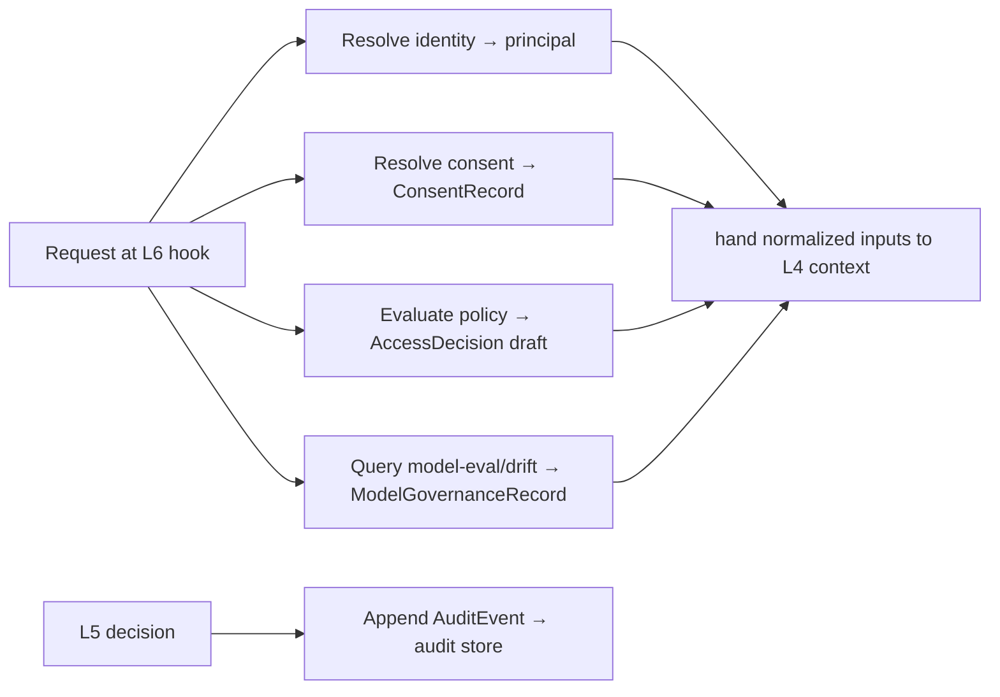

# Sentinel — Adapters (L2)

L2 is the **only layer that reaches outward** — to the L1 MCP servers (`02`) and to the
identity/consent context of the calling component. It **normalizes** each server's native
payload into a Sentinel domain object (`04`). Above L2, enforcement and serving work on
those objects, not live calls.

> L2 **gathers and grounds**; it does not decide. No allow/deny, no promotion verdict, no
> drift judgement here — just call the servers, normalize, and shape the inputs the
> governance context (L4) and enforcement (L5) will reason over.

## What L2 normalizes

| Source (MCP) | Via | Yields (L3 type) |
|---|---|---|
| **Policy engine** | evaluate | raw verdict + obligations → `AccessDecision` (un-finalized) |
| **Audit-log store** | append / read | persisted `AuditEvent` (+ sequence/hash) |
| **Consent / PHI registry** | resolve | `ConsentRecord` |
| **Identity / access provider** | authenticate | principal (subject, roles, org) |
| **Model-eval / drift monitor** | query | `ModelGovernanceRecord` signals (eval, drift, approval) |

## The normalize sequence

1. **Identity** — authenticate the incoming token, resolve the principal (who, roles, org).
2. **Consent** — resolve the applicable `ConsentRecord` for the patient/action/scope.
3. **Policy** — evaluate the policy engine into a draft `AccessDecision` (verdict +
   obligations such as de-identify).
4. **Model-eval/drift** — for model-touching requests, query the monitor into a
   `ModelGovernanceRecord` (eval scores, drift status, approval state).
5. **Audit** — after L5 decides, normalize and **append** the resulting `AuditEvent` to the
   store (the only thing L2 writes).

## Normalization contract

Each adapter maps a vendor payload to the stack vocabulary:
- policy obligations (`mask-phi`, `deident`, `min-necessary`) → `AccessDecision.obligations`;
- consent status (`active`/`withdrawn`/`expired`) → `ConsentRecord.status`;
- identity claims → principal roles in the stack's role set;
- eval/drift signals → `ModelGovernanceRecord.{evalStatus, driftStatus, approvalState}`.

So downstream every decision is traceable to a normalized record, and a candidate decision
always carries *which policy / consent / identity / model signal* drove it.

## Contract stability

Higher layers code against the L3 types (`04`), never these payloads. Swap the consent
registry or identity provider → only its L2 adapter changes; L4/L5 are untouched. L2 is the
**single boundary** to L1 and to the calling component's identity/consent context — above it,
governance is pure in-memory reasoning over normalized objects.
