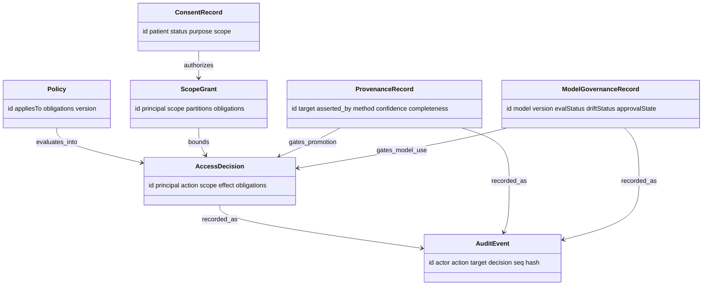

# Sentinel — Domain Model (L3)

L3 defines Sentinel's vocabulary. Everything above L3 speaks it; nothing above L2 makes live
MCP calls — it all works on these objects. Several map onto the shared attribute set every
Connectome node/edge carries (`docs/components/connectome/04-domain-model.md`) — Sentinel is
the component that **owns and validates** that set.

## Entities

### Policy
A governing rule (or rule set) evaluated by the policy engine (`02`).
- **Attributes:** `id`, `appliesTo` (action/scope pattern), `effectLogic`, `obligations[]`
  (e.g. `deident`, `min-necessary`, `role-required`), `version`.

### AccessDecision
The outcome of evaluating access/scope for a request (set at L5).
- **Attributes:** `id`, `principal`, `action`, `scope`, `effect` (`allow` | `deny`),
  `obligations[]` (e.g. de-identify), `policyRefs[]`, `reason`, provenance.

### ConsentRecord
The applicable consent / lawful basis for a patient + action + scope.
- **Attributes:** `id`, `patient`, `status` (`active` | `withdrawn` | `expired`),
  `purpose`, `scope` (`patient:<id>` | `cohort`), `restrictions[]`, `source` (registry),
  `timestamp`.

### ScopeGrant
An authorized scope a principal may operate within — the bridge between consent and access.
- **Attributes:** `id`, `principal`, `scope` (`patient:<id>` | `cohort`), `partitions[]`
  (e.g. de-identified cohort partitions), `obligations[]`, `grantedBy`, `expiresAt`.

### ProvenanceRecord
The governed who/what/how/when of an assertion — **the Connectome shared attribute set,
elevated to a first-class record** Sentinel validates.
- **Attributes:** `id`, `target` (node/edge ref), `asserted_by` (`human` | `algorithm` |
  `embedding`), `method`, `confidence` (0–1), `source`, `timestamp`,
  `completeness` (`complete` | `incomplete`).

### ModelGovernanceRecord
The governance state of a model version other components call.
- **Attributes:** `id`, `model`, `version`, `evalStatus` (`pass` | `fail` | `pending`),
  `driftStatus` (`stable` | `drifting` | `flagged`), `approvalState`
  (`approved` | `deprecated` | `blocked`), `registeredBy`, `timestamp`.

### AuditEvent
An immutable record of an action and its governance outcome (`08`).
- **Attributes:** `id`, `actor` (principal), `action`, `target`, `scope`, `decision`
  (allow/deny/permit/block), `refs[]` (consent/policy/provenance/model), `timestamp`,
  `seq`, `prevHash`, `hash` (append-only chain).

## Relationships

## The provenance invariant

`ProvenanceRecord` is not a new abstraction — it **is** Connectome's shared attribute set
(`asserted_by`, `method`, `confidence`, `source`, `timestamp`) treated as a governed record.
Sentinel's job (`06`) is to validate that **every asserted node/edge carries a complete
one**, and to refuse a candidate→confirmed promotion whose evidence trail is
provenance-`incomplete`.

## Shared attributes

Every Sentinel record carries `id`, `source` (originating MCP server / hook),
`asserted_by` (here `human` for human decisions, `algorithm` for automated checks),
`method`, `confidence` (for evaluative outputs), `timestamp`. Full attribute reference and
diagrams in `09`.

## Enumerations

| Enum | Values |
|---|---|
| `AccessDecision.effect` | `allow`, `deny` |
| `ScopeGrant.scope` / `ConsentRecord.scope` | `patient:<id>`, `cohort` |
| `ConsentRecord.status` | `active`, `withdrawn`, `expired` |
| `ProvenanceRecord.completeness` | `complete`, `incomplete` |
| `ModelGovernanceRecord.evalStatus` | `pass`, `fail`, `pending` |
| `ModelGovernanceRecord.driftStatus` | `stable`, `drifting`, `flagged` |
| `ModelGovernanceRecord.approvalState` | `approved`, `deprecated`, `blocked` |
| promotion verdict (L5) | `permit`, `block` |
