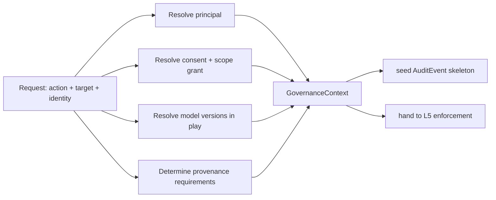

# Sentinel — Governance Context (L4)

L4 assembles the **GovernanceContext**: the bundle of facts everything above reasons over to
make a decision. It is built from the L2-normalized objects (`03`) — it does not itself reach
the MCP servers. It also seeds the **audit-trail skeleton** so that whatever L5 decides can
be recorded with its full basis.

> L4 **assembles, it does not enforce.** No allow/deny, no promotion verdict here — just
> gather *who, what scope, what consent, which model versions, what provenance is required*
> into one object and hand it to L5.

## What the context holds

| Part | Contents | From |
|---|---|---|
| `principal` | who is asking (subject, roles, org) | identity provider (L2) |
| `action` | what they want to do (e.g. `discoverSimilarCases`, `promote`) | the calling hook |
| `targetScope` | on what (`patient:pat-001`, `cohort`, a node/edge ref) | the request |
| `consent` | applicable `ConsentRecord` | consent registry (L2) |
| `scopeGrant` | the authorized `ScopeGrant` (+ de-id partitions) | policy + consent |
| `modelVersions[]` | model versions in play + their `ModelGovernanceRecord`s | eval/drift (L2) |
| `provenanceRequirements` | what provenance must be present/complete for this action | policy |
| `auditSkeleton` | the half-formed `AuditEvent` (actor/action/target/scope) | this layer |

## The assemble sequence

1. **Resolve principal** — the authenticated subject, roles and org (the `who`).
2. **Resolve consent + scope** — for the patient/action/scope, the `ConsentRecord` and the
   `ScopeGrant` it authorizes, including de-identified cohort partitions where relevant
   (`docs/components/recall/08-granularity-and-spaces.md`).
3. **Resolve model versions** — for model-touching actions, the `ModelGovernanceRecord`s of
   the versions about to be used (LLM, seg, embedding).
4. **Determine provenance requirements** — for a promotion, *which* assertions must carry a
   complete `ProvenanceRecord` (the evidence trail behind the candidate).
5. **Seed the audit skeleton** — actor/action/target/scope captured up front so L5's
   decision lands in a fully attributed `AuditEvent`.

## Two shapes of context

The same scaffold serves both governed moments in the running case:

| Moment | `action` | Context emphasizes |
|---|---|---|
| **Cohort discovery** (`discoverSimilarCases(pat-001)`) | `discoverSimilarCases` | consent + `cohort` scope grant + de-id obligation |
| **Promotion** (`dx-001` candidate→confirmed) | `promote` | confirming principal's role + provenance requirements over the evidence trail |

## Grounding contract

Every part of the context is **traceable** to its source record (consent registry entry /
identity claim / policy / model-governance record), so that:
- the L5 `AccessDecision` can **cite** the consent + policy that drove it (`06`),
- the promotion verdict can **point at** the `ProvenanceRecord`s it checked,
- the resulting `AuditEvent` carries a complete, auditable basis (`08`).

L4 makes no decision and writes nothing; it only assembles. The single write Sentinel makes —
appending the `AuditEvent` — happens after L5, via L2.
