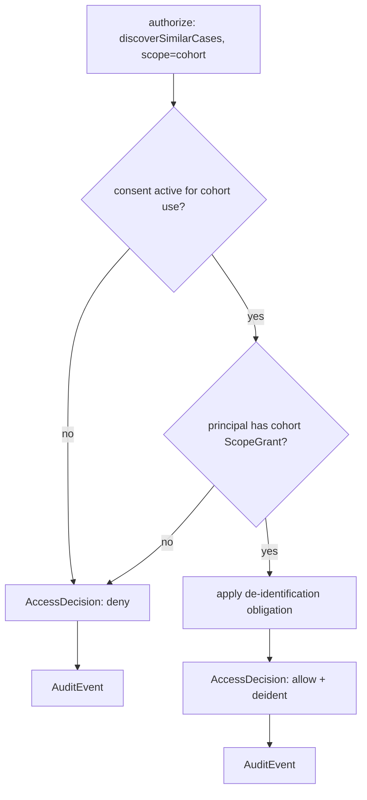
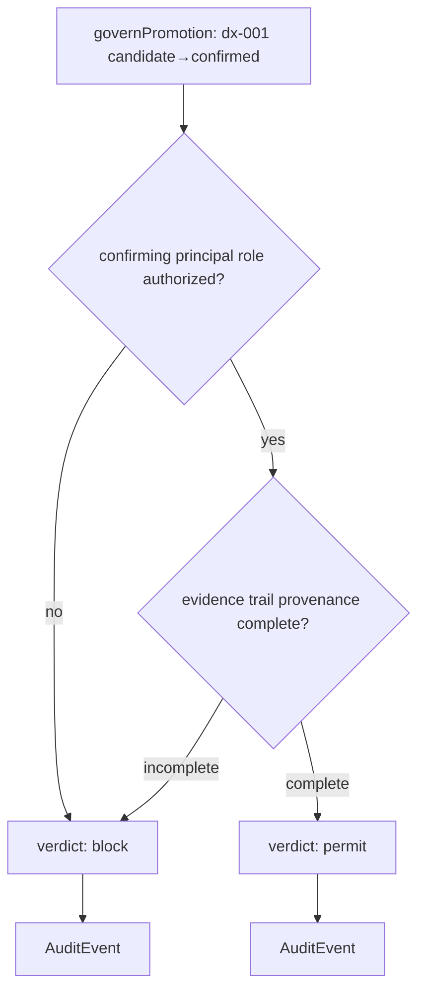

# Sentinel — Enforcement & Evaluation (L5)

L5 is the **decision layer**. It takes the assembled `GovernanceContext` (`05`) and produces
a verdict — deterministically and auditably, the way Reasoner applies criteria. Every
decision here emits an `AuditEvent` (`08`). L5 does not reach the MCP servers; it reasons
over the normalized context.

## The five enforcement operations

| # | Operation | Input | Output |
|---|---|---|---|
| 1 | **evaluate access / scope** | principal, action, scope, policy, consent | `AccessDecision` (`allow` \| `deny`) + obligations |
| 2 | **gate candidate→confirmed promotion** | confirming principal, candidate, evidence trail | `permit` \| `block` |
| 3 | **validate provenance completeness** | target node/edge + its `ProvenanceRecord` | `complete` \| `incomplete` |
| 4 | **run model eval / drift checks** | `ModelGovernanceRecord` for the version in use | `approved` \| `deprecated` \| `blocked` |
| 5 | **apply redaction / de-identification** | result set + obligations | de-identified result |

## 1 + 5 — access, scope, de-identification (cohort discovery)

When Recall asks to authorize `discoverSimilarCases(pat-001)` on `cohort` scope:

- Cohort retrieval is only allowed on **de-identified partitions** for which a consent /
  lawful basis is recorded — the privacy scoping Recall depends on
  (`docs/components/recall/08-granularity-and-spaces.md`).
- The `allow` carries a **de-identify obligation**; L5 applies the redaction rules so the
  cohort result (`pat-417`) is returned without direct identifiers.

## 2 + 3 — promotion gate + provenance completeness (dx-001)

When Console asks to promote candidate `dx-001` to `confirmed`:

- **Role authority** — promotion requires an authorized role (e.g. attending / MDT member),
  resolved from the principal. This is the human confirmation Reasoner and Pathways defer to:
  *they propose candidates; a human confirms via Console.*
- **Provenance completeness** — every assertion in the candidate's evidence trail
  (`find-mri-001`, `find-ct-001`, `find-histo-001`, the criteria) must carry a complete
  `ProvenanceRecord` (`asserted_by` / `method` / `confidence` / `timestamp`). An incomplete
  trail **blocks** promotion — this is the stack-wide invariant enforced at the gate.

> The provenance invariant is checked at **every** assertion and again, decisively, at
> promotion. A confirmed fact in `ai-neuro-os` always has a complete, governed trail behind
> it (`08`).

## 4 — model eval / drift

For a model-touching action (Reasoner's LLM, Perception's segmentation, Recall's embedding),
L5 checks the `ModelGovernanceRecord` of the version in use:

| Check | Effect |
|---|---|
| `evalStatus = pass` and `approvalState = approved` | proceed |
| `driftStatus = flagged` | block use of the version; require re-eval / new version |
| `approvalState = deprecated` | warn; allow only for read/repro, not new assertions |
| `approvalState = blocked` | deny |

A new version is registered via `registerModelVersion` (`07`); Conductor (C6) schedules the
eval/backfill, Sentinel records the result.

## Determinism & auditability

Like Reasoner's criteria adjudication, every L5 decision is **explicit and checkable**: the
`AccessDecision`/verdict names the policy, consent, provenance and model records that drove
it, and **each emits an `AuditEvent`**. Nothing here is a judgement call hidden in code — the
rules live in the policy engine (`02`) and the decision logic is a deterministic combination
of the context's facts.
