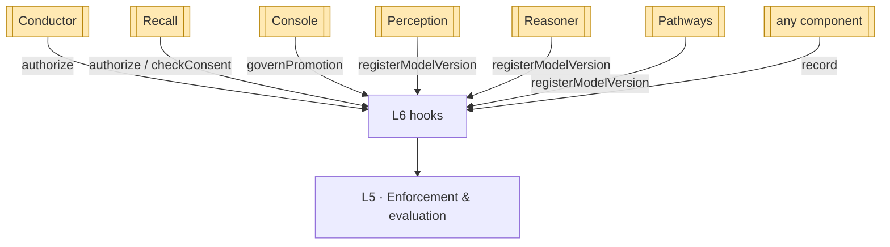

# Sentinel — Governance API / Serving (L6)

L6 is Sentinel's **serving surface**: the **interception hooks** other components call. Unlike
the producing components, L6 does not hand a candidate to Connectome — it is **called by** the
stack and returns a decision, then records it. Each hook descends L5→L1 and back (`01`).

> Producing components push *into* Connectome; Sentinel is pulled *by* the stack. L6 is how
> the rest of the OS asks "may I, and is it recorded?".

## The hooks

| Hook | Signature | Returns | Primary caller(s) |
|---|---|---|---|
| `authorize` | `authorize(action, scope)` | `AccessDecision` (allow/deny + obligations) | Conductor (routing), Recall (cohort scope) |
| `record` | `record(auditEvent)` | ack (seq + hash) | **all** components |
| `checkConsent` | `checkConsent(patient, action, scope)` | `ConsentRecord` + decision | Recall, Console |
| `governPromotion` | `governPromotion(candidate→confirmed)` | `permit` \| `block` | Console (confirmation) |
| `registerModelVersion` | `registerModelVersion(model, version)` | `ModelGovernanceRecord` | Perception, Recall, Reasoner, Pathways |

## How each sibling calls Sentinel

### Recall — cohort / cross-patient scope
Before serving `discoverSimilarCases(pat-001)` on `cohort` scope, Recall calls
`checkConsent(pat-001, discoverSimilarCases, cohort)` and `authorize(discoverSimilarCases,
cohort)`. Sentinel returns an `AccessDecision` — typically `allow` with a **de-identify**
obligation — and Recall serves the de-identified cohort result (reaching `pat-417`). This is
the gating named in `docs/components/recall/08-granularity-and-spaces.md`: *who may run cohort
discovery, on which de-identified partitions, with what audit.*

### Console — candidate→confirmed confirmation
When a clinician confirms a candidate via Console (the `dx-001` diagnosis, the `tx-001`
plan), Console calls `governPromotion(dx-001: candidate→confirmed)`. Sentinel checks the
confirming principal's role and the provenance completeness of the evidence trail (`06`) and
returns `permit` or `block`. The clinician makes the clinical call; Sentinel records **who**
confirmed and that the trail was complete.

### Conductor — action authorization
Conductor (C6) routes calls across components and MCP servers; for governed actions it calls
`authorize(action, scope)` first, so routing honors access control uniformly rather than each
component re-implementing it.

### Perception / Reasoner / Pathways — model versions
The model-calling components register the versions they use — Perception its segmentation
models, Recall its embedding models, Reasoner and Pathways the LLM — via
`registerModelVersion(model, version)`. Sentinel returns the `ModelGovernanceRecord` (eval,
drift, approval). The components call the models; they honor the approval state Sentinel
returns (`06`). New versions trigger Recall's re-embed / new VectorSpace flow, scheduled by
Conductor.

### All components — audit
Any component reports a governed event via `record(auditEvent)` — appended immutably to the
trail (`08`). Sentinel's own decisions are recorded the same way.

## Serving contract

- L6 **never** writes the clinical graph; it returns decisions and appends audit.
- Every hook call resolves to an `AuditEvent` (the decision, or the reported event).
- Hooks are **synchronous gates** for `authorize` / `checkConsent` / `governPromotion`
  (the caller waits for allow/deny/permit) and **registrations** for `registerModelVersion`.
