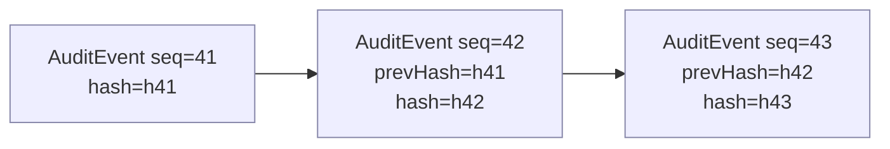

# Sentinel — Audit & Compliance (cross-cutting)

Two cross-cutting concerns that span every Sentinel layer: the **audit / provenance model**
(how decisions and assertions are recorded immutably) and the **compliance mapping** (how the
design aligns with healthcare data regimes). Both are defined once, here, so the layer docs
stay consistent.

## The audit trail

Every governed action — an `AccessDecision`, a promotion verdict, a model registration, or an
event a component reports via `record` (`07`) — produces an **`AuditEvent`** appended to the
audit store (`02`). The trail is **append-only and hash-chained**: each event carries the
hash of the previous one, so any tampering is detectable.

| `AuditEvent` field | Meaning |
|---|---|
| `actor` | the principal (who) |
| `action` | what was attempted (e.g. `discoverSimilarCases`, `promote`) |
| `target` | on what (`pat-001`, `dx-001`, a node/edge) |
| `scope` | `patient:<id>` \| `cohort` |
| `decision` | `allow` / `deny` / `permit` / `block` |
| `refs[]` | consent / policy / provenance / model records that drove it |
| `timestamp` | when |
| `seq`, `prevHash`, `hash` | append-only chain position + tamper-evidence |

Sentinel **only appends**; it never updates or deletes an event. This is what makes the trail
trustworthy for retrospective review and reproduction.

## The provenance invariant

The audit trail records *decisions*; the **provenance invariant** governs *assertions*. Every
node/edge in Connectome carries the shared attribute set
(`docs/components/connectome/04-domain-model.md`): `asserted_by` (`human` | `algorithm` |
`embedding`), `method`, `confidence`, `source`, `timestamp`. Sentinel:

1. **validates completeness** on every assertion (`06`),
2. **re-checks** it decisively at candidate→confirmed promotion (an incomplete trail
   **blocks** the promotion), and
3. **records** the check in the audit trail.

So a confirmed fact — the confirmed `dx-001`, the active `tx-001` — always has a complete,
governed provenance trail behind it, and the *decision to confirm it* is itself audited.

## Compliance mapping (design-level alignment)

This is **design-level alignment**, not a legal compliance claim. The architecture is shaped
so the controls these regimes expect have a natural home.

| Concern | Where it lives | Aligns with |
|---|---|---|
| Access control, minimum-necessary | `authorize` + policy obligations (`06`,`07`) | HIPAA minimum-necessary; access controls |
| Immutable audit of access | hash-chained `AuditEvent` (`02`,`08`) | HIPAA audit controls |
| Consent / lawful basis | `ConsentRecord` + `checkConsent` (`04`,`07`) | GDPR lawful basis; purpose limitation |
| De-identification for cohort use | de-identify obligation on cohort `AccessDecision` (`06`) | HIPAA Safe Harbor / de-identification; GDPR data-minimisation |
| Provenance of every assertion | `ProvenanceRecord` invariant (`04`,`08`) | data integrity / attributability |
| Model governance & safety | `ModelGovernanceRecord` + eval/drift (`02`,`06`) | clinical AI governance / model lifecycle |
| Human confirmation of automated output | `governPromotion` role gate (`06`) | clinical safety / human-in-the-loop |

## Retention & immutability

- **Append-only:** audit events are never mutated; corrections are *new* events that
  reference the prior one.
- **Retention:** audit and provenance are retained for review/reproduction; deprecated model
  versions and VectorSpaces stay readable (Recall `08`) so a past decision can be re-derived
  in the exact context that produced it.
- **Reproducibility:** because every decision names the consent / policy / provenance / model
  records that drove it, a governed action can be replayed and explained after the fact.
