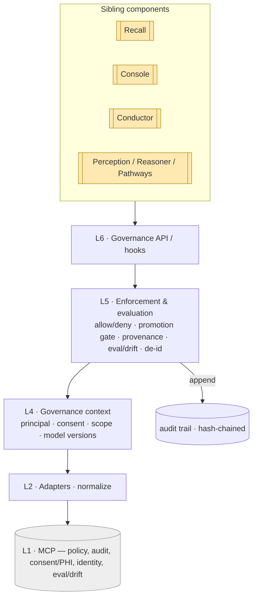
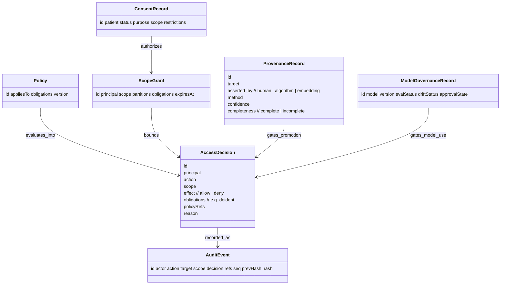

# Sentinel — Reference (diagrams + attributes)

The visual model and attribute-level reference. Pairs with `04` (entities), `06`
(enforcement) and `08` (audit / provenance).

## Pipeline (end to end)

## Data shapes

## Attribute reference

### AccessDecision
| Attribute | Type | Notes |
|---|---|---|
| `principal` | ref | the `who` (subject + roles) |
| `action` | string | e.g. `discoverSimilarCases`, `promote` |
| `scope` | enum/ref | `patient:<id>` \| `cohort` \| node/edge |
| `effect` | enum | `allow` \| `deny` |
| `obligations` | string[] | e.g. `deident`, `min-necessary` |
| `policyRefs` | ref[] | policies that drove the verdict |
| `reason` | text | human-readable basis |

### ConsentRecord
| Attribute | Type | Notes |
|---|---|---|
| `patient` | ref | subject of consent |
| `status` | enum | `active` \| `withdrawn` \| `expired` |
| `purpose` | string | purpose limitation |
| `scope` | enum | `patient:<id>` \| `cohort` |
| `restrictions` | string[] | extra constraints |

### ScopeGrant
| Attribute | Type | Notes |
|---|---|---|
| `principal` | ref | who is granted the scope |
| `scope` | enum | `patient:<id>` \| `cohort` |
| `partitions` | string[] | e.g. de-identified cohort partitions |
| `obligations` | string[] | e.g. `deident` |
| `expiresAt` | timestamp | grant validity |

### ProvenanceRecord
| Attribute | Type | Notes |
|---|---|---|
| `target` | ref | node/edge the provenance is for |
| `asserted_by` | enum | `human` \| `algorithm` \| `embedding` |
| `method` | string | e.g. `manual read`, `seg-v2`, `hybrid: rules+llm` |
| `confidence` | float | 0–1 |
| `completeness` | enum | `complete` \| `incomplete` |

### ModelGovernanceRecord
| Attribute | Type | Notes |
|---|---|---|
| `model` / `version` | string | the governed model version |
| `evalStatus` | enum | `pass` \| `fail` \| `pending` |
| `driftStatus` | enum | `stable` \| `drifting` \| `flagged` |
| `approvalState` | enum | `approved` \| `deprecated` \| `blocked` |

### AuditEvent
| Attribute | Type | Notes |
|---|---|---|
| `actor` | ref | principal |
| `action` / `target` / `scope` | — | what / on what / where |
| `decision` | enum | `allow` \| `deny` \| `permit` \| `block` |
| `refs` | ref[] | consent / policy / provenance / model |
| `seq`, `prevHash`, `hash` | — | append-only chain (`08`) |

## Enumerations

| Enum | Values |
|---|---|
| `AccessDecision.effect` | `allow`, `deny` |
| `scope` | `patient:<id>`, `cohort` |
| `ConsentRecord.status` | `active`, `withdrawn`, `expired` |
| `ProvenanceRecord.completeness` | `complete`, `incomplete` |
| `ModelGovernanceRecord.evalStatus` | `pass`, `fail`, `pending` |
| `ModelGovernanceRecord.driftStatus` | `stable`, `drifting`, `flagged` |
| `ModelGovernanceRecord.approvalState` | `approved`, `deprecated`, `blocked` |
| promotion verdict | `permit`, `block` |

## Worked instance

A concrete run — authorizing + auditing the cohort discovery `discoverSimilarCases(pat-001)`
reaching `pat-417` (consent + de-identification), then governing the candidate→confirmed
promotion of `dx-001` (role + provenance-complete check) — is in `samples/sentinel/`.
