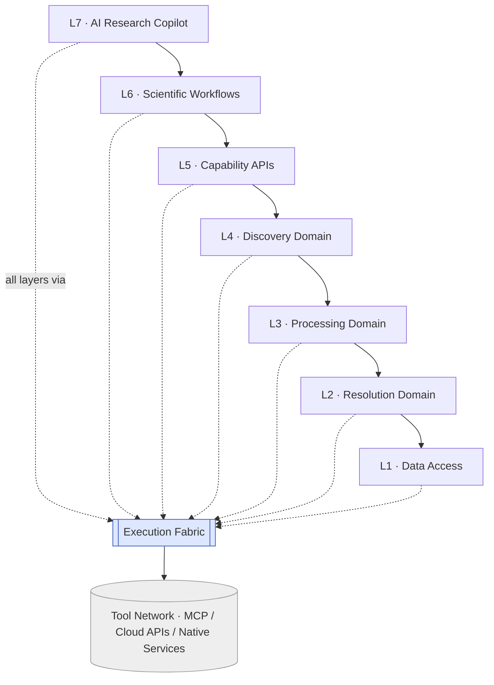

# Alternate Architecture — Layer-First (L1–L7)

> **Status: alternate approach, not adopted.** The canonical architecture for
> `ai-neuro-os` is **component-first** — see [`docs/stack/component-map.md`](../component-map.md).
> This document records a *different way to organize the same system*, derived from the
> uploaded **SciOS** spec, so the alternative is preserved for evaluation. The companion
> [`02-layer-component-grid.md`](02-layer-component-grid.md) shows how this layer model
> maps onto the canonical components.

## The idea in one line

Where the canonical model slices the system **vertically** into components
(C1 Connectome … C8 Sentinel), this model slices it **horizontally** into seven
**global layers**: every domain lives *inside* a layer, and a shared **Execution
Fabric** sits beside the stack handling all cross-cutting concerns.

Same DNA as the rest of `ai-neuro-os` — **MCP-first, no low-level code, contract-first,
knowledge-first, grow-from-use-cases** — different skeleton.

## The stack

Each layer depends only on the layer directly below it. No layer calls upward; no layer
skips a level. The only place that touches an external system is the Execution Fabric,
which brokers all MCP calls.

| # | Layer | Owns | Never |
|---|-------|------|-------|
| **L7** | **AI Research Copilot** | planning, reasoning, workflow selection, report generation | inference, rendering, storage |
| **L6** | **Scientific Workflows** | workflow orchestration, workflow templates, protocol execution | processing, storage |
| **L5** | **Capability APIs** | reusable scientific APIs (`FindHistology()`, `CompareRegions()`, `AnalyzeLesion()`, `FindSimilarCases()`) | vendor/SDK/database logic |
| **L4** | **Discovery Domain** | atlas reasoning, section similarity, embeddings, spatial search, coordinate intelligence, knowledge generation | rendering, inference internals |
| **L3** | **Processing Domain** | rendering, segmentation, registration, inference, feature extraction *(orchestrated as capabilities — actual compute lives in MCP)* | direct CUDA / library calls |
| **L2** | **Resolution Domain** | id resolution, coordinate resolution, atlas resolution, cross-database joins | storage internals |
| **L1** | **Data Access** | retrieval, metadata, storage abstraction | processing, reasoning |

## Execution Fabric (shared)

A single shared subsystem that every layer routes through. **Layers must not invoke MCP
directly** — they request work from the fabric, which owns the cross-cutting machinery:

- `capability_registry` · `tool_registry` · `resolver`
- `planner` · `executor` · `scheduler`
- `validator` · `provenance` · `cache` · `retry` · `security`

This is the layer-first answer to "where do cross-cutting concerns live." (In the
canonical component-first model these same responsibilities are split across **Conductor**
(C6, plan/route/registry) and **Sentinel** (C8, provenance/consent/governance) rather
than a single named subsystem.)

## Tool Network

The fabric brokers four kinds of backing service: **Internal MCP**, **External MCP**,
**Cloud APIs**, **Native Services**. Layers see capabilities, never these endpoints.

## Dependency rules

**Allowed**

- `L7 → L6 → L5 → L4 → L3 → L2 → L1`
- `ALL → ExecutionFabric`
- `ExecutionFabric → MCP / Tool Network`

**Forbidden**

- Skipping layers
- Direct database access
- Direct CUDA / OpenSlide / CellPose / cloud-SDK usage
- Any upward call

## Knowledge objects

Every output is a typed **KnowledgeObject** with provenance — e.g. `Patient`, `Study`,
`MRI`, `Section`, `ROI`, `CellCollection`, `AtlasRegion`, `Lesion`, `SimilarCase`,
`Report`. (The canonical model expresses the same discipline as a **knowledge graph** of
provenance-stamped nodes and edges rather than discrete objects.)

## Reuse ladder (shared with the canonical model)

Before writing code:

1. Search existing **capability**.
2. Search existing **MCP** tool.
3. Wrap an **OSS** library as MCP.
4. Wrap a **commercial** API as MCP.
5. **Implement** only the missing capability.

Reusable code → Capability. Reusable data → KnowledgeObject. The framework grows only
from real use cases (`UseCase → Capability → Pipeline → KnowledgeObject → Framework`).

## How this differs from the canonical component-first model

| | Layer-first (this doc) | Component-first (canonical) |
|---|---|---|
| Primary axis | 7 global horizontal layers | 8 vertical components (C1–C8) |
| Unit of ownership | a layer | a component |
| Processing (segment/register/infer) | an **owned layer** (L3) | **brokered to MCP**, surfaced via C2 Perception |
| Cross-cutting concerns | one central **Execution Fabric** | split across **Conductor** + **Sentinel** |
| Shape | slabs stacked top-to-bottom | a "comb": shared L1/L3 bands + component teeth |
| Ships as | the whole stack must exist to demo | one component end-to-end |

**Trade-off in brief.** Layer-first gives a single, uniform mental model and one obvious
home for shared infrastructure, at the cost of broad up-front structure (you must stand
up all seven layers before a vertical use case works end-to-end). Component-first ships
one vertical slice at a time and grows shared bands only when a second component needs
them, at the cost of a less uniform org. See the grid in
[`02-layer-component-grid.md`](02-layer-component-grid.md) for the precise mapping
between the two.
