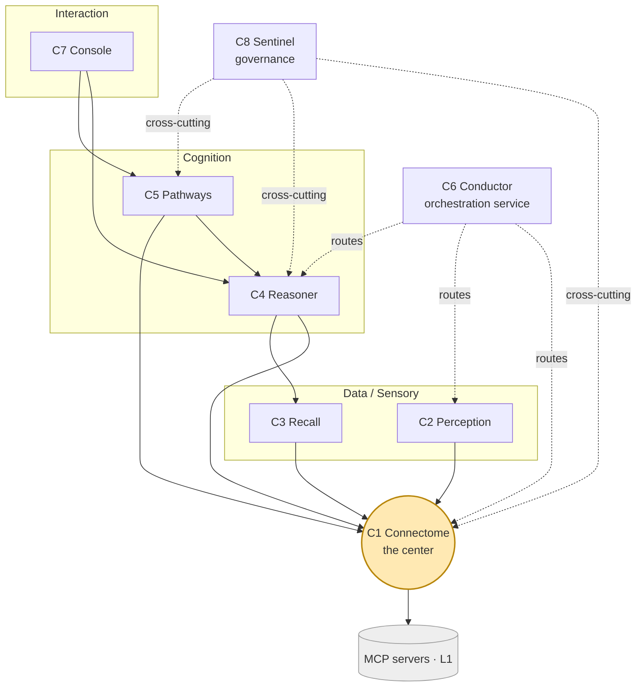

# ai-neuro-os — Component Map

`ai-neuro-os` is an AI operating system for neuro-imaging & neurology, built as a set
of **components**. Every component obeys the same three rules:

- **No low-level code** — all compute/data access via **MCP servers** (the OS *calls* them).
- **Layered** — each layer depends only on the one directly below it.
- **Domain + aggregate code only** — orchestration and knowledge, never low-level processing.

A *component* is a product module that spans the layers (L1–L6, see
`docs/components/connectome/01-layered-architecture.md`) and orchestrates MCP
capabilities for a single domain purpose.

> **Why everything sits behind MCP:** each capability is a **heavyweight subsystem with
> several viable alternative implementations, built and owned by different teams**. The MCP
> contract is the team-ownership + swappability boundary (Conway's law, made deliberate) —
> not a way to defer the hard work. See `docs/stack/design-decisions.md` (ADR-0001).

## Center of gravity: knowledge-first

`ai-neuro-os` is fundamentally a **knowledge graph with apps around it**. **Connectome**
(C1) is the **center** — the shared memory every other component reads from and writes
to. **Conductor** is a *supporting* orchestration service, not the core. Components are
grouped into planes that build outward from Connectome.

## Components

| # | Component | Plane | Role | Builds on | Status |
|---|-----------|-------|------|-----------|--------|
| **C1** | **Connectome** | foundation | Cross-modal knowledge graph: ingest→normalize multimodal neuro data, correlate findings across modalities, embedding-backed **discovery**, **navigation** (diagnosis / treatment / progression). The center. | MCP servers (L1) | **Specified** — `docs/components/connectome/` |
| C2 | **Perception** | data / sensory | Orchestrates imaging-AI + report-NLP MCP servers (segmentation / detection / characterization / measurement / report-NLP) → fuses them into structured **Findings** that feed Connectome (produces; Connectome persists). | C1 schema, imaging MCP | **Specified** — `docs/components/perception/` |
| C3 | **Recall** | data / sensory | The vector-memory service: owns the embedding + vector-index lifecycle and serves multi-granular similarity/discovery (findings, studies, cases, text). Fronts the embedding/vector MCP servers; Connectome stores only `vectorRef`s and delegates to Recall. | C1, embedding MCP | **Specified** — `docs/components/recall/` |
| C4 | **Reasoner** | cognition | Diagnostic reasoning: hybrid (rule-checklists + LLM) differential generation, criteria application (McDonald / RANO / WHO CNS), evidence surfacing, and next-discriminating-test guidance. Proposes a candidate `Diagnosis`; a human confirms. | C1, C3 | **Specified** — `docs/components/reasoner/` |
| C5 | **Pathways** | cognition | Two tracks over one scaffold: **treatment planning** (guidelines + clinical-trial matching → candidate `TreatmentPlan`, MDT-confirmed) and **event-driven monitoring** (RANO/McDonald response assessment → `ProgressionAssessment` on each new study). | C1, C4 | **Specified** — `docs/components/pathways/` |
| C6 | **Conductor** | control | Orchestration **service**: plans tasks into a step DAG, routes calls across components + MCP servers (health-aware, retry/fallback/circuit-break), runs the agent loop, wires events, manages the MCP registry. Supporting service, not the center. | all (routes) | **Specified** — `docs/components/conductor/` |
| C7 | **Console** | interaction | Clinician-facing agent / UI: NL query → navigation, multi-component view composition, evidence/provenance explanation, report drafting, and the place a human **confirms** candidates. | C1, C4, C5 | **Specified** — `docs/components/console/` |
| C8 | **Sentinel** | cross-cutting | Governance over the whole stack: provenance, immutable audit, consent / PHI, access control, candidate→confirmed promotion gates, model & safety governance, eval / drift. Called by others; produces no clinical content. | all | **Specified** — `docs/components/sentinel/` |

**Folded in (not separate components):**
- **Intake** (PACS/EHR/LIS connection, pulling studies/records) → Connectome's **L2
  adapters**. Promote to its own component only if ingestion grows complex
  (scheduling, streaming, backfill).
- **Cohort / population analytics** → **Recall** (C3).

> **All eight components (C1–C8) are now specified in full** — each has a complete L1–L6
> spec under `docs/components/<name>/` (00–09) plus a worked sample under `samples/<name>/`
> threaded through the same running clinical case.

## Dependency map (knowledge-first)

- **Solid arrows** = "reads/writes / builds on" dependencies (each points at what it
  depends on; Connectome at the center sits directly on the MCP layer).
- **Dotted** = Conductor (routes work) and Sentinel (governs) act *across* components
  rather than sitting in the build-up chain.

## Naming

Names are **evocative-but-plain** — real words that hint at the role, no neuroanatomy
required. `Connectome` is the one themed anchor (the map of connections); the rest read
literally: Perception (sense), Recall (memory), Reasoner (think), Pathways (act),
Conductor (route), Console (interface), Sentinel (guard).

## Shared conventions

- **MCP capability layer (L1)** is shared across all components — the catalog Connectome
  uses is in `docs/components/connectome/02-mcp-capability-map.md`; later components
  extend it.
- **Domain model & ontology (L3)** defined by Connectome
  (`docs/components/connectome/04-domain-model.md`) is the lingua franca other components
  read and write.
- **Provenance & confidence** on every asserted node/edge is a stack-wide rule, governed
  by **Sentinel** (C8).
