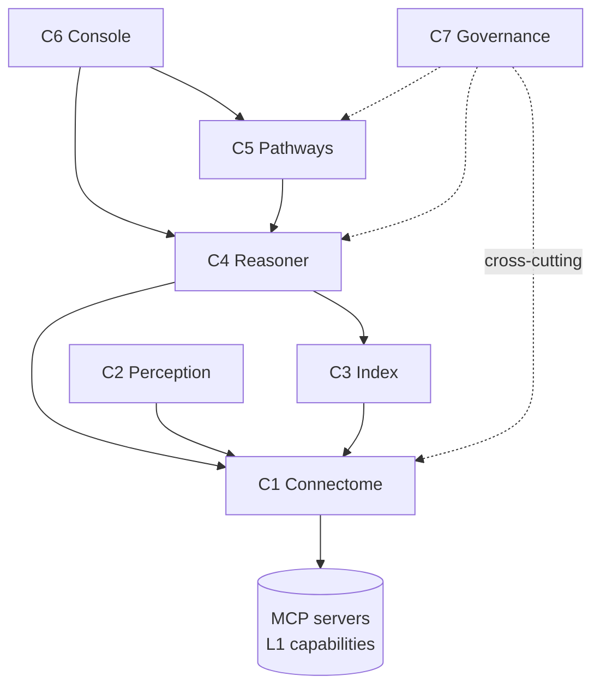

# ai-neuro-os — Component Map

`ai-neuro-os` is an AI operating system for neuro-imaging & neurology, built as a set
of **components**. Every component obeys the same three rules:

- **No low-level code** — all compute/data access via **MCP servers** (the OS *calls* them).
- **Layered** — each layer depends only on the one directly below it.
- **Domain + aggregate code only** — orchestration and knowledge, never low-level processing.

A *component* is a product module that spans the layers and orchestrates MCP
capabilities for a single domain purpose. Components compose: higher components build
on the knowledge and services lower components expose.

## Components

| # | Component | Role | Builds on | Status |
|---|-----------|------|-----------|--------|
| **C1** | **Connectome** | Cross-modal knowledge graph: ingest→normalize multimodal neuro data (histology / US / MRI / CT + history), correlate findings across modalities, embedding-backed **discovery**, and **navigation** (diagnosis / treatment / progression). | MCP servers | **Specified** — see `docs/components/connectome/` |
| C2 | **Perception** *(candidate)* | Orchestrates imaging-AI MCP servers (segmentation / detection / classification) to produce structured **Findings** that feed Connectome. | C1 graph schema | to brainstorm |
| C3 | **Index** *(candidate)* | Owns the embedding + vector-index lifecycle; the discovery substrate Connectome queries. | MCP embedding server | to brainstorm |
| C4 | **Reasoner** *(candidate)* | Diagnostic reasoning, differential generation, guideline/criteria application over the Connectome graph. | C1, C3 | to brainstorm |
| C5 | **Pathways** *(candidate)* | Treatment-planning, trial/guideline matching, longitudinal monitoring & response assessment. | C1, C4 | to brainstorm |
| C6 | **Console** *(candidate)* | Clinician-facing agent / UI for query, navigation and explanation. | C1, C4, C5 | to brainstorm |
| C7 | **Governance** *(candidate, cross-cutting)* | Provenance, audit, consent / PHI handling, model & safety governance applied across all components. | all | to brainstorm |

> Only **C1 Connectome** is specified in full. Names and boundaries for C2–C7 are
> placeholders captured here so we can brainstorm them in place. Add a section per
> component as it firms up; give each its own `docs/components/<name>/` folder.

## Dependency sketch

## Shared conventions

- **MCP capability layer (L1)** is shared across all components — see
  `docs/components/connectome/02-mcp-capability-map.md` for the catalog Connectome uses;
  later components extend it.
- **Domain model & ontology (L3)** defined by Connectome is the lingua franca other
  components read and write — see `docs/components/connectome/04-domain-model.md`.
- **Provenance & confidence** on every asserted edge is a stack-wide rule (governed by
  the future C7 Governance component).
