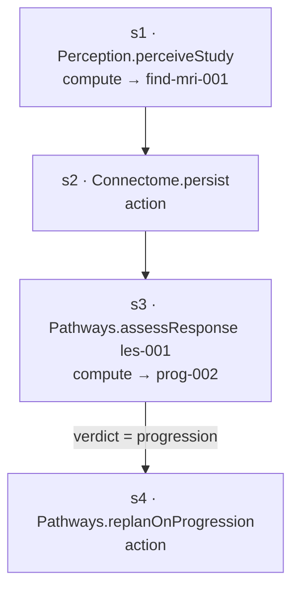

# Worked Example — Conductor orchestrating a study-ingested event

> **Illustrative only.** Not real, not runnable. Shows Conductor's one scaffold on the running
> case: a follow-up MRI is ingested for `pat-001`'s lesion, and Conductor plans a step DAG,
> routes it across components, recovers from a flaky server, and authorizes + audits each
> action. Data: [`orchestration-example.json`](orchestration-example.json).
> Ties to [`../connectome/patient-example.md`](../connectome/patient-example.md) (`find-mri-001`,
> `prog-002`), [`../pathways/treatment-and-monitoring-example.md`](../pathways/treatment-and-monitoring-example.md)
> (`assessResponse` → `prog-002`), and [`../reasoner/diagnosis-example.md`](../reasoner/diagnosis-example.md) (`dx-001`).

## The trigger (Apr 15 — study ingested)

A follow-up MRI `study-mri-003-fu` lands for `les-001`. The `study-ingested` event is wired
(`scheduleOnEvent`) to a **templated** monitoring plan — no LLM decomposition needed.

## L4 — plan the DAG, resolve routes

| Step | Routes to | Side-effect | Authorize? |
|---|---|---|---|
| s1 | **Perception** `perceiveStudy` | compute | no |
| s2 | **Connectome** `adapter.persist` | action | **yes** |
| s3 | **Pathways** `assessResponse` | compute | no |
| s4 | **Pathways** `replanOnProgression` | action | **yes** |

Each step is pinned to a route + version from the L2 catalog (Perception 2.3, Connectome 5.1,
Pathways 1.4).

## L5 — execute, with a flaky server

### s1 — Perception, retry → circuit-break → fallback
- Perception's primary **segmentation MCP** `mcp-seg-a` returns `unavailable`.
- Conductor **retries** (attempt 2) → still `unavailable` → the **breaker trips** on
  `mcp-seg-a`.
- Conductor **falls back** to the healthy replica `mcp-seg-b` (attempt 3) → **success**,
  `find-mri-001` produced.
- All three attempts are recorded — the run succeeded *and* the flakiness is visible.

### s2 — Connectome persist (authorized)
- Action-class → **Sentinel authorizes** (`dec-s2` = allow: consent + access ok) → persist
  `find-mri-001` as **candidate**.

### s3 — Pathways assess response
- `assessResponse(les-001)` over the baseline↔follow-up comparison → **`prog-002`**, verdict
  **progression** (the same `prog-002` from the Pathways monitoring sample). Compute, not
  gated.

### s4 — conditional re-plan (authorized)
- The conditional `verdict = progression` holds → `s4` becomes ready (it would be **skipped**
  if stable).
- Action-class → **Sentinel authorizes** (`dec-s4` = allow) → schedule
  `replanOnProgression` as a fresh planning task (`planning-task-002`).

## What the run produced

| Output | Status | Owner |
|---|---|---|
| `find-mri-001` | candidate (persisted) | Perception produced, Connectome holds |
| `prog-002` | candidate | Pathways' verdict |
| `planning-task-002` | scheduled | re-enters Pathways for second-line options |

`RunContext.status = succeeded`. The audit trail records, per step: the route + version, the
attempt count (3 for s1 — the retry/fallback), the outcome, and the Sentinel authorization on
the two action steps.

## What Conductor did vs. didn't

| Conductor did | Conductor did **not** |
|---|---|
| plan the DAG + resolve every step to a route | produce any finding / verdict (the components did) |
| order dependent steps, run independent ones in parallel | persist anything itself (it routed the write to Connectome) |
| retry, circuit-break, and fall back to a healthy replica | confirm `find-mri-001` or `prog-002` (they stay **candidate**) |
| ask **Sentinel** to authorize each action + audit it | decide *whether* an action is permitted (Sentinel did) |
| schedule the progression re-plan as a new task | interpret the `progression` verdict (Pathways' call) |

> **Conductor moved the work; the components did the thinking; Sentinel said yes; a human will
> confirm.** That is the kernel's job — sequencing and recovery, fully audited, around a graph
> it never asserts into.
