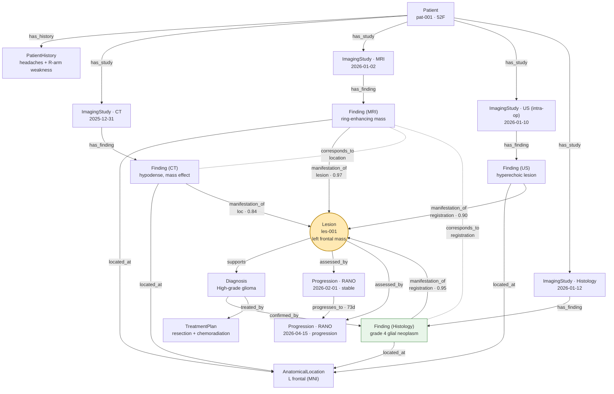
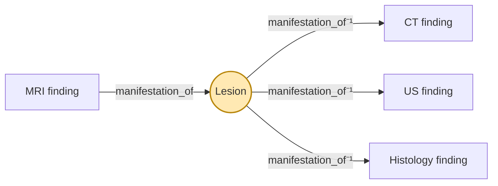

# Worked Example — Instance Graph

The case from [`patient-example.md`](patient-example.md) / [`patient-example.json`](patient-example.json)
rendered as a Connectome graph. One abstract **Lesion** (`les-001`) ties the four
modality findings together; from it hang diagnosis, treatment and the progression
timeline.

## Full instance graph



## Reading the graph

- **The hub is the `Lesion`** — every modality finding points into it via
  `manifestation_of` (solid), each labeled with the **mechanism** (`06`) and **confidence**.
- **Dashed `corresponds_to`** edges are the direct finding↔finding links (CT↔MRI by
  location; MRI↔Histology by registration).
- **Histology** (green) is the highest-trust node and the one that `confirmed_by` the
  diagnosis.
- **From the lesion**, navigation reaches diagnosis → treatment, and the **progression
  chain** (`assessed_by` / `progresses_to`).

## The core journey, isolated

"Find this MRI finding in the other modalities" = pivot through the lesion:



## Discovery (candidate, not stored)

`discover_similar(find-mri-001)` (journey F, mechanism 5) returns **candidate** cohort
matches — rendered distinctly because they are unconfirmed:

```mermaid
flowchart LR
    FMR["MRI finding<br/>find-mri-001"] -.embedding 0.94.-> C1["cohort: pat-417 (MRI)"]
    FMR -.embedding 0.91.-> C2["cohort: pat-088 (MRI)"]
    FMR -.embedding 0.88.-> C3["cohort: pat-203 (CT)"]
    style C1 stroke-dasharray: 5 5
    style C2 stroke-dasharray: 5 5
    style C3 stroke-dasharray: 5 5
```
